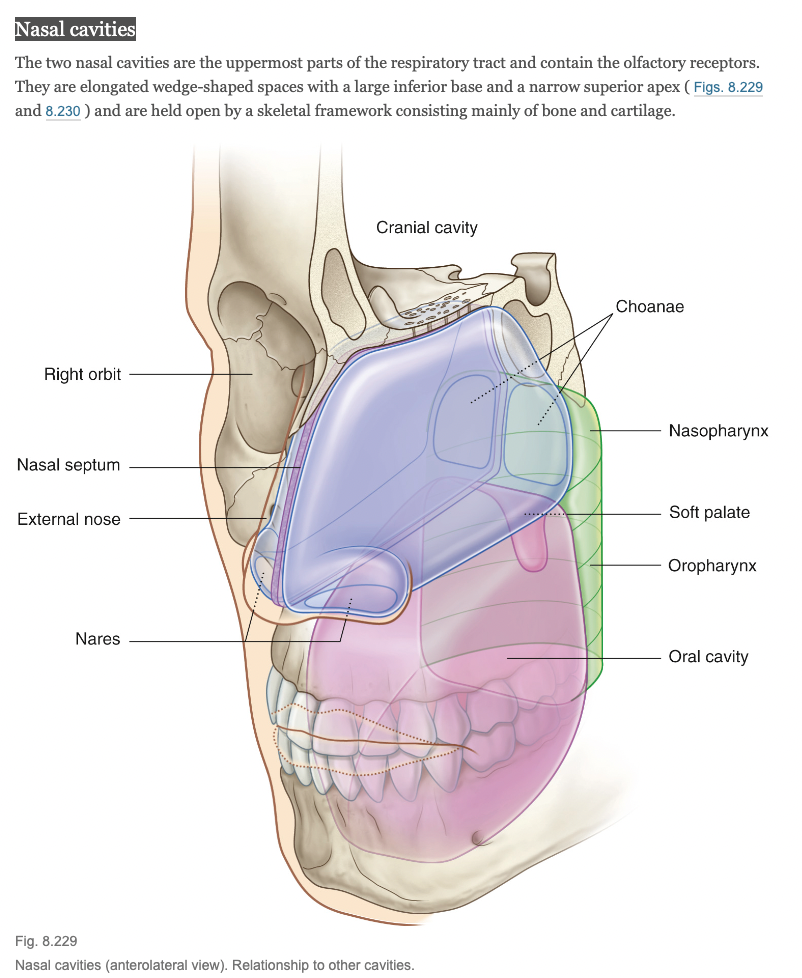
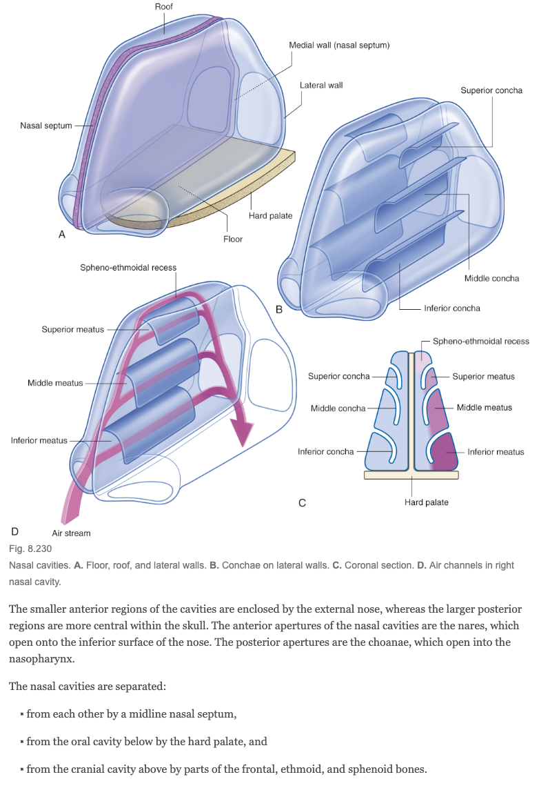
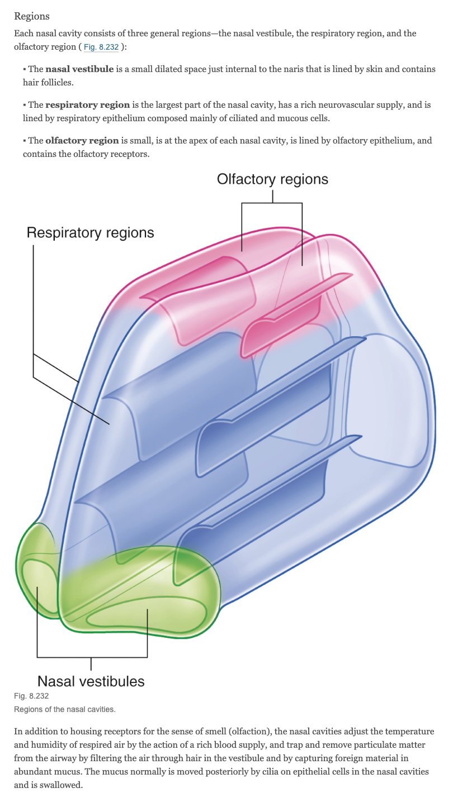
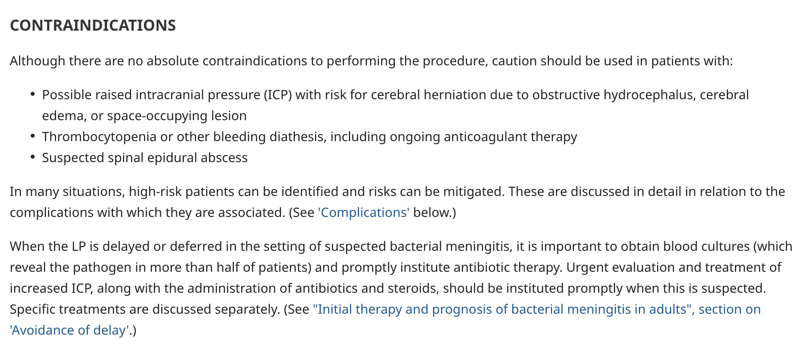

- 11:11
  collapsed:: true
	- [[Relevant Notes]] [[Nasal cavity]]
		- [[Functional histology of the Respiratory System]]
			- ((63b8cd6c-18f7-42b9-ad56-1d0369138a19))
		- [[Permanent Notes]] [[The nasal cavity serves as the proximal part of the respiratory tract]]
			- [[Reference Notes]] [Gray's Anatomy: Nasal cavities](https://www-clinicalkey-com.eproxy.lib.hku.hk/#!/content/book/3-s2.0-B9780323393041000087?scrollTo=%23hl0010885:~:text=on%20each%20side.-,Nasal%20cavities,-The%20two%20nasal)
				- 
				- {:height 947, :width 656}
			- [[Literature Notes]]
			- [[Fleeting Notes]]
				- The nasal  the most proximal part of the respiratory tract, bordered anteriorly by the anterior nasal aperture (nares), and opens posteriorly to the nasopharynx by the posterior nasal aperture (Choanae).
				- The two nasal cavities are separated by the nasal septum.
- 11:30
  collapsed:: true
	- [[Relevant Notes]] [[Varying epithelium]]
		- [[Permanent Notes]] [[3 regions of the nasal cavity is lined with its own type of epithelium]]
			- [[Reference Notes]] [Gray's anatomy: Regions of the nasal cavities](https://www-clinicalkey-com.eproxy.lib.hku.hk/#!/content/book/3-s2.0-B9780323393041000087?scrollTo=%23hl0010885:~:text=and%20nasolacrimal%20duct.-,Regions,-Each%20nasal%20cavity)
				- {:height 1116, :width 632}
			- [[Literature Notes]] The 3 regions of the nasal cavity is lined with its own epithelium.
				- The nasal cavity is separated into 3 regions, each lined with its own type of epithelium.
					- The vestibule, which is lies anteriorly, and serves as the continuation of the skin into the nares
					- The respiratory region, occupying much of the nasal cavity is lined with the characteristic respiratory epithelium.
					- The olfactory region, occupying the roof and the superior conchae, is lined with olfactory epithelium
			- [[Fleeting Notes]]
- 21:07
  collapsed:: true
	- [[Relevant Notes]] [[Precaution]]
		- ((63bac809-cd7c-4e87-b087-8a72219e1186))
		- ((63ba2e01-283e-4c38-8067-221c56b1e8b3))
		- ((63bac860-a4ba-412e-b25a-7f2cefd4c816))
		- [[Permanent Notes]] [[Head CT is routinely performed prior to lumbar puncture to exclude causes of raised intracranial pressure as to avoid a serious complication]]
			- [[Reference Notes]] [Lumbar puncture: Technique, indications, contraindications, and complications in adults](https://www-uptodate-com.eproxy.lib.hku.hk/contents/lumbar-puncture-technique-indications-contraindications-and-complications-in-adults?search=lumbar%20puncture%20space%20occupying%20lesion&source=search_result&selectedTitle=5~150&usage_type=default&display_rank=5#)
				- 
				- 
				- 
				- 
			- [[Literature Notes]] Head CT must be performed prior to a lumbar puncture, as to exclude causes of raised intracranial pressure, to avoid a deadly complication.
				- Cerebral herniation is a common sequelae of raised intracranial pressure, which can caused by CSF pathway obstruction, cerebral oedema, or a space occupying lesion in the brain.
				- Herniation results in compression of brainstem, and as a result cessation of its essential life functions respiratory, cardiovascular etc.
				- This sure-fire sequence of events is actually recognised clinically, and has prompted **routine head CT to be performed prior to lumbar puncture**.
					- This is to exclude any space occupying region, that can trigger the sequence of events.
			- [[Fleeting Notes]] Performing a lumbar puncture in a patient with raised intracranial pressure can send the patient into cerebellar tonsillar herniation, resulting in death.
				- Performing a lumbar puncture actually accelerates the progression from mere raised intracranial pressure to herniation.
					- This is because when drawing CSF from the lumbar area, it creates a decrease in pressure in the subarachnoid space in the lumbar region.
					- This creates a pressure gradient, that causes the brain (particularly the cerebellar tonsils) to herniate through the foramen magnum. **I'm not too sure about this actually, this requires further reading**.
						- The effect of herniation, is the compression on the brainstem, which houses key functions, such as the respiratory centre (medulla and pons), the cardiac centres, vascular centres, so on and so forth.
						- This is essentially, a sequence of effects that cause a spiral into death... the trigger, misguided lumbar puncture disregarding the raised intracranial pressure.
- 21:45
  collapsed:: true
	- [[Relevant Notes]] [[Empirical treatment]]
		- ((63bac7bc-af6e-4eae-9717-c88372e39d16))
		- [[Permanent Notes]] [[In suspected acute bacterial meningitis, empirical treatment must be initiated after blood cultures]]
			- [[Reference Notes]] [Initial therapy and prognosis of bacterial meningitis in adults](https://www-uptodate-com.eproxy.lib.hku.hk/contents/initial-therapy-and-prognosis-of-bacterial-meningitis-in-adults?search=Acute%20bacterial%20meningitis&source=search_result&selectedTitle=4~150&usage_type=default&display_rank=4#H9)
			- [[Literature Notes]]
				- In acute bacterial meningitis (same as almost all infectious disease), empirical antibiotic therapy must be initiated (after blood cultures), before we can wait for the return of results of a lumbar puncture.
				- The principles of the antibiotic selected is as follows:
					- Bactericidal against the most likely organisms (S. pneumoniae, and N. meningitidis)
					- High-dose intravenous route (Because it is required to penetrate the blood brain barrier)
					- Relatively high penetrance into the CNS
				- The key antibiotics used is penincillin G, ceftriaxone and vancomycin.
				- Dexamethaxone, a gluccocorticoid is also suggested as part of empirical therapy, as to reduce neurological complications of suspected acute bacterial meningitis
			- [[Fleeting Notes]] In suspected acute bacterial meningitis, empirical treatment must be initiated after blood culture.
				- We can't have patients wait for the results of lumbar puncture, and antibiotic sensitivity testing. They will most likely deteriorate and die.
				- Empirical antibiotic therapy must be initiated after blood culture, and before the lumbar puncture.
				- Empirical antibiotic therapy requires a drug that has high penetrance into CNS, and is bactericidal against the most likely causative organism.
					- 3rd generation cephalosporin, with its high G+ and G- activity is often considered. Ceftriaxone is often used in empirical management of suspected bacterial meningitis.
					- Penincillin G, or vancomycin is often used.
- 22:05
  collapsed:: true
	- [[Relevant Notes]] [[Anti-inflammatory]]
	  collapsed:: true
		- [[Permanent Notes]] [[Daxamethaxone is also a part of empirical therapy of suspected acute bacterial meningitis]]
		  collapsed:: true
			- [[Reference Notes]] [Initial therapy and prognosis of bacterial meningitis in adults](https://www-uptodate-com.eproxy.lib.hku.hk/contents/initial-therapy-and-prognosis-of-bacterial-meningitis-in-adults?search=Acute%20bacterial%20meningitis&source=search_result&selectedTitle=4~150&usage_type=default&display_rank=4#H9)
			- [[Literature Notes]]
			  collapsed:: true
				- Daxamethaxone is also used for its anti-inflammatory effects, as to avoid neurological complications of bacterial meningitis.
			- [[Fleeting Notes]]