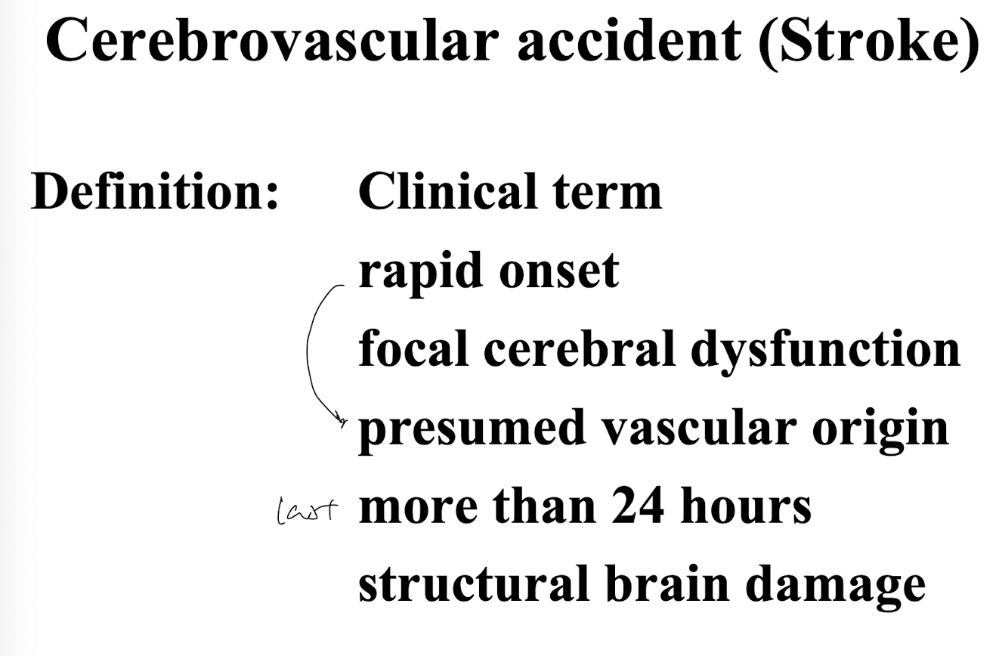
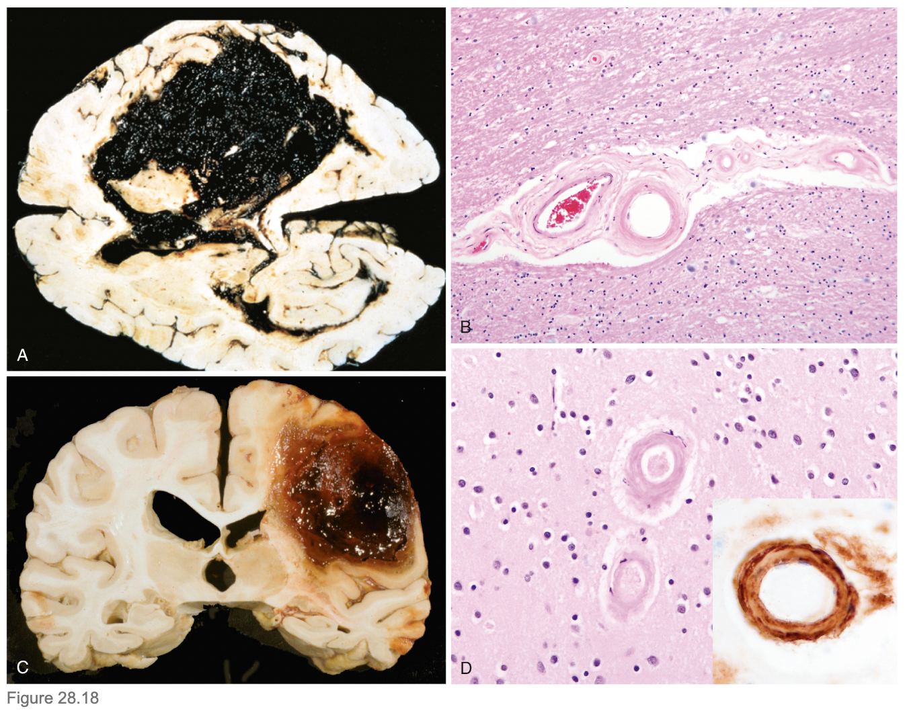

- 14:44
  collapsed:: true
	- [[Relevant Notes]] [[Stroke]]
		- [[Permanent Notes]] [[Cerebrovascular accident, or stroke, is the rapid onset of cerebral dysfunction that lasts for more than 24 hours of vascular origin, resulting in irreversible structural damage to the brain parenchyma]]
			- [[Reference Notes]] Lecture Notes: HNS16
				- 
			- [[Literature Notes]] A cerebrovascular accident is defined as a rapidly onset neurological deficits of presumed vascular origin, lasting for 24 hours, and eventually results in infarction, an irreversible damage to the cerebral parenchyma.
				- Cerebrovascular accident (stroke) is defined on clinical terms.
					- It refers to a clinical condition, with a rather rapid onset (acute onset), and hence a presumed vascular origin, lasting for more than 24 hours.
					- It is marked by focal cerebral dysfunction, and structural brain damage.
				- A stroke differs from a transient ischaemic attack in terms of its reversibility, and its duration, where a transient ischaemic attack:
					- Lasts for less than 24 hours.
					- Generally reversible, and resolves on its own.
					- Not characterised by structural brain damage.
			- [[Fleeting Notes]] Transient ischaemic attacks do not cause infarction of brain parenchyma, but a stroke does.
				- A stroke is involves acute onset of neurological deficits that is of pressumed vascular origins. It results in irreversible structural brain damage.
				- A stroke should always be contrasted with a transient ischaemic attack (TIA), which is also involves acute onset of neurological symptoms, and is also of pressumed vascular origin. But is irreversible, and does not actually cause cerebral infarction.
					- *What transient ischaemic attack is to stroke is what angina pectoralis is to myocardial infarction.*
- 15:12
  collapsed:: true
	- [[Relevant Notes]] [[Classification]]
		- [[Permanent Notes]] [[Stroke is classified into two groups, each with different underlying pathologies]]
			- [[Reference Notes]] [Robbins: Focal cerebral ischaemia](https://www-clinicalkey-com.eproxy.lib.hku.hk/#!/content/book/3-s2.0-B9780323531139000285?scrollTo=%23hl0001855:~:text=well%20as%20necrosis.-,Focal%20Cerebral%20Ischemia,-Focal%20cerebral%20ischemia)
				- 
			- [[Literature Notes]] Strokes can be classified into ischaemic stroke or haemorrhagic stroke, each with distinct underlying pathology.
				- A stroke is classified into ischaemic stroke or haemorrhagic stroke (both of vascular origins).
					- Ischaemic stroke is often caused by the occlusion of its blood supply, where it may be due thrombotic occlusion, as a result of acute plaque change of atherosclerosis.
						- These atherosclerotic plaques usually occur at the carotid bifurcation, origin of the middle cerebral artery, and either ends of the basillar artery.
					- However, it is more likely to be caused by an embolic effect, usually from cardiac mural thrombi. Think atrial fibrillation and valvular heart diseases.
						- These emboli often lodge into the areas of stenosis, usually stable aetherosclerotic plaques that have developed over years.
					- A haemorrhagic stroke is caused by the rupture of the vascular wall.
				- It should be noted that ischaemic stroke (84%) is more common than haemorrhagic stroke (16%).
			- [[Fleeting Notes]]
- 15:44
  collapsed:: true
	- [[Relevant Notes]] [[Classification of infarct]]
		- ((63bd7e0b-9470-466c-876c-b5801260fcdf))
		- [[Permanent Notes]] [[An infarct caused by an ischaemic stroke can be broadly classified into two groups]]
			- [[Reference Notes]] [Robbins: Focal cerebral ischaemia](https://www-clinicalkey-com.eproxy.lib.hku.hk/#!/content/book/3-s2.0-B9780323531139000285?scrollTo=%23hl0001855:~:text=well%20as%20necrosis.-,Focal%20Cerebral%20Ischemia,-Focal%20cerebral%20ischemia)
			- [[Literature Notes]] Infarction as a result of ischaemic stroke are broadly classfied into two groups, with distinct pathologies and histopathologies.
				- Because a stroke is characterised by structural brain damage, where in the case of ischaemic stroke, it is results in irreversible cerebral infarction.
				- Cerebral infarcts are divided into two broad groups. A non-haemorrhagic infarct, and a haemorrhagic infarct.
					- A non-haemorrhagic infarct is also called a pale infarct, and usually occurs in areas that do not receive collateral blood supply
						- Its pathology:
							- Initially, it appears as a pale, soft and swollen.
							- The dead tissue eventually liquefies, leaving a fluid filled cavity, resulting in a cystic infarct.
						- Its histopathology:
							- Ischaemic neuronal change: Increase in eosinophilia (red neurons)
							- Followed by neutrophil infiltration, and subsequent replacement with macrophages.
							- Resorption of infarct, microgliosis, and astrocytosis
					- A haemorrhagic infarct is often caused by a recanalised obstruction (repurfusion),  or due to the presence of collateral blood supply.
			- [[Fleeting Notes]]
- 17:35
  collapsed:: true
	- [[Relevant Notes]] [[Brain bleed]]
		- ((63b93064-1595-4feb-8c1c-55290c3d0c3d))
		- [[Permanent Notes]] [[Intracranial haemorrhage, or an haemorrhagic stroke can be classified by its location]]
			- [[Reference Notes]]
			- [[Literature Notes]] Intracranial haemorrhage, or a haemorrhagic stroke can be classified by their locations found.
				- Intracranial haemorrhage, or haemorrhagic stroke constitutes the minor part of cerebrovascular accidents (stroke)
					- In a sense, they can be classified by the locations found.
						- Intracerebral
						- Subarachnoid
						- Extradural or subdural are usually caused by head trauma
			- [[Fleeting Notes]]
- 17:46
  collapsed:: true
	- [[Relevant Notes]] [[Pathogenesis of intracerebral haemorrhage]]
		- [[CPR64 Pathology of hypertension]]
		- ((63bbcc8e-89f2-4e15-93a8-2d06221d3358))
		- [[Permanent Notes]] [[There are various causes of intracerebral haemorrhage, the most common being a complication of hypertension]]
			- [[Reference Notes]] [Robbins: Intraparenchymal haemorrhage](https://www-clinicalkey-com.eproxy.lib.hku.hk/#!/content/book/3-s2.0-B9780323531139000285?scrollTo=%23hl0001855)
				- ## Intraparenchymal Hemorrhage
					- Rupture of a small intraparenchymal vessel can result in a primary hemorrhage within the brain, often associated with sudden onset of neurologic symptoms (stroke); this should not be confused with the secondary hemorrhagic transformation of an occlusive infarct (described earlier). Spontaneous (nontraumatic) intraparenchymal hemorrhages occur most commonly in middle to late adult life, with a peak incidence at about 60 years of age. Hemorrhages in the basal ganglia and thalamus are commonly designated “ganglionic hemorrhages,” whereas those that occur in the lobes of the cerebral hemispheres are called “lobar hemorrhages”; the two major causes of these patterns of hemorrhage are hypertension and cerebral amyloid angiopathy, respectively. In addition, other local and systemic factors may cause or contribute to nontraumatic hemorrhage, including systemic coagulation disorders, neoplasms, vasculitis, aneurysms, and vascular malformations.
					- **Hypertension is the risk factor most commonly associated with deep brain parenchymal hemorrhages,** accounting for more than 50% of clinically significant hemorrhages and for roughly 15% of deaths among individuals with chronic hypertension. *Hypertensive intraparenchymal hemorrhage* may originate in the putamen (50% to 60% of cases), thalamus, pons, cerebellar hemispheres (rarely), and other regions of the brain ( [Fig. 28.18A](https://www-clinicalkey-com.eproxy.lib.hku.hk/f0095) ). Hypertension leads to a number of vessel wall abnormalities, including accelerated atherosclerosis in larger arteries, hyaline arteriolosclerosis in smaller arteries, and (in severe cases) proliferative changes and frank necrosis of arterioles. Arteriolar walls affected by hyaline change ( [Fig. 28.18B](https://www-clinicalkey-com.eproxy.lib.hku.hk/f0095) ) are thickened but more vulnerable to rupture than normal vessels; these changes are most prominent in the basal ganglia and the subcortical white matter. As described earlier, if small arteries affected by hyaline arteriolosclerosis do not rupture but are occluded, the result is lacunar infarction.
					- 
					- (A) Massive hypertensive ganglionic hemorrhage rupturing into a lateral ventricle. (B) Hyaline arteriolosclerosis (fibrosis and thickening of the arteriolar walls) develops in the basal ganglia and subcortical white matter of patients with long-standing hypertension; it is a risk factor for hypertensive hemorrhages as well as lacunar infarcts. (C) Large lobar hemorrhage due to cerebral amyloid angiopathy; it focally dissects into the subarachnoid space. (D) Amyloid deposition in cortical arterioles in cerebral amyloid angiopathy.
			- [[Literature Notes]] There are various causes of intracerebral haemorrhage, the most common being a complication of hypertension.
				- Regarding the pathogenesis, haemorrhages within the brain are caused by 1) degenerative changes of vessels to hypertension, 2) structural lesions such as arteriovenous malformations, and carvenous malformations, and 3) tumours.
					- The most common cause is hypertension.
						- Often, microaneurysms that are not visible to the naked eye develop. These can rupture, resulting in a bleed.
						- 15% of of deaths among individuals with chronic hypertension is associated with intracranial haemorrhage.
						- These usually occur in the basal ganglion region, thalamus, pons and cerebellum.
					- Cerebrovascular lesions such as carveneous malformation, arteriovenous malformations, saccular aneurysms, berry aneurysms, not associated with hypertension also may develop and have the tendency to rupture.
					- A cerebral infarct as a result of ischaemic stroke, can turn haemorrhagic.
					- So does a brain tumour.
			- [[Fleeting Notes]]
- 18:23
  collapsed:: true
	- [[Relevant Notes]] [[Berry]]
		- [[Permanent Notes]] [[Saccular aneurysms are not a rare phenomenon, and is one of the more likely causes of subarachnoid haemorrhage]]
			- [[Reference Notes]] [Robbins: Subarachnoid haemorrhage and ruptured saccular aneurysm](https://www-clinicalkey-com.eproxy.lib.hku.hk/#!/content/book/3-s2.0-B9780323531139000285?scrollTo=%23hl0001855)
			- [[Literature Notes]] Saccular aneurysms is not a rare phenomenon, that can rupture and called subarachnoid haemorrhage.
				- A saccular aneurysm is a cerebrovascular malformation located in the circle of willis.
				- Epidemiology:
					- Occurs in 1-2% of the population
					- 90% found in the anterior circulation
					- Associated with APKD, Coarctation of aorta
				- 60% are symptomatic, 90% rupture (usually reaching 5mm-10mm) resulting in a subarachnoid haemorrhage, and 10% exert compression effects.
				- Most subarachnoid haemorrhage is accounted for a rupture aneurysm.
				- It is deadly, 30% die within 24 hours, 50% develop a rebleed.
			- [[Fleeting Notes]]
				- A saccular aneurysm is an aneurysm that develops