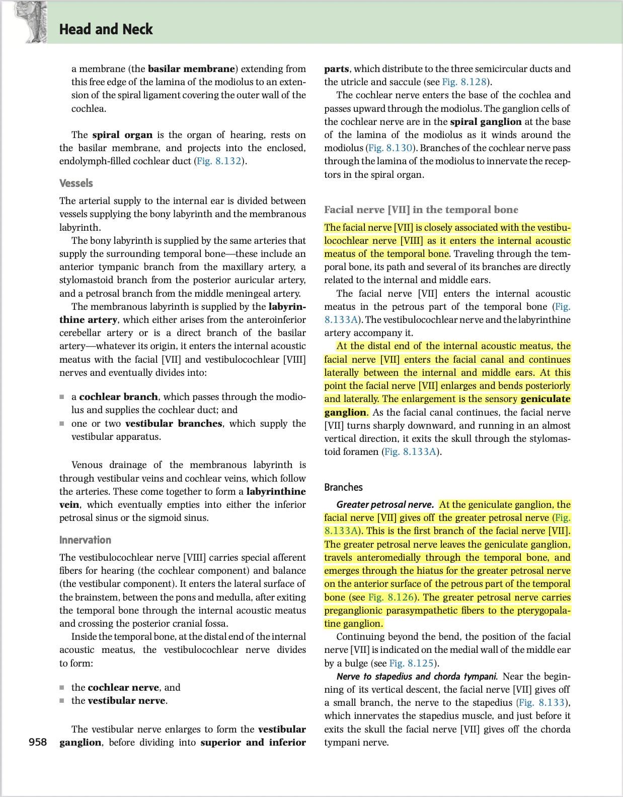
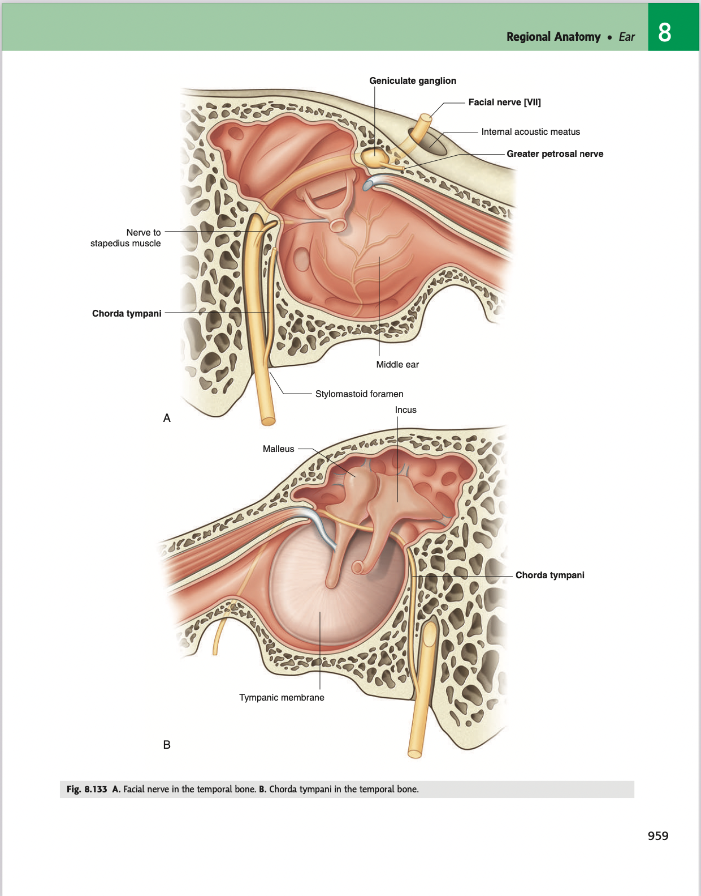
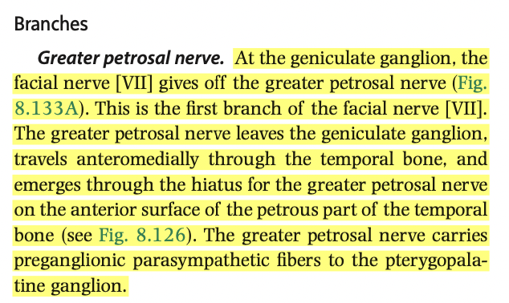

- 15:56
  collapsed:: true
	- [[Relevant Notes]] [[Facial nerve in the temporal bone]]
		- ((63bfc0d0-fbd9-4f0d-982e-5904df0fd639))
		- ((63bd7e0b-0676-4e47-808d-db068d92f9a1))
		- [[Permanent Notes]] [[As the facial nerve emerges from the brainstem, it enters the temporal bone, then drops through the stylomastoid foramen]]
			- [[Reference Notes]] [Gray's anatomy: Ear](https://www-clinicalkey-com.eproxy.lib.hku.hk/#!/content/book/3-s2.0-B9780323393041000087?scrollTo=%23hl0007440)
			  collapsed:: true
				- 
				- 
			- [[Literature Notes]] As the facial nerve emerges from the brainstem, it passes into the internal acoustic meatus, through the facial canal, and exits the skull through the stylomastoid foramen.
				- As the facial nerve emerges from the cerebropontine angle at the brainstem, it accompanies the vestibulocochlear nerve and enters the temporal bone via the internal acoustic meatus.
				- Within the internal acoustic meatus, it expands into the geniculate ganglion, and continues its course between its course between the inner ear and middle ear. It passes into as the facial canal,
					- It's course, marked by the prominence of the facial canal on the medial wall of the middle ear.
				- Along the facial canal, it passes posteriorly and laterally, and sharply drops, and exits the skull through the stylomastoid foramen.
			- [[Fleeting Notes]]
- 16:25
	- [[Relevant Notes]]
		- [[Permanent Notes]]
			- [[Reference Notes]] [Gray's anatomy: Ear](https://www-clinicalkey-com.eproxy.lib.hku.hk/#!/content/book/3-s2.0-B9780323393041000087?scrollTo=%23hl0007440)
				- 
			- [[Literature Notes]]
				- The greater petrosal nerve branches from the geniculate ganglion, and passes anteromedially within the temporal bone.
				- It emerges through the anterior surface of the petrous part of the temporal bone, through the hiatus for the greater petrosal nerve.
				- It conveys preganglionic parasympathetic fibres, that eventually hitchike via the zygomaticotemporal nerve, and that provides parasympathetic stimulation of the lacrimal glands.
			- [[Fleeting Notes]]
- 17:53
	- [[Relevant Notes]]
		- [[Permanent Notes]]
			- [[Reference Notes]]
			- [[Literature Notes]]
				- The tympanic plexus innervates the walls and the contents within the middle ear.
				- The glossopharyngeal nerve exits the skull through the jugular foramen, the gives off the tympanic branch that reenters the middle ear through a small foramen on the temporal bone.
				- The tympanic branch of the glossopharyngeal nerve gives rise to the tympanic plexus, located on the promontory.
				- The tympanic plexus is also contributed by branches from the internal carotid plexus (caroticotympanic nerves).
				- A branch of the tympanic plexus, the lesser petrosal nerve leaves the middle ear into the temporal bone, and exits the temporal bone through the anterior surface of the temporal bone through the hiatus for the lesser petrosal nerve.
				- It exits the skull through the foramen ovale, and enters the otic ganglion.
			- [[Fleeting Notes]]