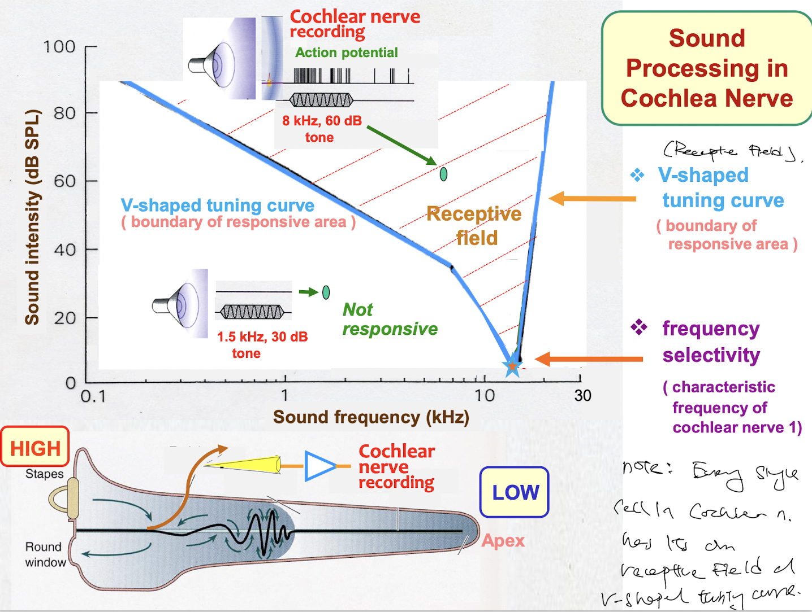

- 13:32
  collapsed:: true
	- [[Relevant Notes]] [[Audition]]
		- [[Permanent Notes]] [[Two sound cues are processed in the ears and the brain]]
			- [[Reference Notes]] Lecture Notes: HNS33
				- {:height 387, :width 480}
			- [[Literature Notes]]
				- There are two sound cues to be distinguished when hearing: Tone and intensity, that is the frequency and amplitude of a sound wave.
				- By comparing the intensity and time lag between left and right, we can delineate the location of the sound.
			- [[Fleeting Notes]]
- LATER 13:32
	- [[Relevant Notes]]
		- [[Permanent Notes]]
			- [[Reference Notes]] Guyton Chapter 53: The sense of hearing
				- {:height 810, :width 581}
			- [[Literature Notes]] In the ear, the ossicular system enables impendence matching for maximal transfer of vibrations from the tympanic membrane to the perilymph. However, this is insufficient, due to the inertia of the fluid. The lever system offered by the ossicular system, and the surface area difference of between the tympanic membrane and oval window helps amplify the force transmission into the inner ear.
				- Impedence matching, surface area ratio, and lever systems of the osseus chain ensure maximal power transfer from air vibration to vibration in the perilymph.
			- [[Fleeting Notes]] Impedence matching in the middle ear is inssuficient. Amplitude of the wave is amplified via the lever system of the ossicular system, and the surface area difference between the two membranes to cause a sufficient amplitude of vibration in the perilymph.
				- Impedence alone, by matching impedence of the ossicular system and the perilymph is insufficient for transmission of vibration to the perilymph.
				- Hence, it must be amplified, by the difference of surface area between the tympanic membrane and oval window, and the lever system of the osseus chain, that enables the amplitude of sound vibrations to be sufficient (lying in the receptive field for the V-shaped tuning curve).
- 13:45
  collapsed:: true
	- [[Relevant Notes]] [[Functional anatomy of the cochlea]]
		- [[Permanent Notes]] [[The cochlea is a system of 3 canals arranged into a snail shape]]
			- [[Reference Notes]] Guyton Chapter 53: Sense of hearing - Functional anatomy of the cochlea
				- {:height 805, :width 555}
				- {:height 745, :width 533}
			- [[Literature Notes]]
				- Functional anatomy of the cochlea
					- The cochlea is a snail-shaped structure, and is a system of coiled tubes.
					- It consist of 3 tubes:
						- The upper scala vestibuli
						- The middle scala media
						- and the lower scala tympani
					- The upper and lower canal are filled with perilymph, the middle is filled with endolymph
					- The upper and middle canal are separated by the vestibular membrane.
						- But because the membrane is so thin, it does not obstruct the transmission of sound vibrations between the two canals.
						- One can consider the two canals as one.
					- The middle and lower canal are separated by the basilar membrane, which houses the organ of corti.
						- From the basilar membrane, basilar fibres project from the helicotremma to the outer wall
						- Fibre height increases towards the helicotremma, but decreases in diameter. This results in a decrease in stiffness from the base to the apex.
						- And as a result, basilar fibres at the base resonate at high frequencies, and those at the apex resonate at a lower frequency.
			- [[Fleeting Notes]]
- 14:16
  collapsed:: true
	- [[Relevant Notes]] [[Sensory transduction]]
		- [[Permanent Notes]] [[The organ of corti on the basilar membrane converts vibration of the basilar membrane into action potentials]]
			- [[Reference Notes]] Guyton Chapter 53: Sense of hearing (Function of the organ of corti)
				- 
			- [[Literature Notes]] The organ of corti converts vibration of the basilar membrane into action potentials.
				- The organ of corti is as the functional unit of the cochlea. Similar to all things in the sensory system, at one point, various stimuli is converted into action potentials. The organ of corti converts vibrations of the basilar membrane into action potential that eventually travel along the cochlea nerve.
				- The organ of corti lies on the basilar fibres of the basilar membrane.
					- It consists of the rods of corti, and the reticular lamina.
					- Hanging off the reticular lamina. the actual receptive cells, hair cells.
					- Hair cells are embedded in the gel coating of the tectorial membrane.
			- [[Fleeting Notes]]
- 14:27
  collapsed:: true
	- [[Relevant Notes]]
		- [[Permanent Notes]]
			- [[Reference Notes]]
			- [[Literature Notes]] When the basilar membrane bulges towards the scala vestibuli, hair cells of the organ of corti depolarise.
				- Hair cells consist of stereocilia (or hair) that is touching, or embedded on the gel layer of the tectorial membrane.
				- Similar to the sense of equilibrium, the direction of displacement of the stereocilia determines whether it depolarises or hyperpolarises.
				- The stereocilia becomes progressively longer on the side of the hair cell away from the modiolus, and the tops of the short cilia is attached via thin filaments to the longer sterocilia.
					- When displaced towards the longer cilia, it results in opening of cation channels, allowing K+ influx from K+ rich endolymph, that depolarises the hair cells.
					- Hair cells release excitatory neurotransmitter (possibly glutamate) that excites the cochlear fibres.
				- When basilar fibres bend toward the scala vestibuli, the hair cell depolarize, and in the opposite direction, they hyperpolarise.
			- [[Fleeting Notes]]
- 14:41
  collapsed:: true
  :LOGBOOK:
  CLOCK: [2023-01-13 Fri 21:18:06]
  :END:
	- [[Relevant Notes]] [[Frequency discrimination]]
		- [[Permanent Notes]] [[Varying properties of basilar fibres along the basilar membrane in the cochlea results in a tonotopic organisation along the basilar membrane]]
			- [[Reference Notes]] Guyton Chapter 53: Sense of hearing
				- 
				- 
				- 
				- 
			- [[Literature Notes]] Varying mechanical properties of the basilar fibres along the basilar membrane allows for tonographic organisation along the basilar membrane enabling frequency discrimination.
				- Because basilar fibres near the base is shorter and thicker, and the basilar fibres at the helicotremma are longer and thinner.
				- As a result, basilar fibres near the base are stiffer, and those at the helicotremma is floppy, basilar fibres at the base resonate at a higher frequency, while those at the helicotremma resonate at a lower frequency.
				- There is a *tonotopic organisation* of the basilar membrane. To differentiate between tone is to differentiate between the parts of the basilar membrane that is vibrating maximally (which corresponds to the area where hair cells are most stimulated).
			- [[Fleeting Notes]]
- 14:56
  collapsed:: true
	- [[Relevant Notes]] [[Amplitude threshold]]
		- [[Permanent Notes]] [[Each inner hair cell has its receptive field as denoted by its V-shaped tuning curve, such that each tone requires a certain degree of loudness to be heard]]
			- [[Reference Notes]]
			- [[Literature Notes]] For each inner hair cell, it has its own V-shaped tuning curve determining its receptive field, such that auditability depends on frequency, but also amplitude.
				- However, there is an amplitude threshold for hearing sound at different frequencies.
					- Because hearing is not just about tonality. It is also about loudness. If I whisper (that is, at a frequency within the ranges of human hearing, but at a lower amplitude), chances are, you could not hear me.
				- This is known as the V-shaped tuning curve, where at different frequencies, there is an amplitude (sound intensity) threshold that most be met for hearing it.
					- 
					- 
				- The area above the V-shaped tuning curve is the receptive field, that is the sum of sound waves of varying frequency and amplitude that can be heard by us.
			- [[Fleeting Notes]]
- 15:27
  collapsed:: true
  :LOGBOOK:
  CLOCK: [2023-01-14 Sat 18:34:46]--[2023-01-14 Sat 18:34:47] =>  00:00:01
  CLOCK: [2023-01-15 Sun 14:14:48]
  :END:
	- [[Relevant Notes]] [[Ascending auditory pathway]]
	  collapsed:: true
		- ((63c39a02-053a-4264-9521-fbe299c7bdb8))
		- ((63bfde72-7546-4f6b-84d3-65c95831b534))
		- [[Permanent Notes]] [[The ascending auditory pathway is a tonotopic, crossed bilateral pathway involving multiple nuclei that enables hierarchical processing of auditory information]]
			- [[Reference Notes]] Guyton Chapter 53: Sense of hearing (Auditory nervous pathway)
				- 
			- [[Literature Notes]]
				- The ascending auditory pathways:
					- Is tonotopic (Place prinicple)
					- Bilateral
					- Crossed
				- Pathway
					- The cochlear nerve enters the medulla oblongata, and synapse with 2nd order neurons at the cochlear nucleus.
					- It then projects to the superior olivary nucleus.
					- Fibres then run up along the lateral lamniscus, and project to the inferior colliculus.
					- The inferior colliculus then projects to the medial geniculate body of the thalamus and into the auditory cortex.
				- At different relay centres, the receptive field is sharpened by means of lateral inhibition.
			- [[Fleeting Notes]]
- 15:40
  collapsed:: true
	- [[Relevant Notes]] [[From outer to inner ear]]
		- ((63be3ad0-434f-4ff9-8c11-a0e58d2bc248))
		- [[Permanent Notes]] [[Sound is transmitted via air transmission through the external ear, and via mechanical conduction through the middle ear into the inner ear]]
			- [[Reference Notes]]
			- [[Literature Notes]]
			- [[Fleeting Notes]]
				- Sound is initially transmitted by air conduction in the external ear, via vibrations of air particles.
				- Then via the tympanic membrane, sound waves is transmitted via mechanical conduction through osseus chain onto the inner ear.