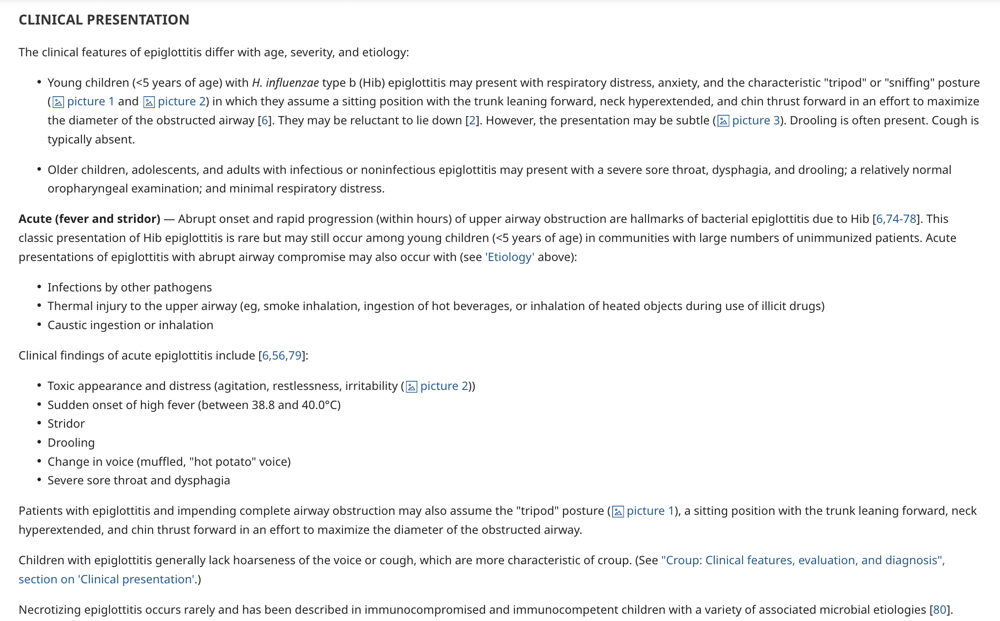
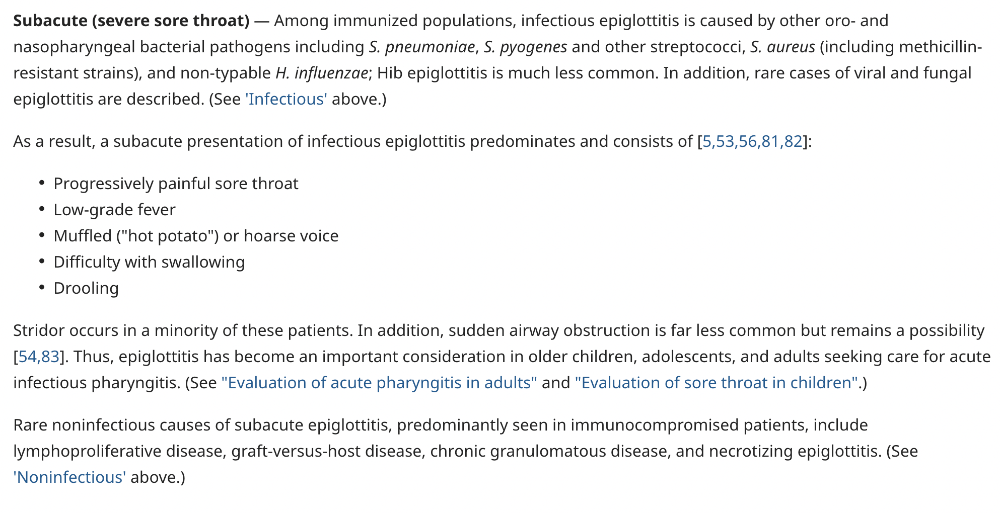

- 11:18
  collapsed:: true
	- [[Relevant Notes]]
		- [[Permanent Notes]]
			- [[Reference Notes]]
			- [[Literature Notes]]
				- Epiglottitis is a rapidly progressive cellulitis over the epiglottis, and involves inflammation of the surrounding structures.
				- It is a medical emergency, as it has the propensity to cause sudden upper airway obstruction.
			- [[Fleeting Notes]]
- 11:21
  collapsed:: true
	- [[Relevant Notes]]
		- [[Permanent Notes]]
			- [[Reference Notes]]
			- [[Literature Notes]]
				- Etiology of epiglottitis
					- Infective cause: Most commonly caused by Haemophilus influenzae type b.
			- [[Fleeting Notes]]
- 11:22
  collapsed:: true
	- [[Relevant Notes]]
		- [[Permanent Notes]]
			- [[Reference Notes]]
			- [[Literature Notes]]
				- Epidemiology of infective epiglottitis
					- Most common occurs in children (2-4 years old).
					- But with the availability of vaccines (but not available in universal childhood immunization programme in Hong Kong), has been less common.
			- [[Fleeting Notes]]
- 11:26
  collapsed:: true
	- [[Relevant Notes]]
		- [[Permanent Notes]]
			- [[Reference Notes]]
			- [[Literature Notes]] Visualisation of epiglottis during airway management confirms the clinical diagnosis of acute epiglottitis. X-Rays and blood cultures are less useful investigations due to their long waiting time.
				- Acute epiglottitis, with impending upper airway obstruction, requires quick identification and management.
					- It all starts with a clinical suspicion, epliglottitis iis a clinical diagnosis.
					- Visualisation of a "cherry-red" epiglottis on laryngoscopy confirms the clinical diagnosis of acute epiglottitis
						- ((63bd7dd1-239e-42fc-afc3-e98f09ce5a5a)) on laryngoscope.
					- Laryngoscope is often used as a diagnosis, as one can immediately secure the airway when required.
					- Other classical investigations have been described, but with limited clinical utility:
						- X-ray and the identification of thumb sign ( ((63bd7dd1-9b96-46bf-b469-ded93c8a97ef)) )
						- Blood culture and pharyngeal culture
						- These tend to incur a long waiting time, and therefore has limited use.
			- [[Fleeting Notes]]
- 11:46
  collapsed:: true
	- [[Relevant Notes]]
		- [[Permanent Notes]]
			- [[Reference Notes]] [UpToDate - Epiglottitis (supraglottitis): Clinical features and diagnosis](https://www-uptodate-com.eproxy.lib.hku.hk/contents/epiglottitis-supraglottitis-clinical-features-and-diagnosis?search=upper%20respiratory%20tract%20obstruction&topicRef=6455&source=see_link#H11)
				- 
				- 
			- [[Literature Notes]]
				- Acute epiglottitis presents with a relatively classical clinical picture. Identifying this clinical picture, coupled with findings of airway obstruction prompts clinical suspicion and airway management.
				- It starts with rapid onset fever (6-12 hours)
				- Onset of respiratory distress:
					- Stridor
					- Assuming a tripod position (chin up, hyperextended neck, leaning forward to maintain patent airway)
				- Dysphagia
				- Dysphonia
				- Drooling
				- Toxic appearance and distress (agitation, restlessness, irritability)
			- [[Fleeting Notes]]
- 11:52
  collapsed:: true
	- [[Relevant Notes]]
		- [[Permanent Notes]]
			- [[Reference Notes]]
			- [[Literature Notes]]
				- Clinical suspicion and clinical findings may prompt airway management.
				- After airway is secure, obtain blood culture, pharyngeal culture and administer IV antibiotics.
			- [[Fleeting Notes]]
- 11:54
  collapsed:: true
	- [[Relevant Notes]]
		- [[Permanent Notes]]
			- [[Reference Notes]]
			- [[Literature Notes]]
				- Peritonsilar abscess, or quinsy is the abscess found in the capsule between the palatine tonsil and the pharyngeal muscles (i.e. in the peritonsilar space).
				- It generally affects adolescents and young adults
			- [[Fleeting Notes]]
- 12:00
  collapsed:: true
	- [[Relevant Notes]]
		- [[Permanent Notes]]
			- [[Reference Notes]]
			- [[Literature Notes]]
				- Quinsy is often a clinical diagnosis:
					- Sore throat
					- Dysphagia
					- Swollen soft palate bulging into the oropharynx
					- Medial displacement of palatine tonsils
					- Deviated uvula
					- Low grade fever
			- [[Fleeting Notes]]