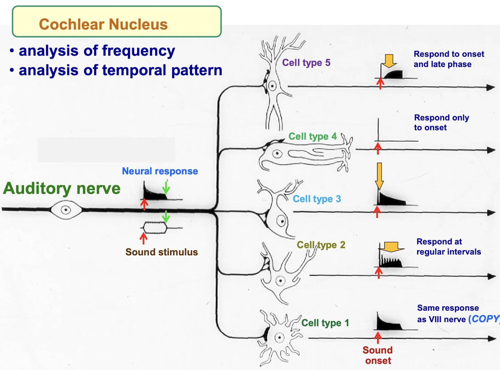
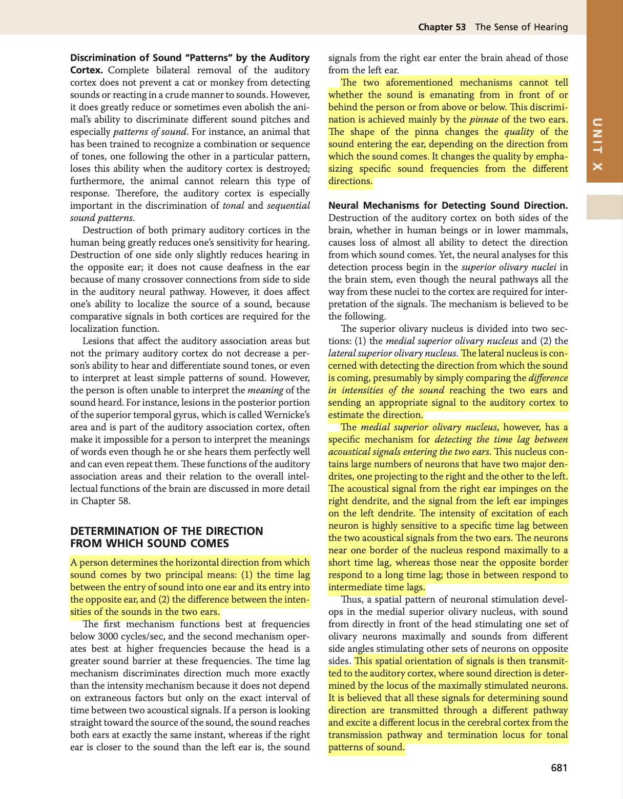
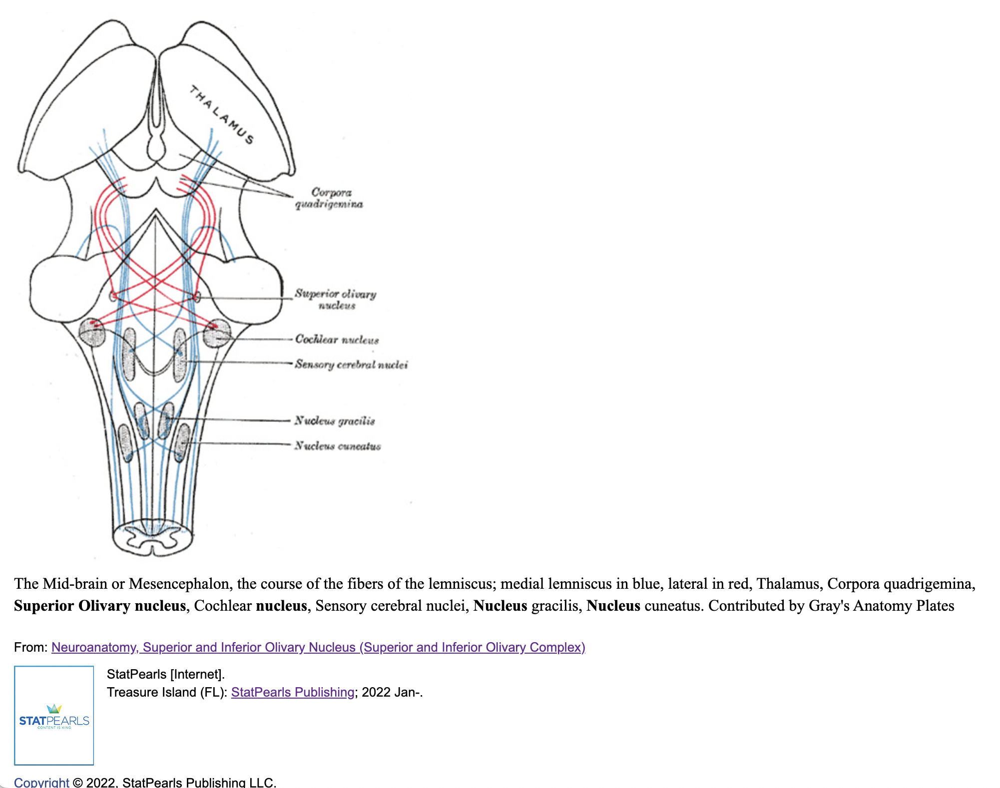
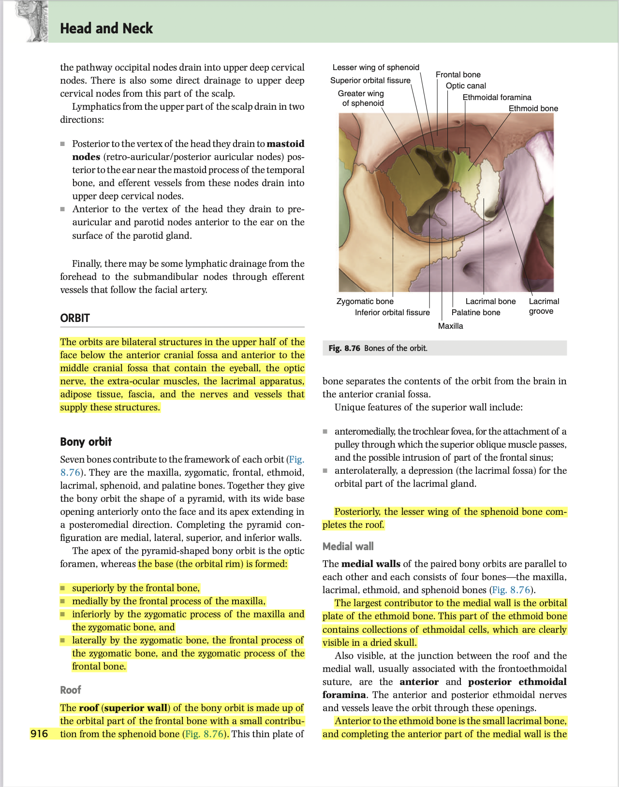
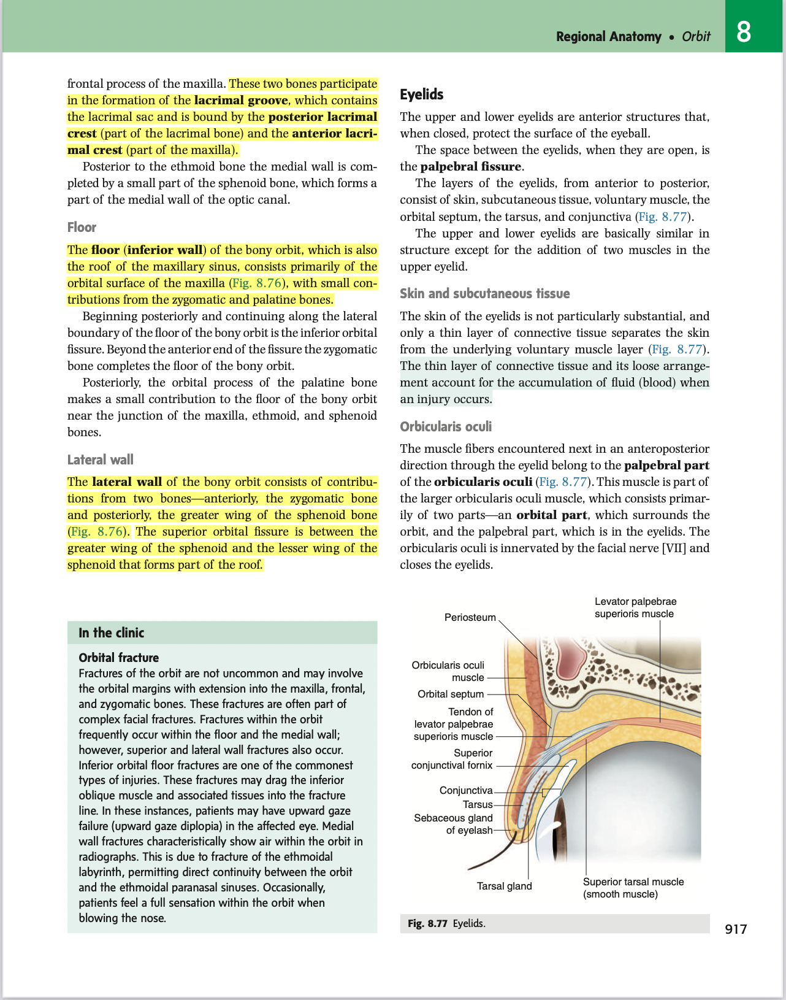

- 14:19
  collapsed:: true
	- [[Relevant Notes]]
		- [[Permanent Notes]]
			- [[Reference Notes]] Lecture notes: HNS33
				- 
			- [[Literature Notes]]
				- There are 5 cell types within the cochlear nucleus, each respond to a particular part of the sound cue.
				- This enables it analyse frequency, and temporal pattern of sound.
			- [[Fleeting Notes]]
- 14:21
  collapsed:: true
	- [[Relevant Notes]]
		- [[Permanent Notes]]
			- [[Reference Notes]] Guyton Chapter 53: Sense of hearing
			  [StatPearls: Neuroanatomy, Superior and Inferior Olivary Nucleus (Superior and Inferior Olivary Complex](https://www.ncbi.nlm.nih.gov/books/NBK542242/)
				- {:height 679, :width 517}
				- 
			- [[Literature Notes]]
				- Determination of the direction of sound simply boils down two two main factors: 1) **Binaural time lag**, and 2) **Difference in intensity**.
					- This can be made sense with a simple thought experiment, if the sound came from the right, the intensity is greater on the right than on the left, and the information from the right side arrives quicker than the left.
				- Crude spatial information is first formulated at the level of the **superior olivary nucleus**, and is fine-tuned as we move up the ascending auditory pathway.
					- The lateral superior olivary nucleus creates a spatial differentiation simply by comparing the intensity (amplitude) difference. It then projects an appropriate signal to the auditory cortex regarding the direction.
					- The **medial superior olivary nucleus** creates a spatial differentiation by the **binaural time lag**.
			- [[Fleeting Notes]]
- 21:19
	- [[Relevant Notes]] [[Orbit]]
		- [[Permanent Notes]] [[The orbit is a bilateral space inferior to the anterior cranial fossa, and anterior to the middle cranial fossa, bordered by various bones of the cranium]]
			- [[Reference Notes]] Grays anatomy: Orbit
				- 
				- 
			- [[Literature Notes]] The orbit is a bilateral, pyramidal space inferior to the anterior cranial fossa and anterior to the middle cranial fossa, bordered by various bones of the skull.
				- The orbit is a paired space in the head that lies inferior to the anterior cranial fossa, and anterior to the middle cranial fossa and superior to the maxillary sinuses.
				- Its roughly pyramidal in shape, where the apex is found deep in the orbital foramen (canal?), and the base is formed by the orbital rim:
					- Superiorly bounded by the frontal bone
					- Medially bounded by the frontal process of the maxilla
					- Inferiorly bounded by the maxilla
					- Laterally bounded by the frontal process of the zygomatic bone
				- Roof
					- The roof is mainly formed by the orbital part of the frontal bone, with small contributions to the lesser wing of the sphenoid bone.
				- Floor
					- Formed mainly by the maxilla, with contributions by the zygomatic bone and the palatine bone
				- Medial wall
					- The medial wall is formed mainly by the orbital plate of the ethmoid bone.
					- Anterior to it, it is characterised by the two the lacrimal bone, as well as the maxilla.
					- Posterior to it, the sphenoid bone contributes to the medial wall of the orbit.
				- Lateral wall
					- The lateral wall is mainly formed anteriorly by the zygomatic bone, and posteriorly the greater wing of the sphenoid bone.
			- [[Fleeting Notes]]