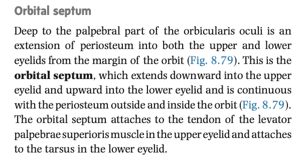
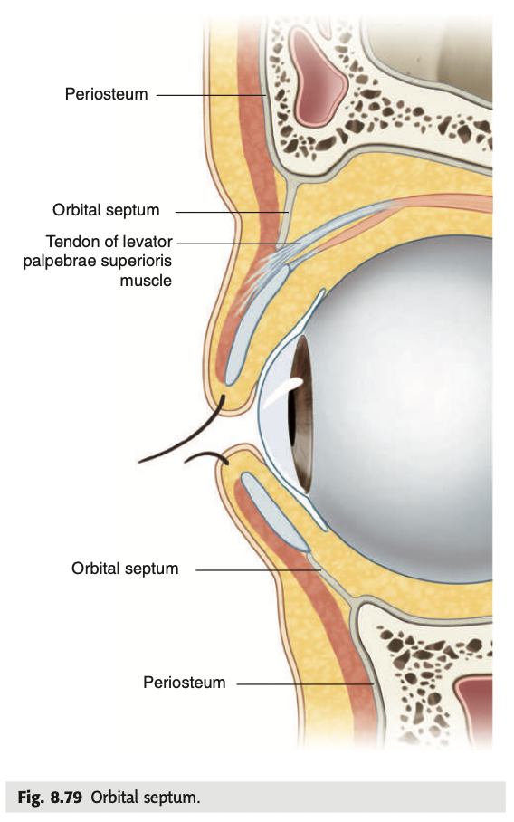
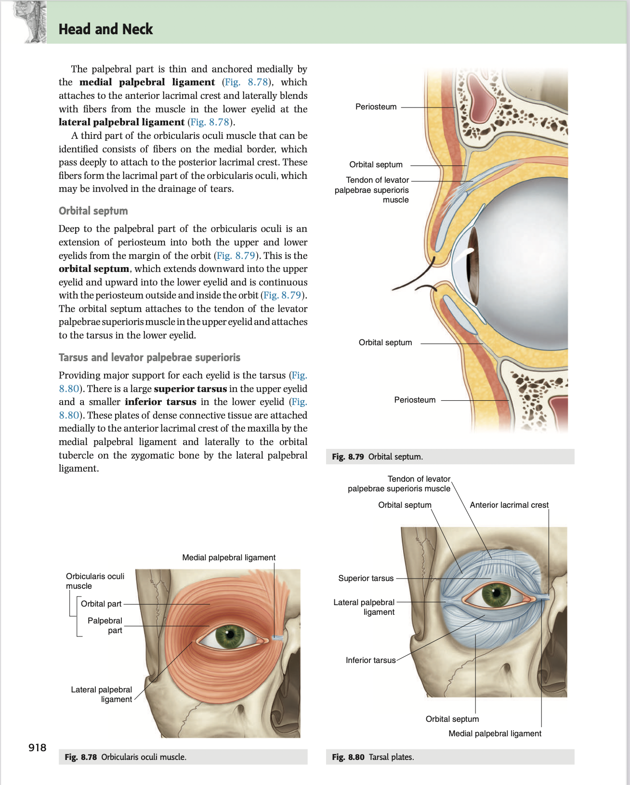
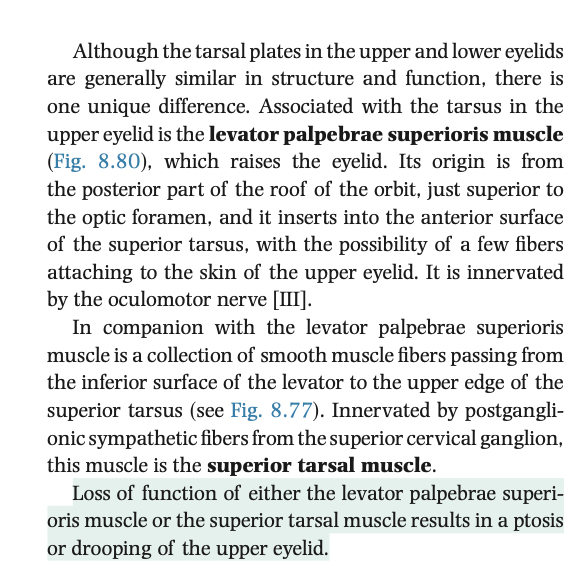

- 19:40
	- [[Relevant Notes]]
		- [[Permanent Notes]]
			- [[Reference Notes]] Gray's anatomy: Orbital septum
				- {:height 255, :width 464}
				- {:height 641, :width 336}
			- [[Literature Notes]]
				- The orbital septum is a fold of periosteum that is continuous from the inner and outer surface of the bones that form the orbital rim.
				- It extends inferiorly into the upper eyelipid, and upwards into the lower eyelid.
				- The orbital septum of the of the upper eyelid serves as the attachment of the levator palpebrae superioris, and the orbital septum of the lower eyelid attaches to the tarsus.
			- [[Fleeting Notes]]
- 19:47
  collapsed:: true
	- [[Relevant Notes]]
		- [[Permanent Notes]]
			- [[Reference Notes]] Gray's anatomy: Tarsus and levator palpebrae superioris
			- {:height 699, :width 446}
			- {:height 504, :width 448}
			- [[Literature Notes]] The levator palpebrae superioris is a muscle that raises the upper eyelid. It's skeletal muscle part is innervated by the occulomotor nerve, while the smooth muscle part is innervated by T1.
				- The levator palpebrae superioris (Levator of the superior eyelid) originates from the posterior part of the roof of the orbit, and inserts onto the superior tarsus (and orbital septum of the upper eyelid), and partly to the palpebrae part of the orbitalis occuli.
				- It is responsible for raising the eyelid, antagonistic to the orbicularis oculi, an orbital group of muscles of facial expression.
				- It is innervated by the occulomotor nerve.
				- Anteriorly, there are smooth muscle fibres that extend from the inferior surface of the levator palpebrae scapuli, and inserts onto the superior tarsus.
					- This receives sympathetic outflow from T1.
			- [[Fleeting Notes]]