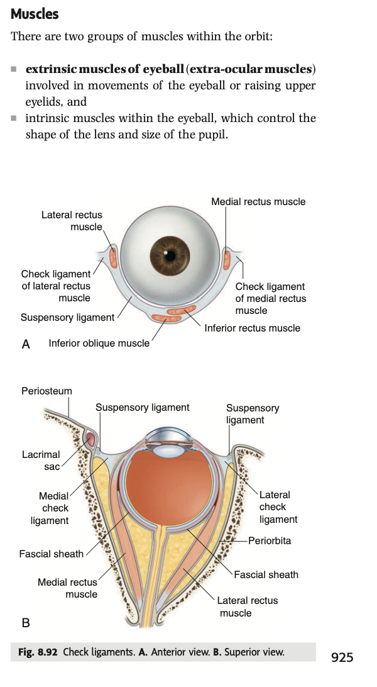
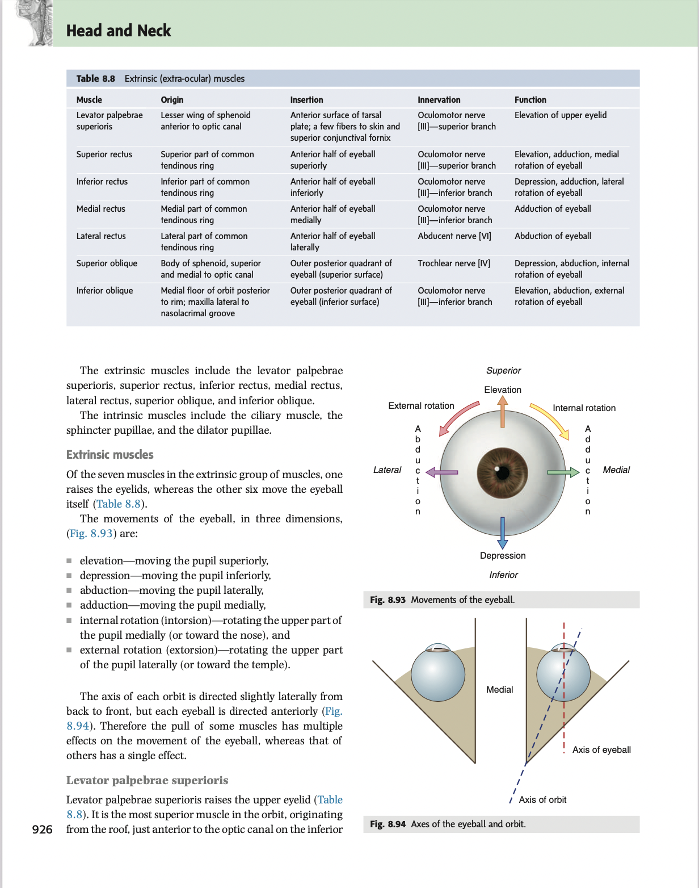
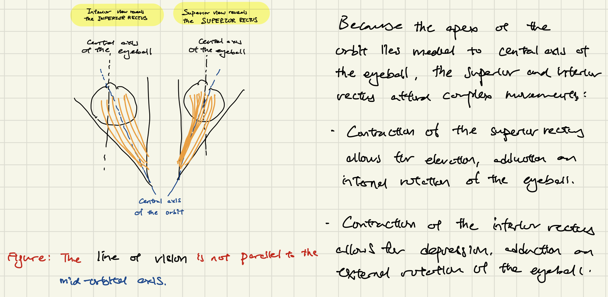
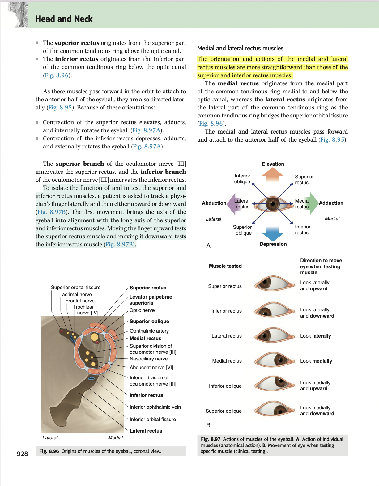
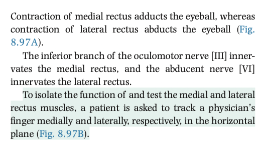
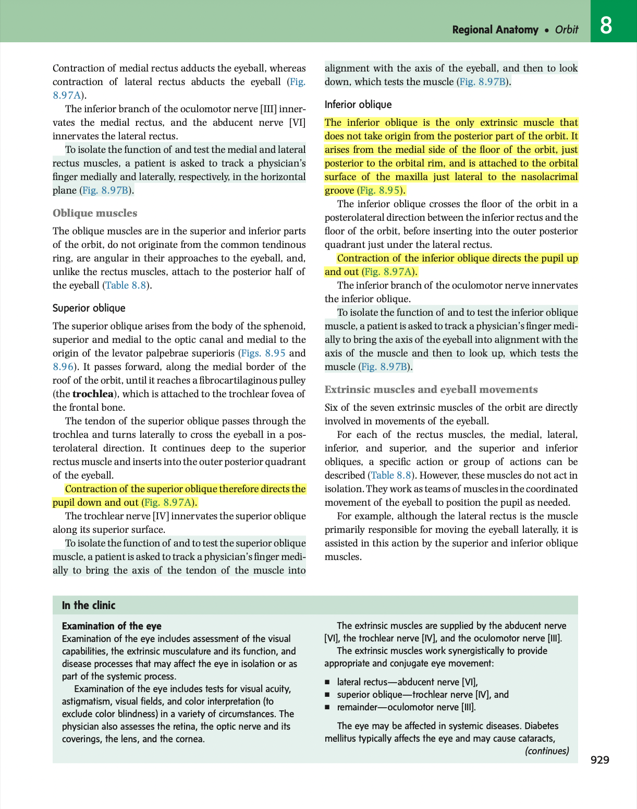

- 12:50
  collapsed:: true
	- [[Relevant Notes]] [[Extraoccular muscles]]
		- [[Permanent Notes]] [[There are 7 extraoccular muscles, one  raises the upper eyelid, while the other 6 move the eyeball]]
			- [[Reference Notes]] Gray's anatomy: Orbit
				- {:height 889, :width 375}
				- 
			- [[Literature Notes]] There are 7 extra-ocular muscles, which either produce movement at the eyeball or the upper eyelid.
				- There are 7 extra-ocular muscles: The 4 rectuses (superior rectus, inferior rectus, medial rectus and the lateral rectus), and the 2 obliques (superior oblique and inferior oblique). The levator palpebrae superioris (which elevates the upper eyelid) is also considered an extra-ocular muscle.
				- The 4 rectuses originate from their corresponding points on the tendon ring, and insert to the corresponding points on the anterior half of the eyeball.
				- The two oblique muscles originate not from the tendinous ring, are angular in their approaches to the eyeball, and insert onto the posterior half of the eyeball.
			- [[Fleeting Notes]]
- 13:21
  collapsed:: true
	- [[Relevant Notes]] [[Superior and inferior rectus]]
		- [[Permanent Notes]] [[The difference in axis of the orbit and eyeball explains why the superior and inferior rectus can afford complex movements]]
			- [[Reference Notes]]
			- [[Literature Notes]] The difference in the axis of the orbit and eyeball explains the complex movement afforded by the superior rectus.
				- 
					- Because the apex lies medially to the line of vision when we look forward, the superior and inferior rectus offers complex movements.
						- The superior
			- [[Fleeting Notes]]
- 13:33
  collapsed:: true
	- [[Relevant Notes]] [[Medial and lateral rectus]]
		- [[Permanent Notes]] [[The medial and lateral rectus enables side-to-side movement of the eyeball]]
			- [[Reference Notes]] Gray's Anatomy: Orbit
				- 
				- 
			- [[Literature Notes]] The medial and lateral rectus offers side-to-side movement of the eyeball.
				- Compared to the superior and inferior rectus, the movement of the medial and lateral rectus is far simpler.
				- The medial rectus originates from the medial part of the tendinous ring, and inserts onto the medial aspect of the anterior half of the eyeball.
					- It is the main adductor of the eyeball.
				- The lateral rectus originates from the lateral part of the tendinous ring, and inserts onto the lateral aspect of the anterior half of the eyeball.
					- It is the main abductor of the eyeball.
			- [[Fleeting Notes]]
- 13:44
  collapsed:: true
	- [[Relevant Notes]] [[Superior and inferior oblique]]
		- [[Permanent Notes]] [[The superior and inferior oblique are key extra-ocular muscles for intorsion and extorsion of the eyeball]]
			- [[Reference Notes]] Guyton Anatomy: Orbit
				- 
			- [[Literature Notes]] The oblique muscles are key muscles that enable intorsion and extorsion of the eyeball due to their angular approach to the eyeball.
				- The oblique muscles do not originates from the tendinous ring, but from the borders of the orbit.
				- Its course is angular to the eyeball (line of vision), and inserts onto the posterior half of the eyeball.
				- The superior rectus originates from the orbital surface of the maxilla, courses anteriorly towards the trochlea.
					- The trochlea serves as a pulley, from which the superior rectus hooks around the trochlea and passes posterolaterally, inserting on the superior surface on the posterior half of the eyeball.
						- mOst importantly the is the posterolaterally-arranged fibres, which determine the movement afforded by the superior rectus muscle.
							- It depresses and allows for internal rotation.
				- The inferior rectus originates from the floor of the orbit, on the medial side. It inserts on the outer posterior quadrant of the eyeball.
				- It enables external rotation, and elevates the eyeball.
			- [[Fleeting Notes]]
- [[Book sources]]
	- Hong Kong Public library - https://libbyapp.com/search/hkpl