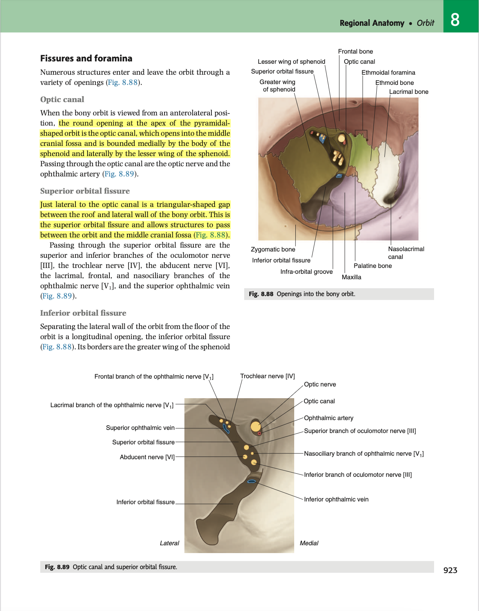
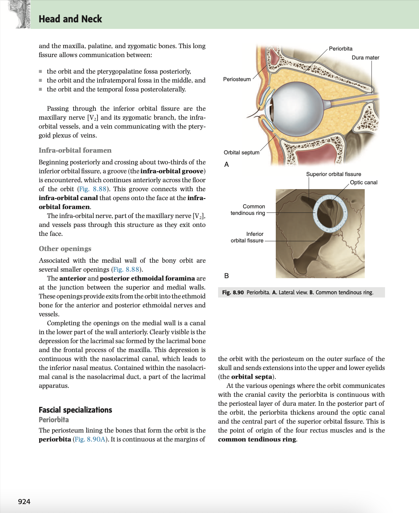

- 19:08
	- [[Relevant Notes]]
		- [[Permanent Notes]]
			- [[Reference Notes]] Gray's anatomy: Orbit
				- {:height 711, :width 461}
				- {:height 630, :width 465}
			- [[Literature Notes]] The orbit is consists of fissures and foramina, which allows for communication between different cavities in the head, enabling the passage of neurovasculature into and out of the orbit.
				- Neurovascular supply must somehow access the orbit through fissures and foramens.
				- There are 3 key fissures and foramina:
					- **Optical canal**
						- The optic canal is found at the apex of the orbit, bordered by the lesser wing of the sphenoid bone, and the body of the sphenoid bone.
						- It allows communication between the orbit and the middle cranial fossa.
						- It is for the passage of the optic nerve and the opthalmic artery (a branch of the internal carotid artery)
					- **Superior orbital fissure**
						- The superior orbital fissure lies lateral to the optic canal, and lies between the roof and the lateral wall of the bony orbit.
						- It allows *communication between the orbit and the middle cranial fossa*.
						- Emerging from the superior orbital fissure inferiorly, is the superior and inferior branch of the **occulomotor nerve**, which sandwiches the **nasociliary nerve** of V1.
						- Emerging superiorly, are the branches of V1, that is the **lacrimal nerve, the frontal nerve**.
						- The **trochlear nerve** also emerges from the supra-orbital fissure.
						- The **superior opthalmic vein** also passes through the superior orbital fissure.
					- **Inferior orbital fissure**
						- The inferior orbital fissure separates the lateral wall from the floor within the bony orbit, being bordered by the greater wing of the sphenoid bone, and the maxilla, palatine bone, and the zygomatic bone.
						- It allows communications between the orbits and:
							- The pterygopalatine fossa posteriorly,
							- The infratemporal fossa in the middle,
							- The temporal fossa posterolaterally.
						- It enables the passage of the zygomatic nerve and inferior orbital nerve of V2, as well as the inferior opthalmic vein.
			- [[Fleeting Notes]]