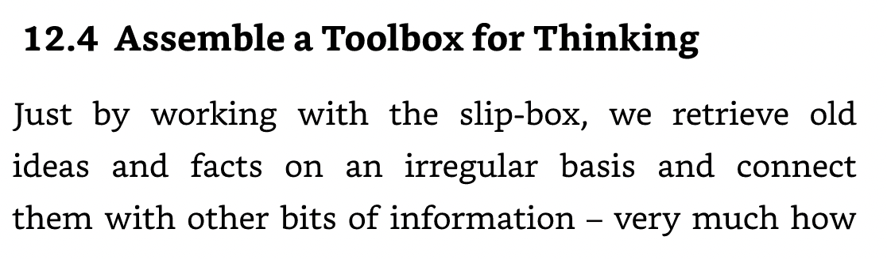
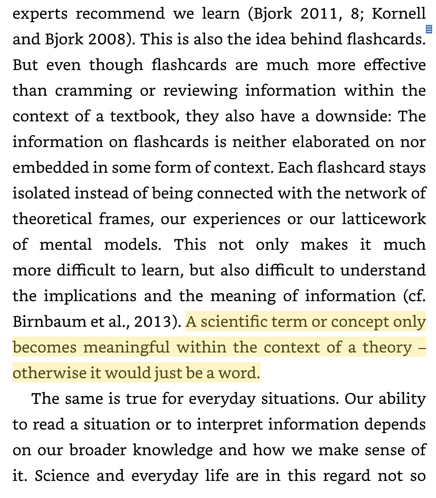
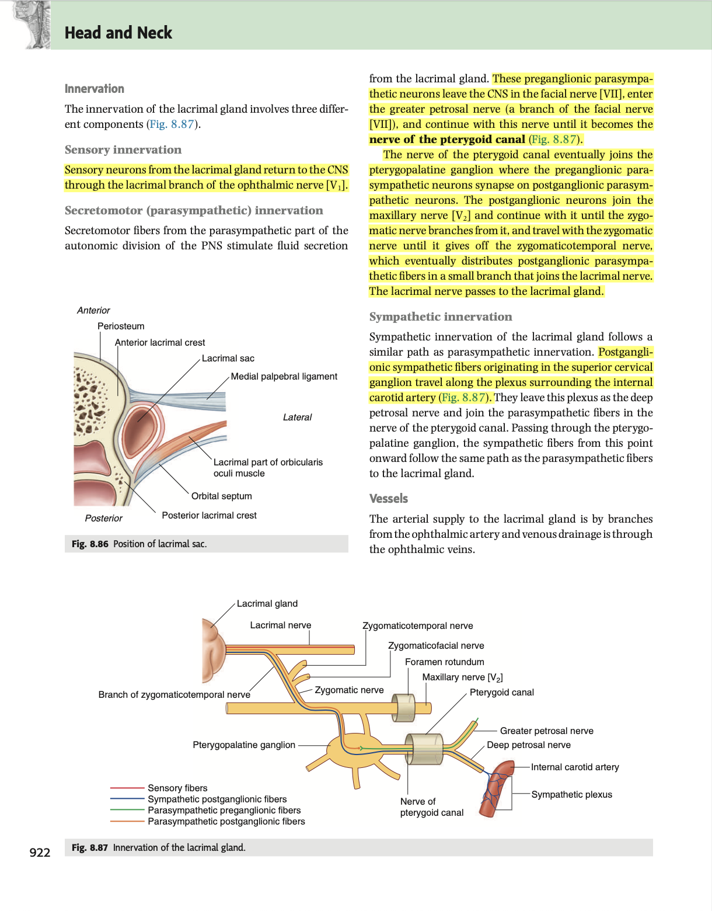
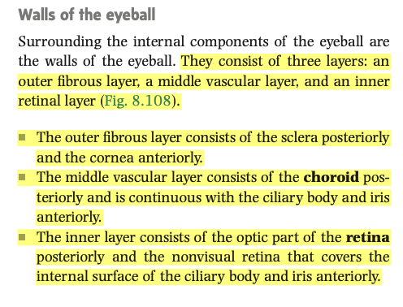
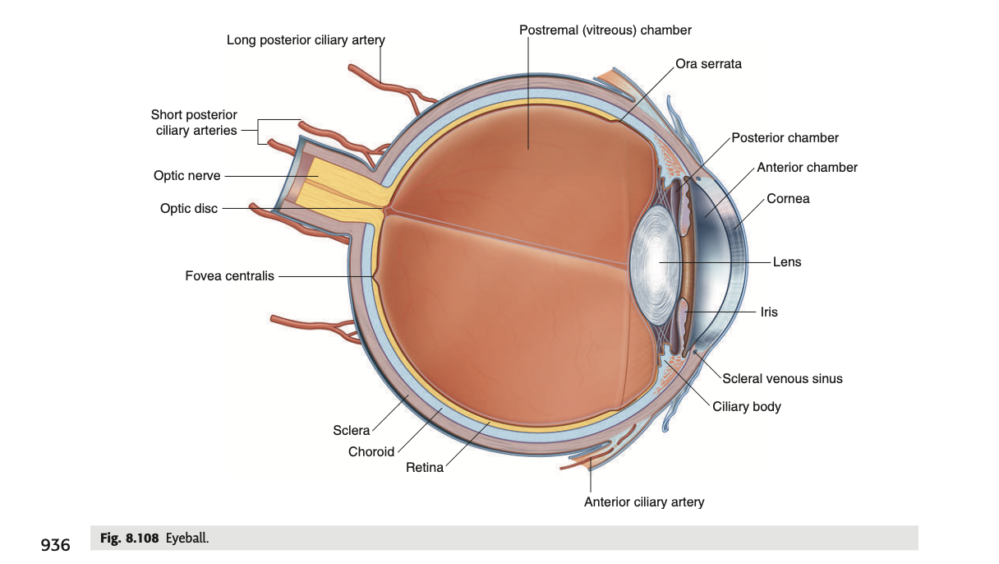
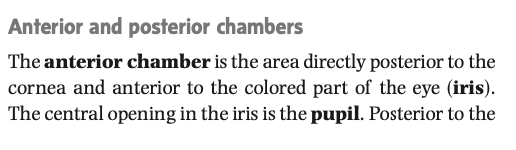
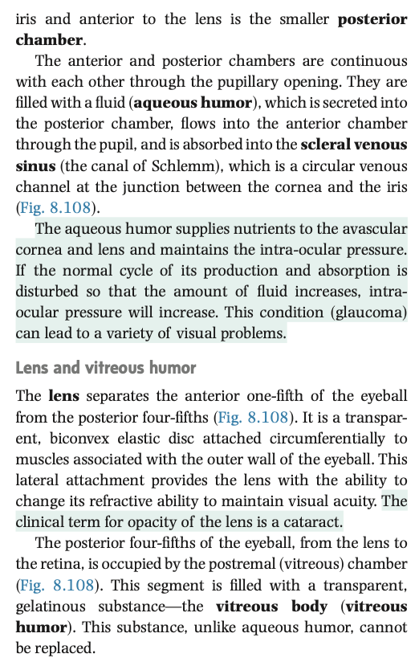
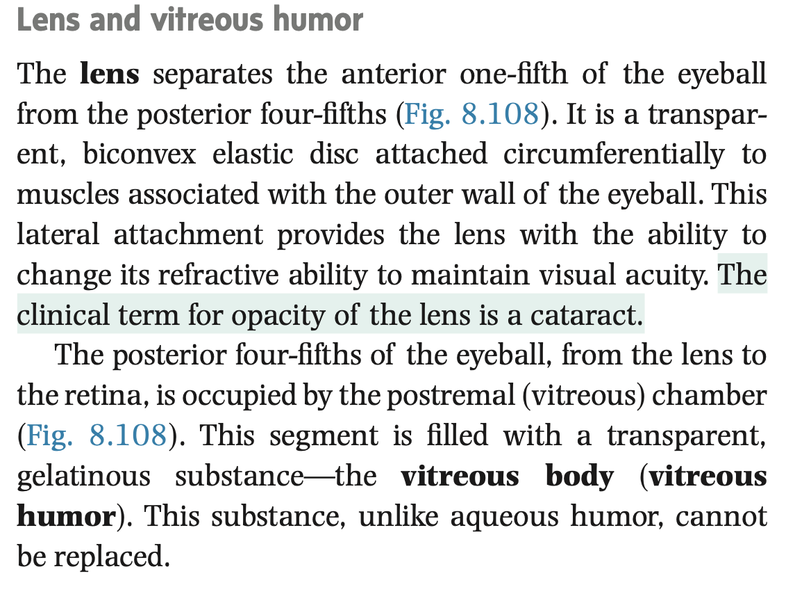

- 09:44
  collapsed:: true
	- [[Relevant Notes]] [[Emergence]]
		- [[Permanent Notes]] [[While a Zettlekasten emphasises on the atomicity of its functional unit, the permanent note, it’s true power lies in its ability for the emergence of structure, enabling mere concepts to coalesce into theories]]
			- [[Reference Notes]] [[How to take smart notes📒]]
				- 
				- 
			- [[Literature Notes]] True power of a zettlekasten is that it allows for concepts to coelasce into theories.
				- The permanent notes with a zettlekasten are based off of atomic ideas.
				- But interplay between ideas, primarily through placing behind another card (physically), and secondarily linking to relevant notes so distant from the system, allows the note to be placed in different context.
				- {{embed ((63ca0759-b924-48a5-b0df-050b95b99e5f))}}
			- [[Fleeting Notes]] While permanent notes are best written as decontextualised concepts, the focus of a zettlekasten is not the atomicity of notes, but the emergence of structure from a mess.
				- Reading Andy’s note on how evergreen note should be atomic, such that it enables dense linking.
				- I did this in MBBS II semester 1. And not to my surprise, it helped deepen my understanding.
				  collapsed:: true
					- I was able to correspond joint structure, to biochemical changes in joint pathologies, and it resulted in the formation of a note I was really proud of: the clinical approach to joint pain.
						- This is really the first time where a bottom up approach worked for me.
							- This drastically helped with performance in PBL tutorials:
								- I demonstrated that understanding the biochemical basis of parhogenesis of OA, corresponds to the progression of its function pathoanatomy viewed on arthroscopy, and it’s manifestations on the radiological signs and physical presentation.
								- All these concepts came from different lectures… I shouldn’t be able to associate them together, unless I physically broke these lectures apart, and synthesised new understanding.
				- However, there was a problem with my approach. Everytime I added a new note, while I was often able to secondarily link to other notes, I often forgot to put the note behind another note on the index.
				  collapsed:: true
					- I didn’t have a defined jumping point. I could only see clusters of notes emerging.
					- Structure is present, because not visible because I didn’t put the notes into an index.
						- Which is the big idea? Which is not?
				- This made it difficult for structure to emerge.
					- For half a year where I focused on the power of atomic ideas, I neglected on the power of structure.
					- The zettlekasten’s focus on ‘one concept one note’ does not intend for the notes to sit in a contextless vacuum, rather it is the decontextualisation of ideas that enables it to exist within different contexts.
						- Context matters. Structure matters.
						- The idea of breaking literature into ideas is not for them to exist freely, but is to use them as building blocks to build structure. Concepts coelasce into theories!
- 16:54
  collapsed:: true
	- [[Relevant Notes]]
		- [[Permanent Notes]]
			- [[Reference Notes]]
			- [[Literature Notes]]
				-
			- [[Fleeting Notes]]
				- Permanent notes are evergreen.
				- With spaced repetition, they should get better.
				- Because everytime we review a piece of information, we subconsciously compare, contrast and differentiate it with the existing information.
				- And as a result, we may remember an article that supports, is similar to, or contradict with the idea presented in your permanent note.
				- And just like a plant, without regularly tending to it, it will die (lose its use).
- 20:10
  collapsed:: true
	- [[Relevant Notes]]
		- [[Permanent Notes]]
			- [[Reference Notes]] Gray's anatomy: Orbit
				- {:height 849, :width 658}
			- [[Literature Notes]] Parasympathetic innervation of the lacrimal gland requires hitchiking through the facial nerve, branches of the maxillary nerve, and branches of the opthalmic nerve.
				- Preganglionic parasympathetic fibres arise from the superior salivary nucleus of the facial nerve.
				- It travels via the facial nerve, then passes through the great petrosal nerve, emerging as the nerve of pterygoid canal, that passes into and synapse at the pterygopalatine ganglion.
				- The pterygopalatine ganglion then hitchike via the zygomaticotemporal nerve (a branch of the maxillary nerve). It then travels via a branch of the zygomaticotemporal nerve to the lacrimal nerve, providing parasympathetic supply.
			- [[Fleeting Notes]]
- 19:16
  collapsed:: true
	- [[Relevant Notes]] [[Eyeball]]
		- [[Permanent Notes]] [[The eyeball is arranged in layers]]
			- [[Reference Notes]] Gray's Anatomy: Orbit
				- 
				- {:height 340, :width 538}
			- [[Literature Notes]] The eyeball is arranged into 3 layers.
				- The anatomy of the eyeball can be thought as 3 layers:
					- The outer fibrous layer, which includes the **sclera** and the **cornea**
					- The middle vascular layer, which includes the **choroid** and its extensions: the **ciliary body** and the **iris**
					- The **inner layer**, which consists of the **retina**
			- [[Fleeting Notes]]
- 19:42
  collapsed:: true
	- [[Relevant Notes]] [[Anterior and posterior chambers]]
		- [[Permanent Notes]] [[The anterior and posterior chambers forms a continuous space that regulates production and reabsorption of aqueous humour, regulating intra-ocular pressure]]
			- [[Reference Notes]] Gray's Anatomy: Orbit
				- 
				- 
			- [[Literature Notes]] The anterior and posterior chambers is a continuous space housing aqueous humour, determining intra-ocular pressure.
				- The anterior chamber and posterior chamber is a continuous space anterior to the lens, housing aqueous humour.
					- The anterior chamber is the space posterior to eyelids, but anterior to the iris.
					- The posterior chamber is the space posterior to the iris, but anterior to the lens.
					- They are continuous through the pupil.
				- Aqueous humour is produced in the posterior chamber, and reabsorbed in the scleral venous sinus.
					- The balance of production and absorption regulates intra-ocular pressure.
			- [[Fleeting Notes]]
- 20:11
  collapsed:: true
	- [[Relevant Notes]] [[Vitreous chamber and vitreous humour]]
		- [[Permanent Notes]] [[The vitreous chamber houses non-replaceable vitreous humour]]
			- [[Reference Notes]]
				- 
			- [[Literature Notes]]
				- The postremal, or vitreous chamber, lies posterior to the lens, and houses vitreous humour.
			- [[Fleeting Notes]]