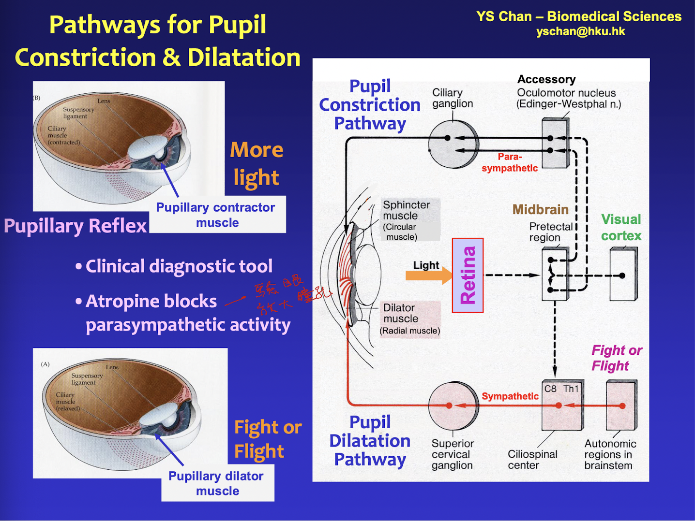
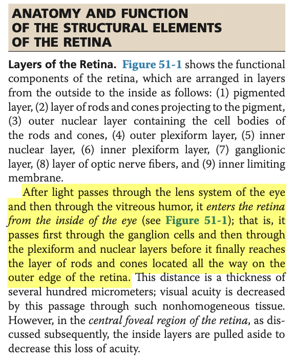
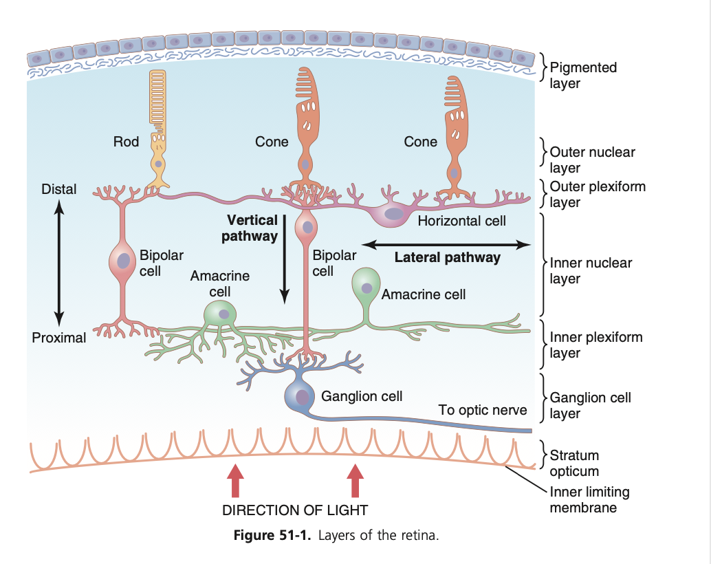
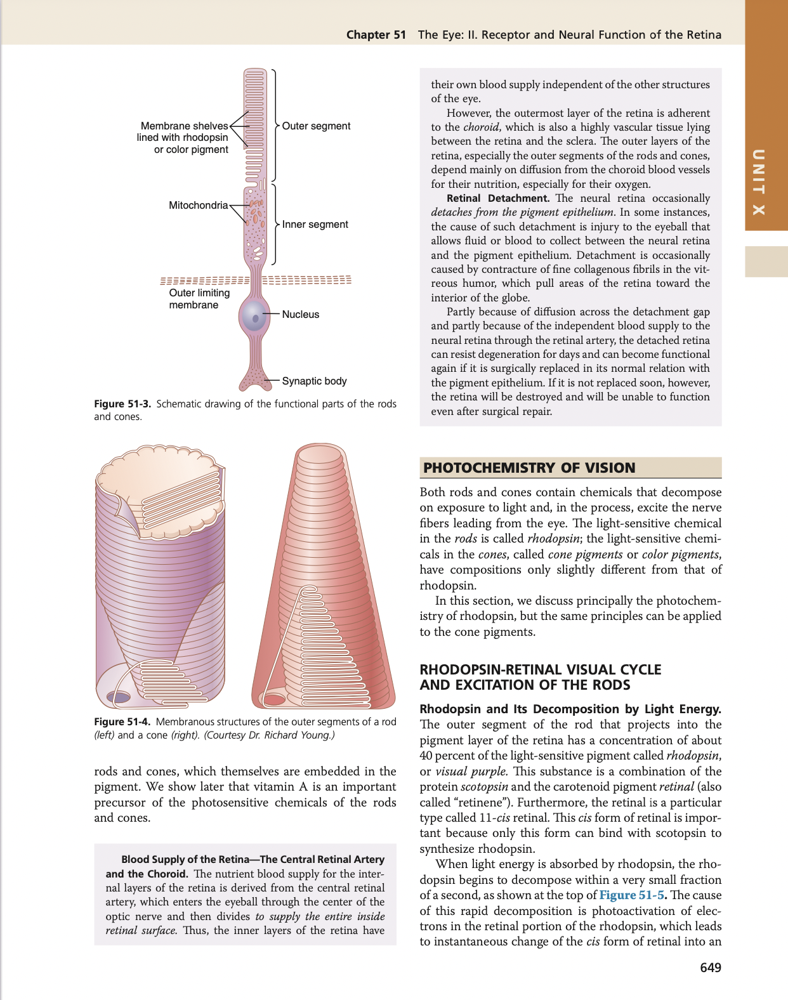
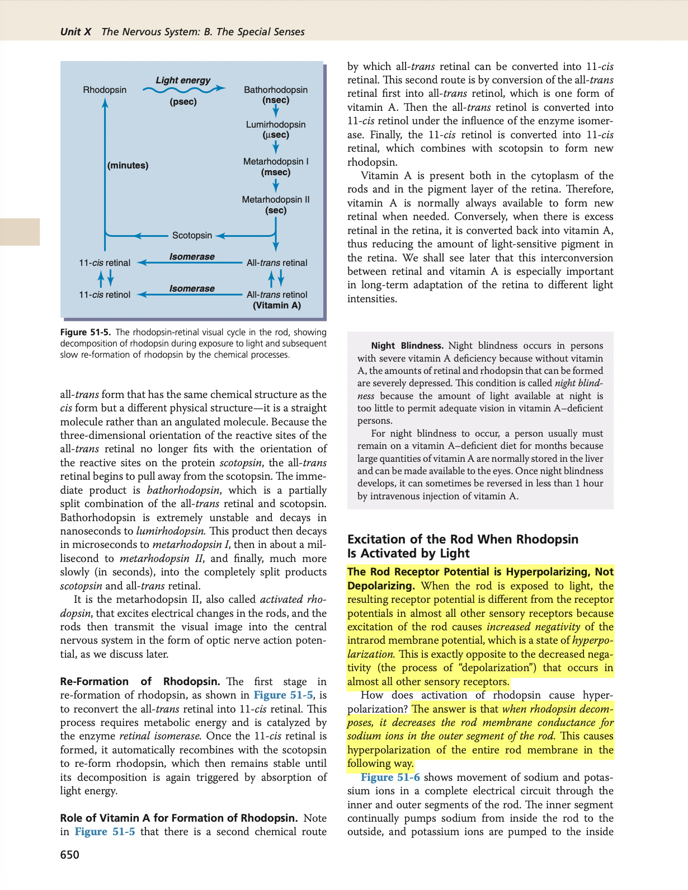
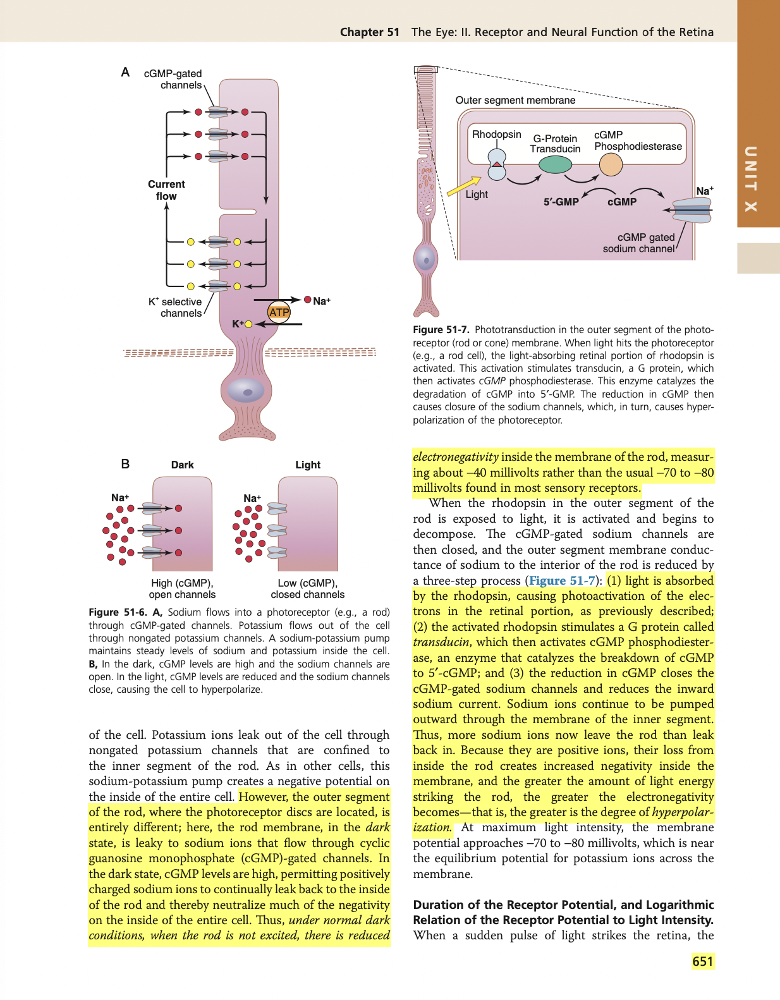
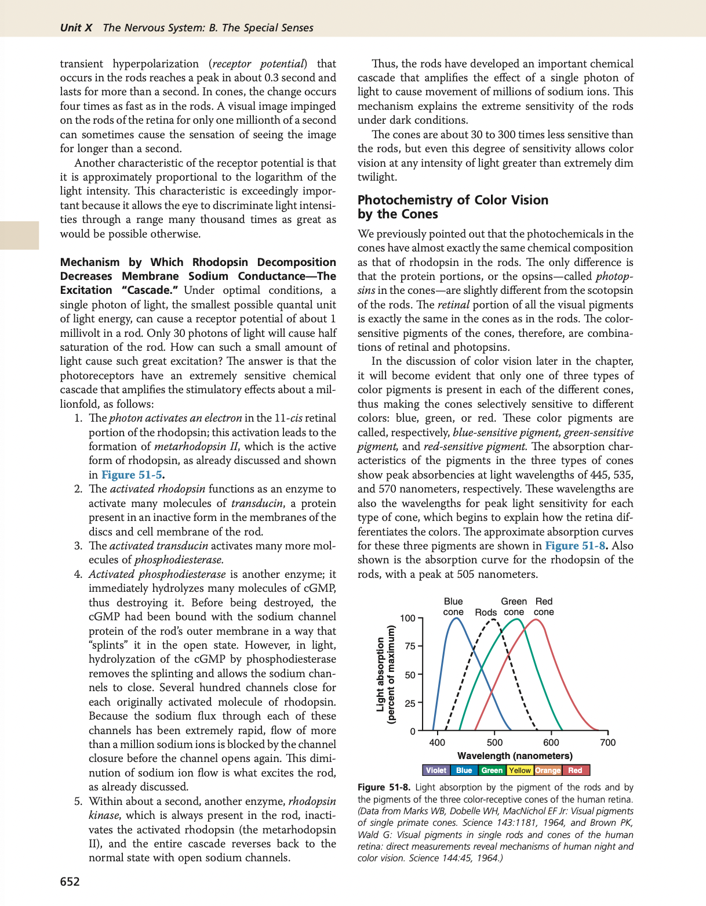
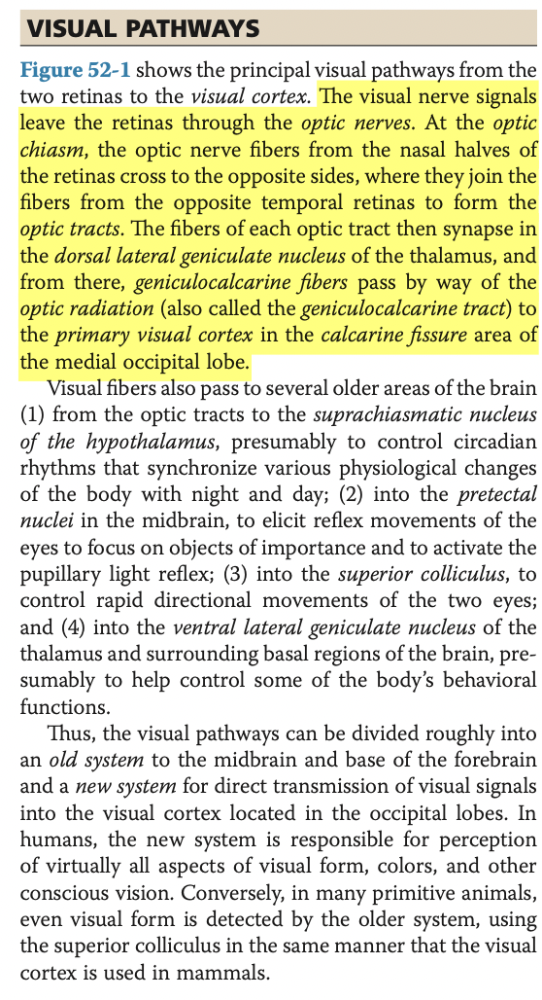

- 09:59
  collapsed:: true
	- [[Relevant Notes]] [[Pupillary light reflex]]
		- [[Permanent Notes]] [[When light is shone into one eye, the circuitry of the reflex arc enables both direct and consensual pupillary reflex that protects the eyes]]
			- [[Reference Notes]]
			- [[Literature Notes]] When light is shone into one eye, the reflex arc enables both direct and consensual pupillary reflex.
				- The pupillary reflex is an autonomic reflex in which light shone onto one eye results in bilateral reflex constriction of both eyes.
				- It regulates the amount of light entering the eye.
				- Reflex arc
					- When the retinal ganglion cells are stimulate, it generates an action potential that travels via the optic nerve, which synapse with the pretectal nucleus unilaterally.
					- The Pretectal nucleus then stimulates the Edinger-Westphal nucleus bilaterally, which project preganglionic parasympathetic fibres via the occulomotor nerve to the iris.
					- It stimulates the sphincteric pupillae of the irs, casuing bilateral pupillary constriction.
				- Constriction of the ipsilateral eye is called **direct pupillary reflex**, while constriction of the contralateral eye is called **consensual pupillary reflex**.
			- [[Fleeting Notes]]
- 10:26
  collapsed:: true
	- [[Relevant Notes]] [[Pharmacological dilatation]]
		- [[Permanent Notes]] [[Atropine eyedrops dilate the pupils]]
			- [[Reference Notes]] Lecture Notes: HNS38
				- 
			- [[Literature Notes]]
				- Atropine, a muscarinic antagonist blocks parasympathetic activity, thus inhibiting the pupillary reflex.
				- This dilates the pupils.
				- 視光師：滴眼藥水放大瞳孔
			- [[Fleeting Notes]]
- 10:32
  collapsed:: true
	- [[Relevant Notes]] [[Retina]]
		- ((63ca7bb7-6acb-46c8-8590-1eef9cf528b7))
		- [[Permanent Notes]] [[The retina is arranged in 3 layers of cells in a counterintuitive manner]]
			- [[Reference Notes]] Guyton Chapter 51: The Eye: II. Receptor and Neural Function of the Retina
				- {:height 671, :width 439}
				- {:height 374, :width 462}
			- [[Literature Notes]] The retina is organised in 3 layers of cells, which is organised in somewhat of a counterintuitive manner.
				- The retina essentially consist of 3 layers of cells. From innermost to outermost:
					- The retinal ganglion cells, where its axons collect at the optic disc, and passes through the optic nerve
					- The bipolar cells, which conducts action potentials from the photoreceptors to the retinal ganglion cells
					- The photoreceptors, which are the rods and cones.
				- This organisation of cells is quite puzzling, as when light is shone onto the retina, it must pass the retinal ganglion cells and bipolar cells before it can reach the rods and cones, all the way on the outer edge of the retina. Visual acuity is decreased by this passage through such nonhomogenous tissue.
				- But within the fovea (yellow spot), the inner layers of cells are pulled apart to decrease this loss of visual acuity.
			- [[Fleeting Notes]]
- 18:51
  collapsed:: true
	- [[Relevant Notes]]
		- [[Permanent Notes]]
			- [[Reference Notes]] Guyton Chapter 51: Receptor and Neural function of the Retina
				- 
				- 
				- 
				- 
			- [[Literature Notes]] In light, activated rhodopsin hyperpolarises the cell. But in dark, inactivated rhodopsin depolarises the cell, allowing sensory transduction.
				- Activation of rhodopsin in the presence of light hyperpolarizes the rod cell.
				- In the presence of light, rhodopsin degrades into scotopsin and retinal.
				- Retinal activates phosphoesterase that degrades cGMP, thus inhibiting cGMP-gated Na+ channels.
				- The reduced Na+ influx hyperpolarizes the rod.
				- However, in the dark, scotopsin recombines with retinal, such that cGMP levels remain high, enabling the opening of cGMP-gated Na+ channels.
			- [[Fleeting Notes]]
- 19:49
  collapsed:: true
	- [[Relevant Notes]] [[Central visual pathway]]
		- [[Permanent Notes]] [[The central visual pathway describes how visual signals travel from the front of the eye to the back of the brain]]
			- [[Reference Notes]] Guyton Chapter 52: Central Neurophysiology of Vision
				- 
			- [[Literature Notes]]
			- [[Fleeting Notes]]
				- From the front of the eye to the back of the head, the visual pathway denotes the neural circuitry that transmits visual signals from the two retina to the visual cortex.
				- The left visual field is relayed to the right visual cortex, while the right visual field is relayed to the left visual cortex.
				- Retinal bipolar cells project axons through the optic nerve towards the optic chiasm:
					- Retinal bipolar cells from the temperohemiretina do not decussate, and travel to the ipsilateral optic tract.
					- Retinal bipolar cells from the nasal side decussate to the opposite, where they join fibres of the cotralateral temporal hemiretinas.
				- The fibres in optic tract then synapse at the lateral geniculate nucleus of the thalamus, which then project by way of the optic radiation (geniculocalcarine tract) to the primary visual cortex near the calcarine fissure area of the occipital lobe.
					- In essence, the optic tract conveys fibres corresponding the same visual field to the **contralateral** lateral geniculate nucleus, which then project to the contralateral visual cortex.
					- For example, the left visual field (formed on the nasal hemiretina of the left eye and the temporal hemiretina of the right eye) pass via the right optic tract to the right LGN of the thalamus, which relays via the optic radiation to the right visual cortex.