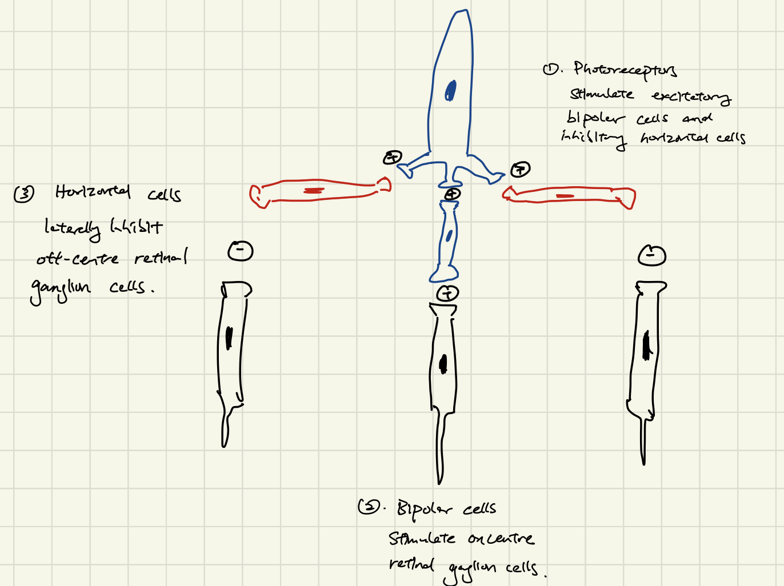

- 11:58
  collapsed:: true
	- [[Relevant Notes]]
		- [[Permanent Notes]]
			- [[Reference Notes]] Conversation with Darren on 20/1/2023 after receiving results of 2nd formative assessment
				- 
			- [[Literature Notes]]
			- [[Fleeting Notes]]
				- I think changing how you study is the quickest way to improve.
				- As mentioned in Outliers, a linear relationship between intrinsic virtues (effort, IQ, time, hustle etc.) and reward holds true only up to a breaking point.
				- The relationship shatters up to a point!
				- Anything beyond this point is irrelevant. No association can be drawn from the difference in these intrinsic virtues.
				-
- 12:02
  collapsed:: true
	- [[Relevant Notes]] [[Reversed and inverted]]
		- ((63ccbb53-46f5-4ba6-b056-67a08a166a46))
		- [[Permanent Notes]] [[Because the image formed on the retina is reversed and inverted, the central visual pathway must run in a way to restore the normal image]]
			- [[Reference Notes]] Crossman Neuroanatomy Chapter 15: Visual system
				- 
				- 
					- As previously noted, objects in either half (left or right) of the visual field produce images upon the nasal hemiretina of the ipsilateral eye and the temporal hemiretina of the contralateral eye ( [Fig. 15.3](https://www-clinicalkey-com.eproxy.lib.hku.hk/f0020) ). Each optic nerve, therefore, carries information concerning both halves of the visual field ( [Fig. 15.5](https://www-clinicalkey-com.eproxy.lib.hku.hk/f0030) ). Because of the decussation of fibres from the nasal hemiretinae at the optic chiasm, however, each optic tract, lateral geniculate nucleus and visual cortex receives information relating only to the contralateral half of the visual field. This combination of the images from both eyes is necessary for stereoscopic vision (depth perception). The upper half of the visual field forms images upon the lower halves of the retinae and the lower half of the visual field forms images upon the upper hemiretinae. As thalamocortical fibres leave the lateral geniculate nucleus they pass around the lateral ventricle, those representing the lower part of the visual field coursing superiorly to terminate in the visual cortex above the calcarine sulcus. Those which represent the upper part of the visual field sweep into the temporal lobe ( **Meyer's loop** , [Fig. 15.6](https://www-clinicalkey-com.eproxy.lib.hku.hk/f0035) ) before terminating below the calcarine sulcus.
				- {:height 419, :width 187}
			- [[Literature Notes]]
			- [[Fleeting Notes]] Because images formed on the retina is **reversed and inverted**, the central visual pathway must run in a way that it restores normal relationship, which requires a point-to-point relationship between retina and visual cortex.
				- Because images formed on the retina is upside-down, and left-right reversed, the visual pathway from the front of the eye to the back of the brain, must run in a way that it restores the normal image.
				- That is, the retino-genicular-calcarine pathway must run in a way that there is a **point-to-point relationship** between the retina and primary visual cortex.
- 12:44
  collapsed:: true
	- [[Relevant Notes]] [[Lateral geniculate nucleus]]
		- [[Permanent Notes]] [[The lateral geniculate nucleus of the central visual pathway serves as a relay of visual information between the optic tract and the primary visual cortex]]
			- [[Reference Notes]] Guyton Chapter 52: Central Neurophysiology of Vision
				- 
				- 
			- [[Literature Notes]] The function of the lateral geniculate nucleus in the central visual pathway is simple: It relays visual information from the optic tract to the primary visual cortex by ways of the optic radiation.
				- The function of the lateral geniculate nucleus of the thalamus, similar to the function of the thalamus, serves as a relay centre.
				- It relays visual information conveyed by the optic tract (regarding a visual field) to the primary visual cortex by way of the optic radiation (the geniculocalcarine tract).
				- From ventral to dorsal, the lateral geniculate nucleus consist of 6 layers of cells:
					- Layer 1 and 2 are the magnocellular layers, which receives signals from the large type M retinal ganglion cells.
						- This is a rapidly conducting pathway, but is only for dark vision (no colour vision). It responds greatly to high contrast, and movement of stimulus.
					- Layer 3 to 6 are the parvocellular cells, which receives signals to smaller type P retinal ganglion cells.
						- This is a slower conducting pathway, but enables colour vision, and precise point-to-point discrimination, which enables fine detail.
			- [[Fleeting Notes]]
- 13:11
  collapsed:: true
	- [[Relevant Notes]] [[Contrast]]
		- [[Permanent Notes]] [[As a result of lateral inhibition by the horizontal cells, retinal ganglion cells function to transmit signals depicting contrast within its receptive field]]
			- [[Reference Notes]] Guyton Chapter 51: Receptor and Neural Function of the Retina
				- {:height 1222, :width 457}
				- {:height 857, :width 393}
			- [[Literature Notes]] As a result of lateral inhibition by horizontal cells, retinal ganglion cells transmit signals that depict contrast of its receptive field.
				- Each retinal ganglion cell receives inputs from some 60 rods and 2 cones, this is the **receptive field**.
				- Before we understand how a retinal ganglion cells respond to contrast within a receptive field, we must again re-familiarise ourselves with the concept of **lateral inhibition**, this time within the context of lateral inhibition.
					- Supposedly, if it light is only shone onto the centre, it would excite the bipolar cells, and the horizontal cell.
					- Bipolar cells are excitatory, which depolarises the on-centre ganglion cells.
					- Horizontal cells are inhibitory, which hyperpolarises the off-centre ganglion cells. This is a classical depiction of the effect of lateral inhibition within the visual system.
					- 
				- Retinal ganglion cells generally respond when there is contrast within its receptive field, particularly, between centre and surround.
				- The other (dare I say counter-intuitive) way of understanding the receptive field of each retinal ganglion cell is to consider it having a circular receptive field. It is the contrast within the circular receptive field that the retinal ganglion cell responds to!
					- Only if light is shone onto the centre of receptive field, while keeping the surround dark, would there be no lateral inhibition of the on-centre ganglion cells.
			- [[Fleeting Notes]]
- 17:06
  collapsed:: true
	- [[Relevant Notes]] [[Fundamental unit]]
		- [[Permanent Notes]] [[Like neurons of the nervous system, the permanent note is the fundamental unit of knowledge work]]
			- [[Reference Notes]]
			- [[Literature Notes]]
				- ((63cb5333-d2a3-4fd8-ae0d-002cb67583ce))
				- This is in contrast to what most acaedemics think.
					- At a consumption level, they may regard the number of lectures they reviewed, the number of chapters read, the number of articles skimmed through, or the number of topics covered, to be the the fundamental unit of knowledge work.
					- At a generative level, they may regard the number of literature reviews performed, the number of papers published, the number of essays written to be the fundamental unit of knowledge work.
				- But at their essence, all these actions in ones acaedemic oddyssey can be broken down into smaller unit. Learning must be accompanied with the writing of permanent notes, generative knowledge work requires active researching, which is also accompanied with the writing of permanent notes.
			- [[Fleeting Notes]]
- 17:32
  collapsed:: true
	- [[Relevant Notes]] [[External scaffolding]]
		- [[Permanent Notes]] [[The slip-box and all its existing dialogues provide external scaffolding for us, freeing up cognitive space to creatively place our newly crafted permanent notes in all potential context]]
			- [[Reference Notes]] [[How to take smart notes📒]]
				- 
				- 
				- ((2dd5c043-8e9e-4f18-9c2a-f731560b6e25))
			- [[Literature Notes]] The slip-box and all its existing dialogues provide external scaffolding for us, freeing up cognitive space to creatively find all potential contexts in which the newly crafted permanent note can live in.
				- {{embed ((63cb5333-9ff2-4b6f-b0f0-7243d6811c54))}}
				- This sort of externalisation is essential for when we write permanent notes.
				- Because we write permanent notes with an eye to already existing notes, and the use of a tangible index allows us to physically see all the potential context for which this permanent note may live in.
				- We do not rely on the use of our intrinsic memory, where we may miss potential context from which the new note may exist, and this cognitive strain of active retrieval also many lower the quality of links.
				- It provides external scaffolding, freeing up cognitive space for us to make better connections.
			- [[Fleeting Notes]]
- 17:51
  collapsed:: true
	- [[Relevant Notes]] [[Zettlekasten]]
		- [[Permanent Notes]] [[The Zettlekasten is a simple, yet durable system that enables us to collect, connect, retrieve and produce ideas]]
			- [[Reference Notes]] [[How to take smart notes📒]]
			- ((34ecec13-f363-4341-9e6a-64f952ff0d4a))
			- ((17553172-0393-4b5a-9f35-7cfa495110b7))
			- [[Literature Notes]] The zettlekasten is a simple, yet durable system that enables us to collect, connect, retrieve and put out ideas.
				- ((63cb5333-7b1f-4ded-935a-84990c4445e2))
				- {{embed ((63cb5333-6b66-4ee8-8fe9-b025988bf6b9))}}
				- The zettlekasten is a simple, yet durable system that serves to tackle one problem: How we collect, connect, resurface and produce ideas.
					- Zettlekasten is such a simple system. It's heart and soul, the permanent notes are simply arranged into chains of dialogue, rather than being filed into folders with ambiguus topics.
						- Just to organise it, the permanent notes are placed into the slip-box, but already maintain their order within the dialogue.
						- It's so simple, that the system is operated within the analog world, with just notecards and paper.
					- Yet, simple does not imply brittle. The system is remarkably durable.
						- Conventional method of storing notes require the use of folders, with subfolders, with subfolders that nest deep, resulting in a diverging tree of folder that is so complex, that the system would invariably break.
						- The zettlekasten is so indestructable. Luhmann has kept 60,000 notes, yet the system did not become too complicated. In fact, the more notes you keep, the more enriched the system is. Luhmann remained as prolific as an acaedemic, and maybe even more prolific, with more notes in his system.
							- The scalability of the zettlekasten is unmatched.
			- [[Fleeting Notes]]
- 19:52
	- [[Relevant Notes]]
		- [[Permanent Notes]]
			- [[Reference Notes]] [[How to take smart notes📒]]
				- 
				- 
				- 
			- [[Literature Notes]] The approximated spaced repetition offered when working in a Zettlekasten enables an ongoing examination of old permanent notes in new light. This prompts updating of the note, making it evergreen.
				- {{embed ((63cb5333-73d0-44c1-8d02-07e04adba5e2))}}
				- The seredipity nature of the zettlekasten, as we constantly find places where our newly written note can sit, enables the resurfacing of notes that you did not even think of.
				- This approximates spaced repetition.
				- And as we once again face these new notes, we see them with a fresh perspective:
					- We may have acquired new knowledge, that has an effect on how we interpret this note.
				- Reviewing these notes in new light enables us to compare and contrast between ideas. This enables the note to grow.
					- The note becomes updated each time we review it, the note becomes evergreen.
			- [[Fleeting Notes]]