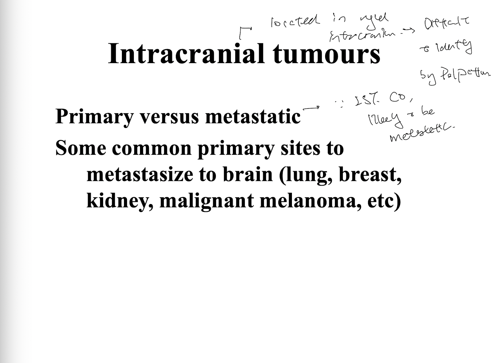
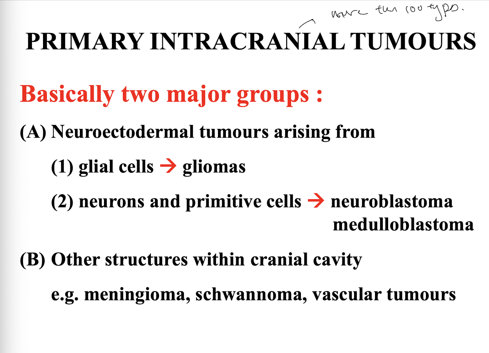
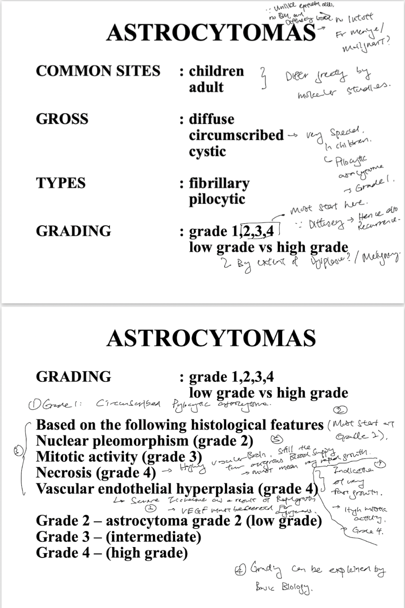
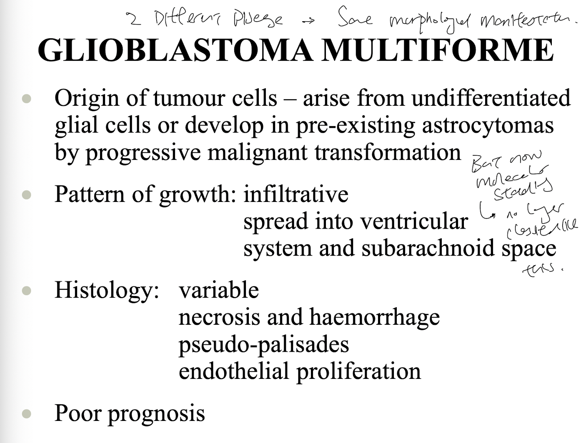
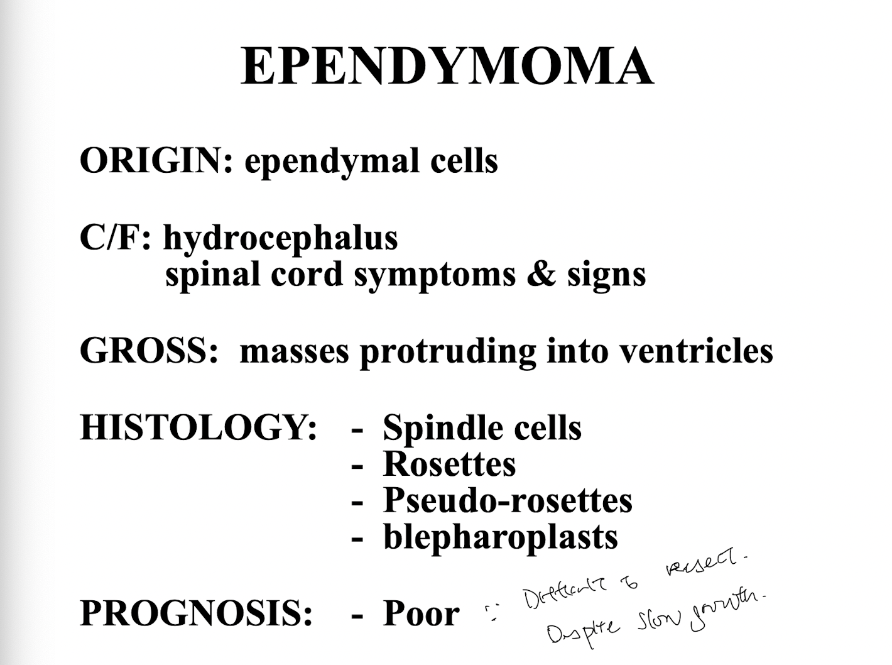
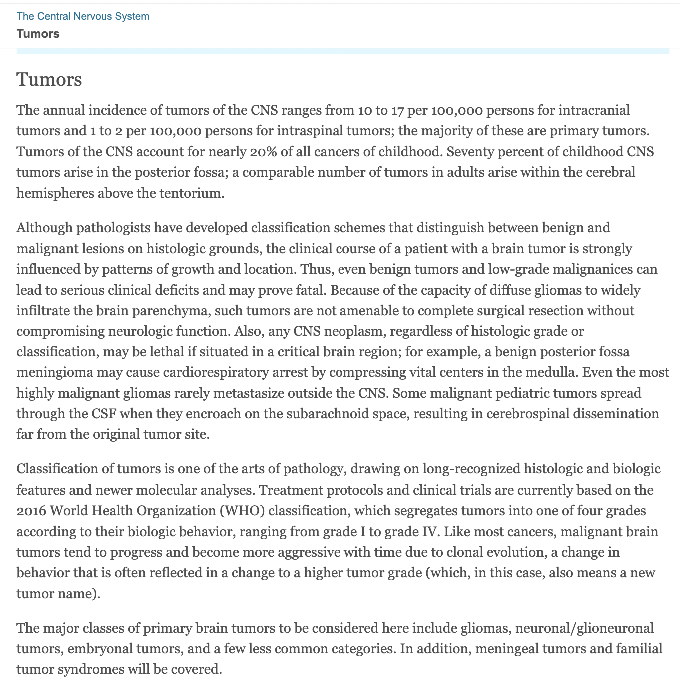
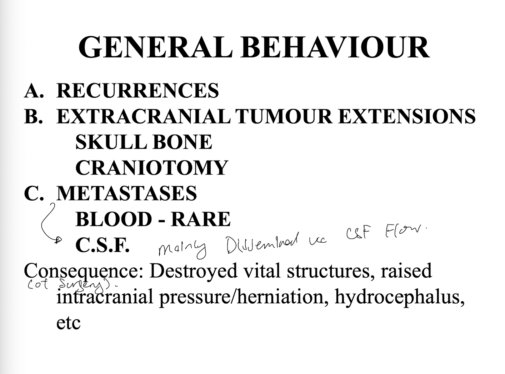

- 15:17
  collapsed:: true
	- [[Relevant Notes]] [[Intracranial tumours]]
		- ((63cf96ff-64eb-4073-9647-f9105a5ad8da))
		- [[Permanent Notes]] [[Intracranial tumours are classified into primary intracranial tumours and metastatic tumours, the later being more common]]
			- [[Reference Notes]] Lecture Notes: HNS39
				- 
			- [[Literature Notes]] Intracranial tumours, defined as tumours found intracranially, are more likely to be metastatic, rather than a primary intracranial tumour.
				- Intracranial tumours, by definition are neoplasms found intracranially.
				- They are first classified into primary or metastatic intracranial tumours.
					- Most are metastatic, as the the brain receives 25% of cardiac output.
			- [[Fleeting Notes]]
- 15:19
  collapsed:: true
	- [[Relevant Notes]] [[Primary intracranial tumours]]
		- [[Permanent Notes]] [[Primary intracranial tumours are classified into two types by cells of origin, tumours of neuroectodermal origin, and tumours arising from other structures within the cranial cavity]]
			- [[Reference Notes]] Lecture Notes: HNS39
				- 
			- [[Literature Notes]] Primary intracranial tumours can be classified into two major groups, those arising from neuroectodermal cells, and those arising from other structures in the cranial cavity.
				- Primary intracranial tumours are basically classified into two major groups:
					- Neuroectodernal tumours
					- Arising from other structures within the cranial cavity
				- Neuroectodermal tumours include:
					- Those arising from glial cells: Gliomas
					- Those arising from neurons and primitive cells: Neuroblastoma, medulloblastoma
				- Other structures within the cranial cavity:
					- Meningioma, Schwannoma (PNS), vascular tumours
			- [[Fleeting Notes]]
- 15:44
  collapsed:: true
	- [[Relevant Notes]] [[Astrocytoma]]
		- [[Permanent Notes]] [[Astrocytoma, the most common glioma arising from astrocytes is graded in a way that reflects underlying pathohistology, and gross pathology, where an increase in grade is associated within increasingly grim prognosis]]
			- [[Reference Notes]] Lecture Notes: HNS39
				- 
			- [[Literature Notes]] Astrocytoma, a common form of glioma originates from astrocytes. Their grading, is a reflection of histological features, which also correlates to its gross pathology, which often informs prognosis.
				- **Astrocytoma**, the most common form of **glioma**, arising from the astrocytes of the central nervous system.
				- In general, they are *classified by the type of astrocytes they originate from*:
					- Fibrillary
					- Pilocytic
				- Gross pathology:
					- Grade 1 astrocytoma are well **circumscribed**, but this kind only arises in children as a circumscribed pilocytic astrocytoma.
					- Grade 2 and 3 astrocytomas are **diffuse**, with infilatration beyond grossly evident margins.
					- **Cystic** degeneration of astrocytomas are often common.
				- Based on histological features, astrocytomas are *stratified into 4 grades with increasingly grim prognosis*:
					- Grade 1 tumours are generally well circumscribed pilocytic astrocytoma, a rather common childhood CNS tumour.
					- Grade 2 tumours are characterised with nuclear pleomorphism.
					- Grade 3 tumours are characterised with mitosis.
					- Grade 4 tumours are characterised with necrosis, as they generally outgrow their vascular supply. There is also vascular endothelial hyperplasia, as a result of marked ischemia that prompts secretion of VEGF for angiogenesis.
			- [[Fleeting Notes]]
- 15:48
  collapsed:: true
	- [[Relevant Notes]]
		- [[Permanent Notes]]
			- [[Reference Notes]]
				- 
			- [[Literature Notes]]
				- Glioblastoma multiformes, a term that should no longer exist, develops from a pre-existing astrocytoma by progressive malignant transformation.
				- It is a grade 4 astrocytoma, with histological manifestations such as:
					- Necrosis and haemorrhage
					- Endothelial proliferation (often forming tufts of vessels called glomerular bodies)
					- Pseudo-palisades
				- Its mode of metastasis, local invasion by infiltrative growth, often results in spread into the ventricular system and subarachnoid space.
			- [[Fleeting Notes]]
- Butterfly formation of astrocytoma
- 16:14
  collapsed:: true
	- [[Relevant Notes]]
		- [[Permanent Notes]]
			- [[Reference Notes]]
			- [[Literature Notes]]  Oligodendroglioma, a form of glioma arising from oligodendrocytes are a less aggressive form of glioma with characteristic histological features.
				- Oligodendrocytes are the lesser common form of gliomas.
				- They are generally well-circumscribed, with little necrosis.
				- Usually found in cerebral hemispheres, particularly in the frontal lobe and the temporal lobe.
				- Classical histology is a box-shaped cell, with clear cytoplasmic halo.
			- [[Fleeting Notes]]
- 17:44
  collapsed:: true
	- [[Relevant Notes]] [[Ependymoma]]
		- [[Permanent Notes]] [[Ependymoma, a form of glioma arising from ependymal cells manifests as a mass protruding into the ventricles, resulting in ventricular obstruction]]
			- [[Reference Notes]] Lecture Notes: HNS39
				- 
			- [[Literature Notes]]
				- Ependymoma is a glioma that arises from ependymal cells, i.e. cells lining the ventricular system.
				- Gross pathology
				  collapsed:: true
					- A mass protruding into ventricles
				- Histopathology
				  collapsed:: true
					- Characterised by spindle cells, rossettes, perivascular pseudo-rosettes and blepharoplasts.
				- Prognosis is poor as a result of limited resectability.
			- [[Fleeting Notes]]
- 17:47
  collapsed:: true
	- [[Relevant Notes]] [[Clinical picture]]
		- [[Permanent Notes]] [[While understanding the sequelae of intracranial tumour is important, it is actually the context of the tumour that informs the clinical picture]]
			- [[Reference Notes]] [Robbins Chapter 23](https://www-clinicalkey-com.eproxy.lib.hku.hk/#!/content/book/3-s2.0-B9780323531139000285?scrollTo=%23hl0003280)
				- 
				- Secondary reference: Lecture Notes: HNS39
					- 
			- [[Literature Notes]] While pathophysiology tells us an intracranial tumour can caused raised intracranial pressure and a sequelae of herniation, it is the context of the tumour, particularly its rate of growth and location that informs the clinical picture.
				- In general, intracranial tumours can cause raised intracranial pressure, which triggers the sequelae of herniation.
				- But the clinical picture, largely depends on the nature of growth, and its location.
				- At the "correct" location, compressing on the "right" structure, even low-grade or even benign tumours can result cause severe neurological defects, and could even be fatal.
			- [[Fleeting Notes]]