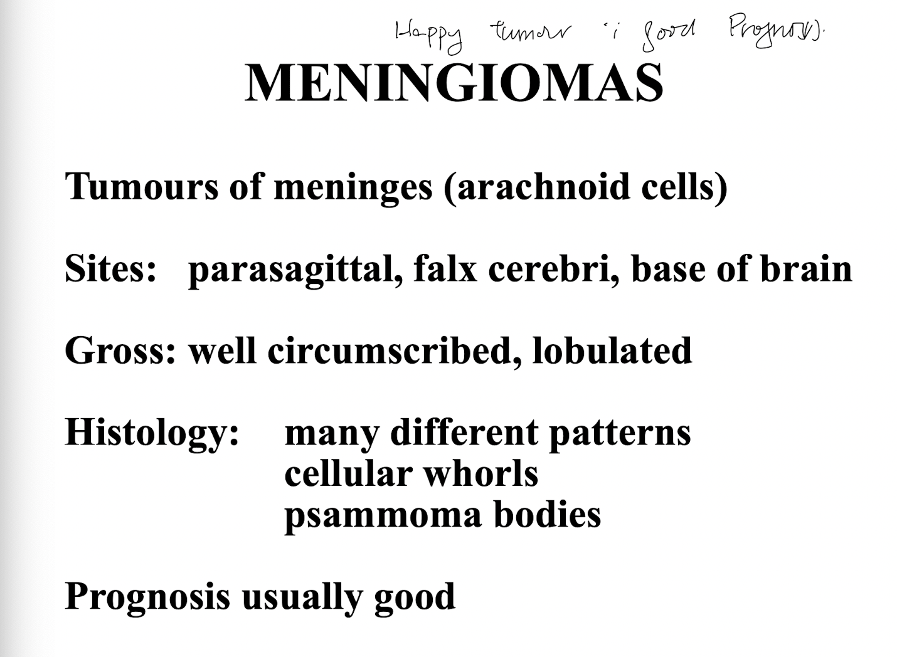

- 10:15
  collapsed:: true
	- [[Relevant Notes]] [[Meningioma]]
		- ((63b93064-1595-4feb-8c1c-55290c3d0c3d))
		- ((63d00120-3c36-486a-a2c7-15bfd0d06539))
		- ((63d00120-f32b-4f5d-84ba-9b53a72e7adb))
		- [[Permanent Notes]] [[Meningiomas are benign tumours arising from arachnoid cells, where the context of the meningioma determines clinical manifestation]]
			- [[Reference Notes]] Lecture Notes: HNS39
				- 
			- [[Literature Notes]] Meningiomas are benign tumours arising from the arachnoid cells of the meninges, where the context of the meningioma determines the clinical manifestation.
				- Meningioma is a benign tumour that arises from the meningothelial cells of the arachnoid mater.
				- Gross pathology of meningioma:
					- The meningioma is often a well-circumscribed, lobulated tumour.
				- Histopathology of meningioma:
					- Meningiomas have a highly variable histological features but may be characterised by cellular whorls, and psammoma bodies.
				- Sites of meningioma:
					- Usually found in parasagittal brain convexity, lateral brain convexity, and in the skull base (sella turcica). It is the context of the meningioma that guides clinical manifestation
					- {:height 389, :width 419}
			- [[Fleeting Notes]]