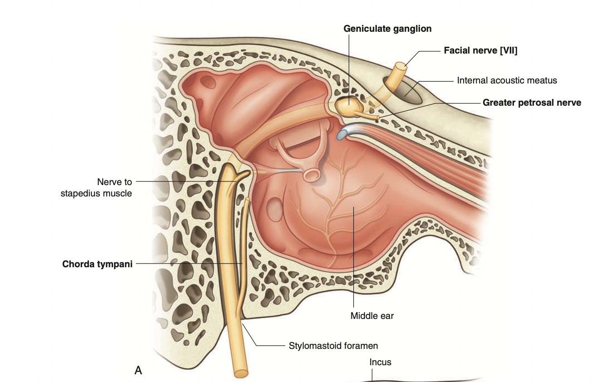

tags:: [[HNNS]], [[Anatomy]], [[Anatomy of the head and neck]] 
status::
alias::

- ### As the facial nerve emerges from the brainstem, it enters the temporal bone, then drops through the stylomastoid foramen
	- As the facial nerve emerges from the brainstem, it accompanies the vestibulocochlear nerve into the internal accoustic meatus.
	- At the distal end of the internal acoustic meatus, the nerve expands to form the sensory **geniculate ganglion**.
	- The facial nerve passes in the **facial canal**, passing posteriorly and laterally, between the middle ear and the inner ear. What this results in, is a bulge on the medial (labyrinth) wall of the middle ear, the **prominence of the facial canal**.
	- As it approaches the posterior wall of the middle ear, it suddenly descends, and leaves the temporal bone through the **stylomastoid foramen**.
	- 