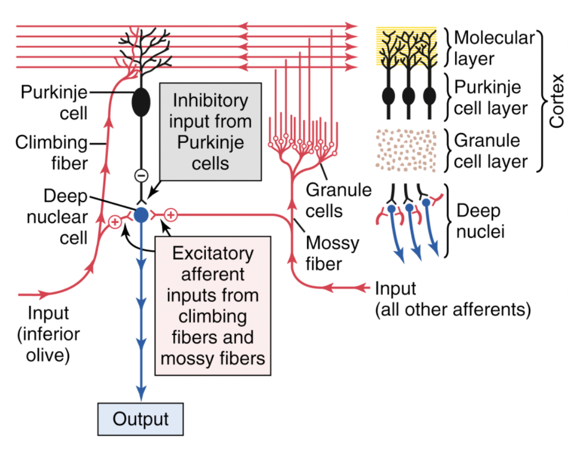

- ### Cerebellar cortex circuitry silences deep cerebellar nuclei and vestibular nuclei
  collapsed:: true
	- When there is cerebellar imput through a two fibre system, the two fibre circuitry silences cerebellar nuclei and vestibular nuclei through excitation of Purkinje cells.
	- **Climbing fibre circuitry directly excites Purkinje cells**
	  collapsed:: true
		- When stimulated, climbing fibres from the **inferior olivary nucleus** of the [[Medulla]] directly stimulates a Purkinje cells.
		- The stimulated purkinje cells then inhibits deep cerebellar nuclei and vestibular nuclei.
	- **Mossy fibre circuitry indirectly excites Purkinje cells**
	  collapsed:: true
		- Mossy fibres from various sources stimulate the granular cells, where axons of granular cells ascend and bifurcate to give parallel fibres, stimulating some 40 pyramidal cells.
		- The stimulated purkinje cells then inhibit deep cerebellar nuclei and vestibular nuclei.
		- Parallel fibres also stimulate **basket cells** and **stellate cells** of the **molecular layer of the cerebellar cortex**. [[Basket cell and stellate cell cause lateral inhibition of off beam pyramidal cells]].
	- 