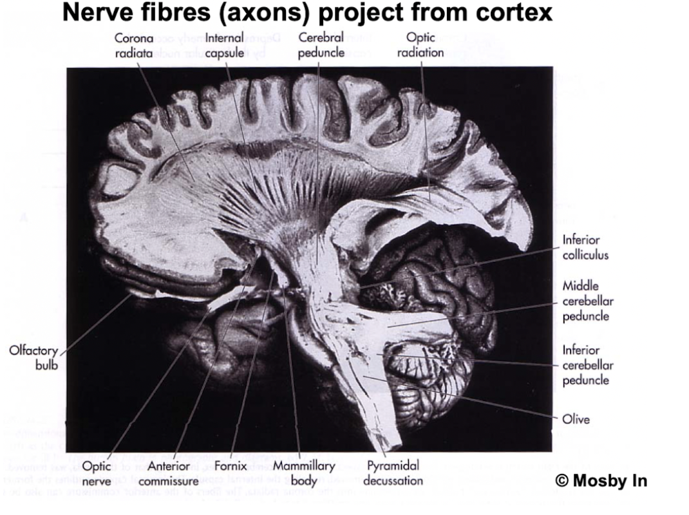

- # Cerebral hemisphere
	- The cerebral hemisphere is the embryological tenencephalon, and refers to the largest part of the brain. It is comprised of the superficial gray matter, [[Cortex]], the internal masses of gray matter, namely the Striatum of [[Basal ganglia]] (The thalamus is a part of the diencephalon and is not part of the cerebral hemisphere, but a part of the cerebrum).
	- ### Surface anatomy of the cerebral hemisphere
		- The surface of the cerebral hemisphere is not smooth, but is marked by elevations and grooves called [[Gyri and sulci of the cerebral hemisphere]]. These gyruses and sulci define the [[Lobes of the cerebral hemisphere]], and the important gyri.
	- ### Organization of the cerebral hemisphere
	  collapsed:: true
		- **Cortical gray matter**
		  collapsed:: true
			- The cerebral hemisphere is made of the superficial [[Cortex]] that runs along the [[Gyri and sulci of the cerebral hemisphere]], which houses the neurons.
		- **White matter of cerebral hemisphere**
		  collapsed:: true
			- The neurons within the cortex sends axons that forms much of the white matter that is arranged in a fan-like arrangement, the **corona radiata**.
			- A vast majority of the axons pass into the **internal capsule**, which is medially bordered by the ((63b38608-09dd-4933-a5c4-d224a8458aa0)) and the ((63b385a9-e193-451a-9865-4931752da77a)), and laterally bordered by the ((63b385a9-e32a-4dde-b089-ad7885454ba2)).
			- The axons eventually descend into the cerebral peduncles of the [[Midbrain]].
			- {:height 408, :width 444}
		- **Subcortical gray matter**
		  collapsed:: true
			- Subcortical gray matter are also found, they are the [[Basal ganglia]].
		- **Separation and connection of the two cerebral hemisphere**
		  collapsed:: true
			- The two cerebral hemisphere is separated by the **median longitudinal fissure**, which houses the ((63b385b6-2861-497e-b305-cd72580d967c)) and associated dural venous sinus, and the **cingulate gyrus**.
			- The two cerebral hemispheres are connected by the corpus collosum.