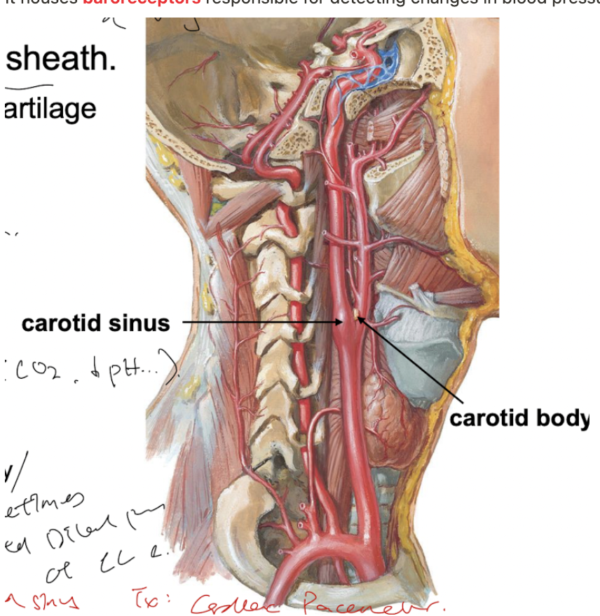

- # Common carotid artery
  collapsed:: true
	- The much of the vascular supply of the head and neck is provided by the common carotid artery.
	- **Course of the common carotid artery**
	  collapsed:: true
		- The left common carotid artery is a direct branch of the aortic arch, while the right common carotid artery is a branch of the brachiocephalic artery.
		- The common carotid artery ascends through the [[Carotid sheath]] in the neck, and subsequently give two terminal branch.
	- **Branch of the common carotid artery**
	  collapsed:: true
		- The common carotid artery bifurcates into two terminal branches, the [[Internal carotid artery]] and the [[External carotid artery]].
		- The most distal part of the carotid artery, parts of the internal and external carotid artery can be found the ((63b385a8-40f0-487a-b4be-d8a8f2749ce2)) , a subdivision of the [[Anterior triangle of the neck]].
	- **Two specialised organs can be found at the bifurcation of the common carotid artery**
	  collapsed:: true
		- The **carotid bodies** and the **carotid sinus** are *specialised organs for homeostatic functions* found at the bifurcation of the common carotid artery:
		- Carotid body
		  collapsed:: true
			- The carotid body can be found at the bifurcation of the common carotid artery, *embedded in the tunica adventitia of the vessel*.
			- It houses **peripheral chemoreceptors** responsible for the [[Chemoreceptor reflex]].
		- Carotid sinus
		  collapsed:: true
			- The carotid sinus is a dilated portion of the internal carotid artery (or the distal part of common carotid artery) near the bifurcation.
			- It houses **baroreceptors** responsible for detecting changes in blood pressure and initiating the [[Baroreceptor reflex]] .
	- {:height 686, :width 510}