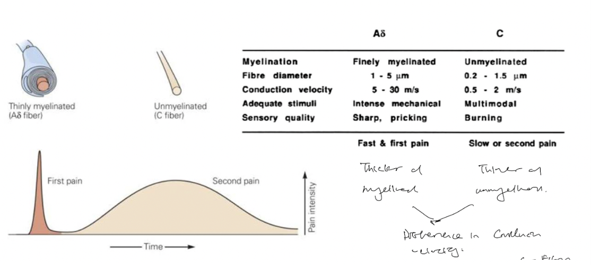

- ### Dual pathway for transmission of pain signals into the central nervous system underlies fast and slow pain
  collapsed:: true
	- Two types of fibres relay pain signals from [[Nociceptors]] to the central nervous system, particularly the 2nd order neurons in the [[Pain and the pain pathway]], with different conduction velocity, and use of different neurotransmitters that underlie *speed of transmission and the chronicity of pain*.
	- The two afferent fibres mediate [Fast pain and slow pain]([[Fast pain and slow pain and their qualities]]).
	- Once can consider fast pain to be mediated by a fast pain pathway outside the central nervous system, that is mediated by **Type A-delta fibres**, and the slow pain is mediated by slow pain pathway outside the central nervous system, that is mediated by **Type C fibres**.
	  collapsed:: true
		- Type A-delta fibres are *thicker and myelinated*, and thus have a faster conduction speed, hence, they mediate **fast pain**.
		- Type A-delta fibres usually send mechanical or mechano-thermal stimuli.
		- Type C-delta fibres are *thinner and unmyelinated*, and thus have slower conduction speed, hence, they mediate **slow pain**.
		- Type C fibres usually send polymodal stimuli.
	- 
	- **The two pathways makes use of different neurotransmitters.**
	  collapsed:: true
		- The fast pain pathway is uses glutamate only.
		- The slow pain pathway uses glutamate and substance P.