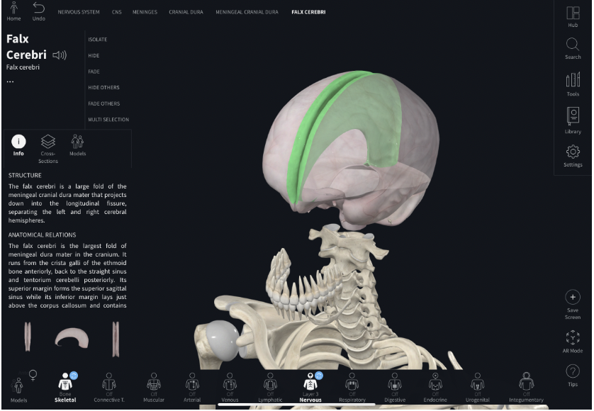
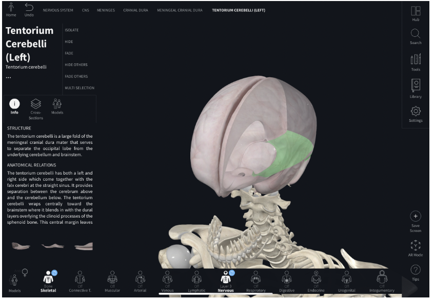
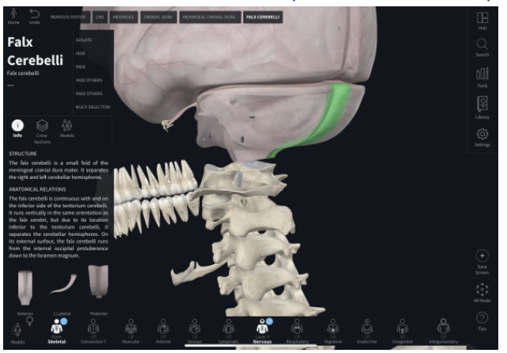
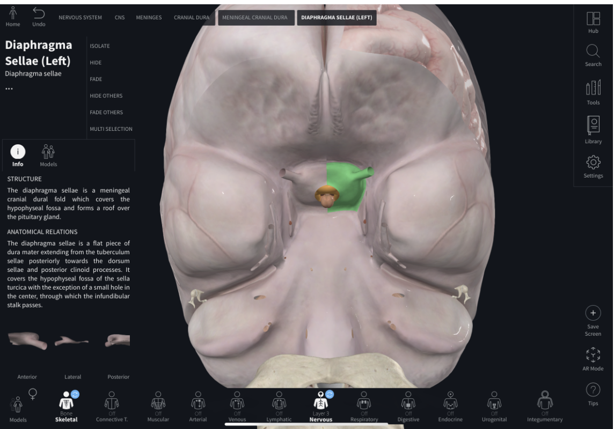
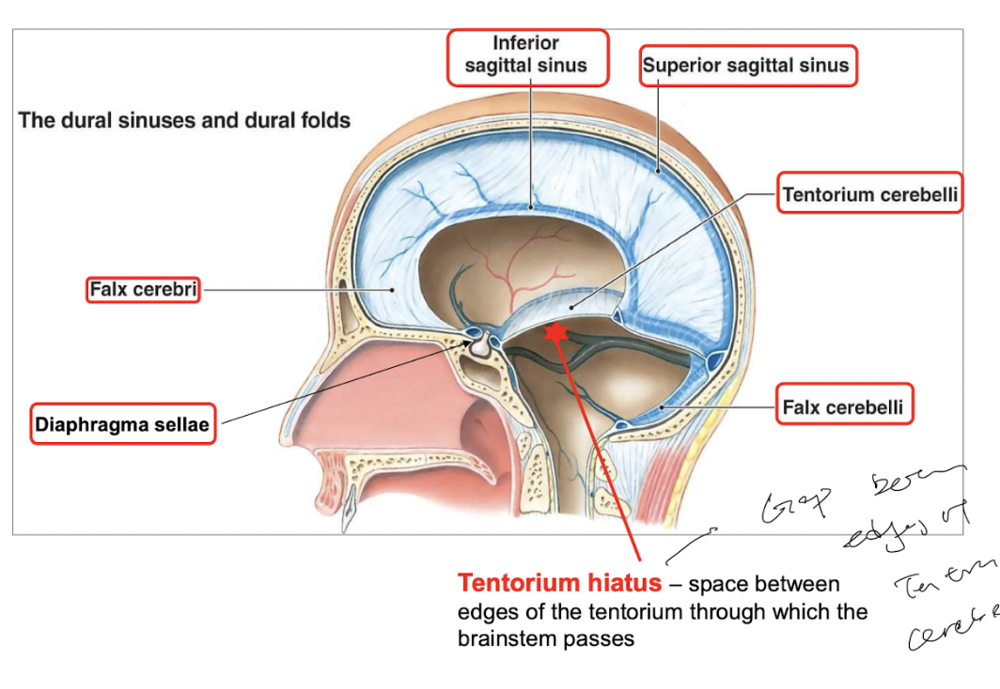

- ### Dural folds are present with the cranial meninges
	- Dural folds are folds of the inner meningeal layer of the dura ([[Meninges]]) that *peels off the outer periosteal layer of dura*.
	- ### Dural folds separate cranial cavity into compartments
		- There are 4 dural folds that separate cranium into compartments.
		- **Falx Cerebri**
		  id:: 63b385b6-2861-497e-b305-cd72580d967c
		  collapsed:: true
			- The falx cerebri is a *sickle-shaped dural fold* that *defines the left and right cerebral compartments*, separating the cerebrum into the left and right [[Cerebral hemisphere]]s.
			- 
		- **Tentorium cerebelli**
		  collapsed:: true
			- The tentorium cerebelli is a *tent-shaped dural fold* that *defines the supratentorial compartment and infratentorial compartment*, separating the cerebral hemisphere from the [[Cerebellum]] and the [[Brainstem]].
			- The edges of the two tentorium cerebelli forms the tentorium hiatus, form which the [[Brainstem]] passes through.
			- 
		- **Falx cerebelli**
		  id:: 63b385b6-e9a2-4f13-95ea-e16456631d68
		  collapsed:: true
			- Falx cerebelli is a *sickle-shaped dural fold* that separates the [[Cerebellum]] into the left and right cerebellar hemisphere.
			- 
		- **Diaphragma sellae**
		  collapsed:: true
			- The diaphragma sellae separates the **hypophyseal fossa** and forms the roof of the **pituitary gland**.
			- {:height 422, :width 478}
		- {:height 374, :width 533}