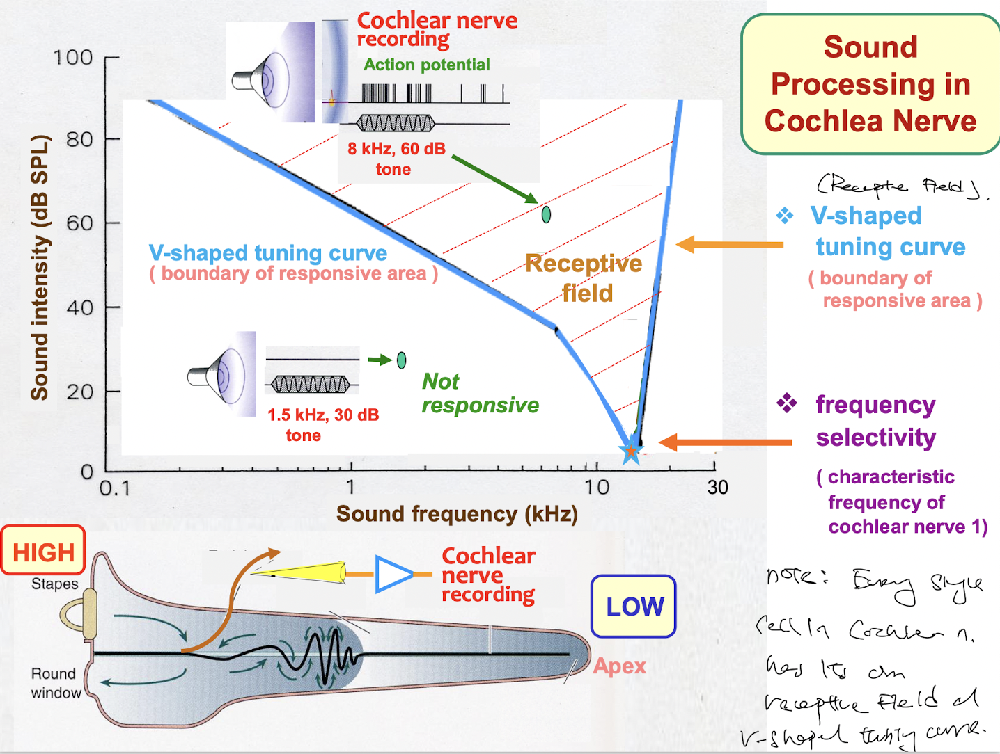

- ### Each inner hair cell has it receptive field as denoted by its V-shaped tuning curve, such that each tone requires a certain degree of loudness to be heard
	- For each frequency (tone), there is an amplitude threshold that is required for it to be heard.
	- This results in a V-shaped tuning curve, where at different frequencies, there is a different amplitude threshold that must be met before signal transduction.
	- The area above the curve is the **receptive field**.
	- 
	  id:: 63c1616b-b9dd-4b94-abc9-94d6d3b4760c