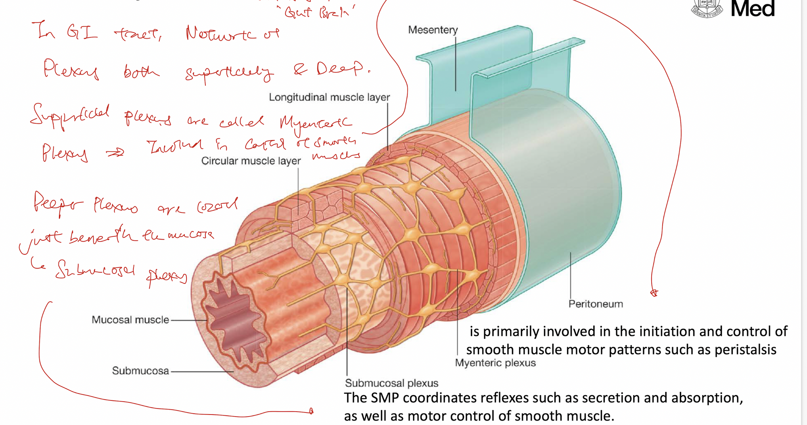

- # Enteric nervous system
  collapsed:: true
	- Along the GI tract, there are two layers of plexuses that comprise the enteric nervous system, the **submucosal (Meissner) plexus** and the **myenteric (Auerbach) plexus**.
	- The submucosal plexus (located in the submucosal layer of the GI tract), has *secretomotor function*, involved in regulating secretion by mucousal glands and the motility of muscularis mucosae.
	- The myenteric plexus (located between the inner circular muscle and the outer circular muscle of the muscularis propria/ externa) mainly has *motor functions*, involved in coordinating the contraction of the muscularis propria (i.e. peristalsis) to push food down the GI tract.
	- While the enteric nervous system can function independently, *the enteric nervous system is under the influence of the autonomic nervous system*, which can greatly enhance or inhibit gastrointestinal functions*.*
	- {:height 417, :width 776}