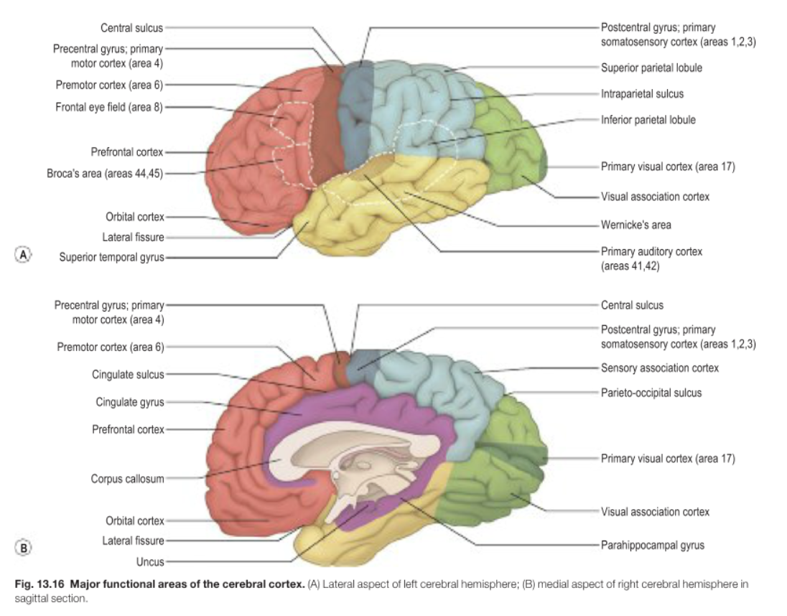

- ### Lobes of the cerebral hemisphere
  collapsed:: true
	- 3 sulci, the central sulcus, the lateral sulcus and the parieto-occipital sulcus help define the cerebral hemisphere into 4 lobes: 1) **Frontal lobe**, 2) **Parietal lobe**, 3) **Temporal lobe** and 4) **Occipital lobe**.
	- **3 sulcus defines the 4 lobes**
	  collapsed:: true
		- Lateral sulcus
		  collapsed:: true
			- The lateral sulcus is described as the *deepest, most conspicuous cleft on the lateral surface of the cerebral hemisphere*, which divides the temporal lobe below from the frontal lobe and parietal lobe above.
			- The temporal lobe overlies cortical area deep to the lateral sulcus called the **insula**.
		- Central sulcus
		  collapsed:: true
			- While the name central sulcus may imply that it divides the cerebral hemisphere centrally into the frontal and parietal lobe, that is not the case.
			- The central sulcus can be found on the medial surface of the cerebral hemisphere, *as the continuation of the marginal branch of the cingulate sulcus*.
			- It can also as the *single sulcus that separates two parallel gyrus*, that is the precentral, and postcentral gyrus.
			- It divides the anterior **frontal lobe** from the posterior **parietal lobe**.
		- Parieto-occipital sulcus
		  collapsed:: true
			- The parieto-occipital sulcus can be viewed on the medial side of the cerebral hemisphere.
			- It divides the **parietal lobe** from the **occipital lobe**.
			- The parieto-occipital sulcus meets with the calcarine sulcus to define the primary visual cortex.
			- 
	- Important gyruses in the 4 lobes