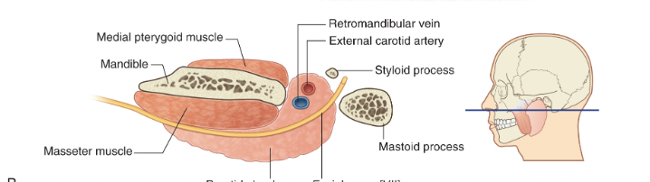

tags:: [[HNNS]], [[Anatomy]], [[Anatomy of the head and neck]] 
status::
alias::

- ### Major neurovascular structures pass through the substance of the parotid gland
	- As the facial nerve descends through the stylomastoid foramen and enters the posteromedial side of the [[Parotid glands]], it gives rise to major branches that supply the muscles of mastication ([[Branches of facial nerve innervate the muscles of facial expression]]).
	- It also houses the [[External carotid artery]] and its terminal branches (as well as the posterior auricular artery).
	- It also houses the [[Retromandibular vein]] and its two tributaries.
	- {:height 170, :width 556}
	-
	-