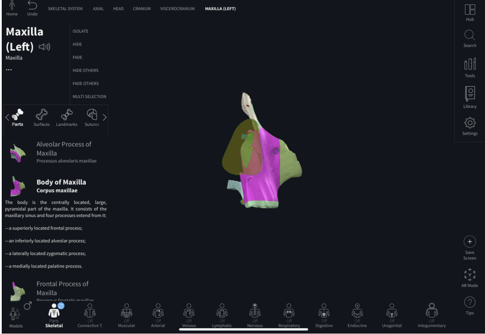

- --
- dg-publish: true
- alias:
- --
- metadata:
	- tags: [[HNNS]], [[Anatomy]], [[Anatomy of the head and neck]]
	- status: #[[Fleeting Notes]]
- ### Maxilla
  collapsed:: true
	- The maxilla is a **paired** bone that forms part of the [[Viscerocranium]], forming the *bone of the upper jaw*.
	- **Parts of the maxilla**
	  collapsed:: true
		- The maxilla has the **frontal process**, **zygomatic process**, **alveolar process** and the **palatine process**.
		- Frontal process
		  collapsed:: true
			- The frontal process projects up to the [[frontal bone]].
			- It forms the medial (and part of the inferior) border of the [[Orbit]].
		- Zygomatic process
		  collapsed:: true
			- The zygomatic process projects laterally to the zygomatic bone.
		- Alveolar process
		  collapsed:: true
			- The alveolar process projects inferiorly and bears the upper row of teeth.
		- Palatine process
		  collapsed:: true
			- The palatine process projects posteriorly (relatively inferiorly), and articulates with the palatine process of the contralateral maxillae.
			- It forms the part of the [[Hard palate]].
		- 
		- 
		- 
	- **Features of the maxilla**
	  collapsed:: true
		- The **infraorbital foramen** is present for:
		  collapsed:: true
			- The exit of the **maxillary** (V2) division of [[Trigeminal nerve (CN V)]], which emerges from the infraorbital foramen as the **infraorbital nerve**.