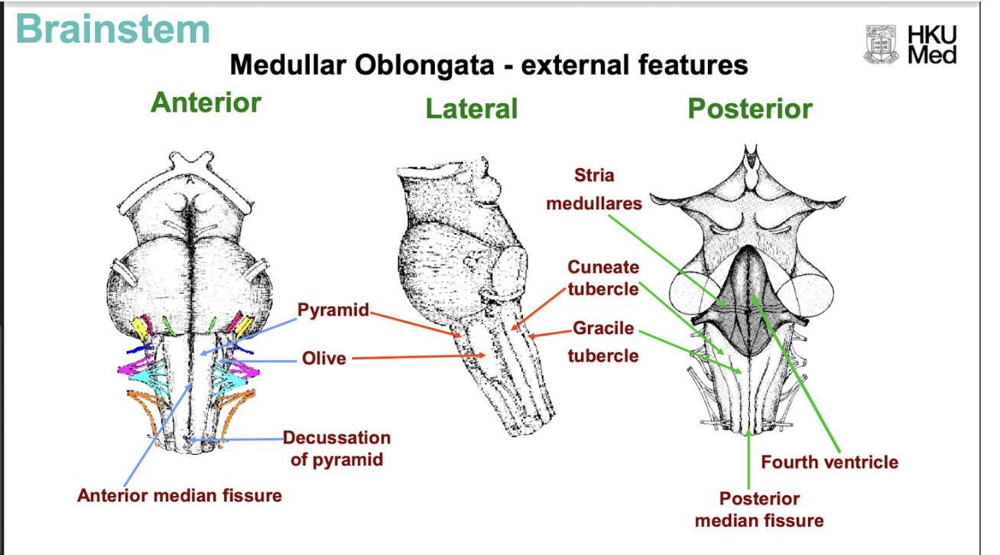

- # Medulla
  collapsed:: true
	- The medulla is the inferior structure of the [[Brainstem]].
	- ### Surface anatomy of the medulla
		- The medulla oblongata is characterised by various structures.
		- **Anterior features**
		  collapsed:: true
			- The medulla is characterised by the two **medullary pyramids**, separated by the anterior medial fissure, conveying the **corticospinal tracts**.
			- Anteriorly, the medulla is characterised by the **anterior medial fissure**, which extends down the spinal cord.
			- Many [[Cranial nerves]] extend from the anterior surface of the medulla.
		- **Lateral features**
		  collapsed:: true
			- Laterally, the medulla is characterised by the olive, which consists of the **inferior olivary nucleus**.
		- **Posterior features**
		  collapsed:: true
			- Posteriorly, the medulla is characterised by the posterior medial fissure.
			- Caudally, it is characterised by the **dorsal columns** (gracile fasciculus and cuneate fasciculus), which expands at mid medulla to give the medial **gracile tubercle** and lateral **cuneate tubercle**.
			  collapsed:: true
				- These are bumps on the dorsal medulla, that consists of the **nucleus gracilis** and **nucleus cuneatus** respectively (housing 2nd order neurons of the [[Dorsal column medial lamniscus pathway|Dorsal column medial lamniscus system]]).
		- 
		- The medulla forms parts of the floor of the 4th ventricle. [[The rhomboid fossa bears various features that reveals the internal structure of the medulla and pons]].
	- ### Internal structure of the medulla
	  collapsed:: true
		- The internal structure of the medulla changes significant at different levels of the medulla, *just a 1mm difference in tranverse section may reveal new structures, or lose old structures*.
		- The internal structure of the medulla should be *understood at 3 levels*.
		- **Caudal (Closed) medulla**
		  collapsed:: true
			- The caudal medulla is also called the **closed medulla**, as the central canal does not open to the 4th ventricle.
			- It is characterised by the dorsal columns dorsally, the medial **gracile fasciculus**, and the lateral **cuneate fasciculus**.
			- The dorsal horn of the spinal cord is replaced with a sensory cranial nerve nuclei of similar functions: the **spinal trigeminal nucleus**, which spans the entire brainstem and the rostral part of the spinal cord.
			- 
		- **Mid-medulla**
		  collapsed:: true
			- The mid-medulla roughly corresponds to the level above the pyramidal decussation.
			- Dorsally, it is characterised by the medial nucleus gracilis, and the lateral nucleus cuneatus:
			- Axons of 1st order neurons ([[Somatosensory pathways are generally organised in a 3 neuron system]]) in the dorsal columns synapse with 2nd order neurons in the corresponding nucleus.
			- Axons of 2nd order neurons pass ventrally and medially and *decussate* through the **internal arcuate fibre** to the contralateral **medial lamniscus**, which ascends ventrally, medially and in a vertical plane.
			- 
		- **Rostral (Open) medulla**
		  collapsed:: true
			- The rostral medulla is also called the open medulla, as the central canal opens dorsally to the 4th ventricle.
			- The rostral medulla is characterised by various new structures.
			- Dorsolateral to the medullary pyramids and lateral to the medial lamniscus, the **inferior olivary nucleus** is present within the olive.
			- **Cranial nerve nuclei**
			  collapsed:: true
				- Dorsally, various cranial nerve nuclei form the floor of the 4th ventricle:
				- Medially, the **hypoglossal nucleus**
				- In the middle, the **dorsal motor nucleus of the vagus** (DMX)
				- Laterally, **vestibular nuclei**
				- The nucleus ambiguus and nucleus solitary tract is also present.
			- **Inferior cerebellar peduncle**
			  collapsed:: true
				- The inferior cerebellar peduncle is present dorsolaterally.
			- 
		- Descending pathways
		  collapsed:: true
			- The corticospinal tract descends ventrally in the **medullary pyramids** and subsequently *decussate at the junction of the junction between the medulla and the spinal cord.*
		- Ascending pathways
		  collapsed:: true
			- [[Dorsal column medial lamniscus pathway]] - At the lower and middle pons, 2nd order neurons within the **Nucleus gracilis** medially and **Nucleus cuneatus** in the lower and middle medulla projects axons that *decussate to the contralateral medial lemniscus*, which ascend *ventrally, medially, and in a vertical plane*.
			- The [[Spinothalamic pathway|Spinothalamic tract]] ascends laterally, posterior to the olive and anterior to the inferior cerebellar peduncle.
		- Cranial nerve nuclei
		  collapsed:: true
			- The **hypoglossal nucleus** (CN XII), **dorsal motor nucleus of the vagus (DMX)** (CN X), **vestibular nucleus** the **nucleus ambiguus** can be found grouped around the central canal dorsally, forming the floor of the [[Ventricular system#4th ventricle|4th ventricle]].
			  collapsed:: true
				- The **hypoglossal nucleus** sends nerve fibres that pass between the pyramids and the inferior olivary nucleus to and emerges as the **hypoglossal nerve**, *between the olive and medullary pyramids*.
			- The **inferior olivary nucleus** is found in the **olive** of the medulla oblongata.
			- The **nucleus of trigeminal nerve** (spinal trigeminal nucleus of [[Trigeminal nerve (CN V)]]) is found laterally at the lower and middle medulla.