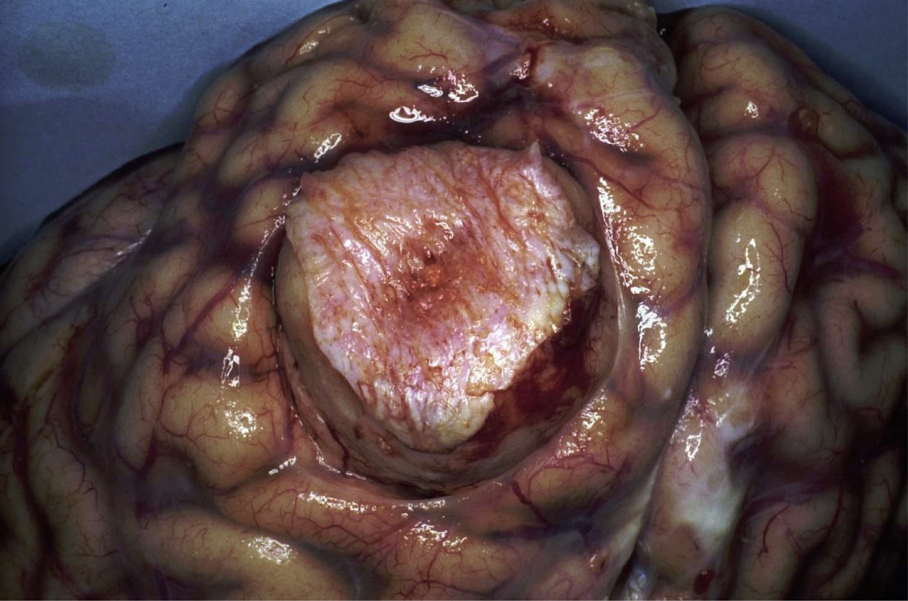
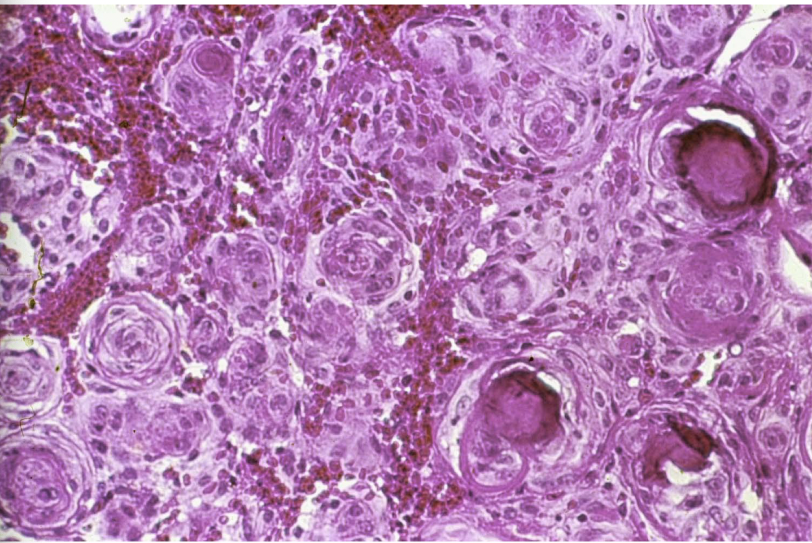

tags:: [[HNNS]], [[pathology]], [[neoplasm]]

- ### Meningiomas are benign tumours arising from arachnoid cells, where the context of the meningioma determines clinical manifestation
	- Meningiomas are **benign tumours** arising from meningothelial cells of the [arachnoid mater](((63bd7e1a-10fc-428a-8c15-4cd411af48e9))).
	- **Gross pathology of meningiomas**
		- Meningiomas are generally **well-circumscribed**, and **lobulated**.
		- Hence, surgical resection is generally viable, which allows for good prognosis.
		- {:height 339, :width 408}
	- **Histopathology of meningiomas**
		- Histopathology of a meningioma is highly variable, but is characterised by:
			- **Psammoma bodies**
			- **Cellular whorls**
			- {:height 360, :width 428}
	- **Sites of meningiomas determine the clinical manifestation**
		- Meningiomas can develop:
			- In the parasagittal space (either side of the ((63b385b6-2861-497e-b305-cd72580d967c)), compressing on the walls of the ((63bd7df6-b06f-4175-8e55-b355ac304e70)).
			- In the lateral
		-