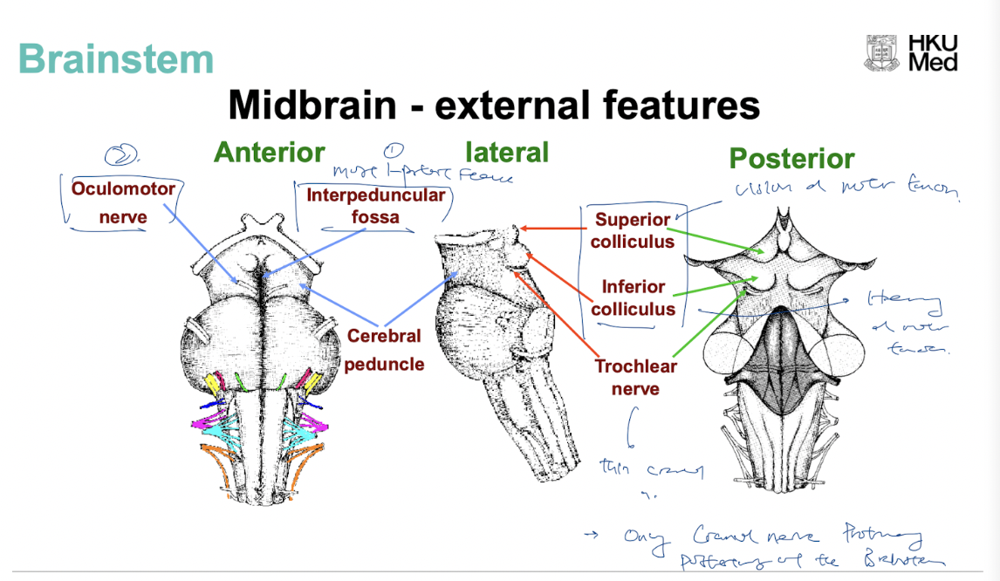
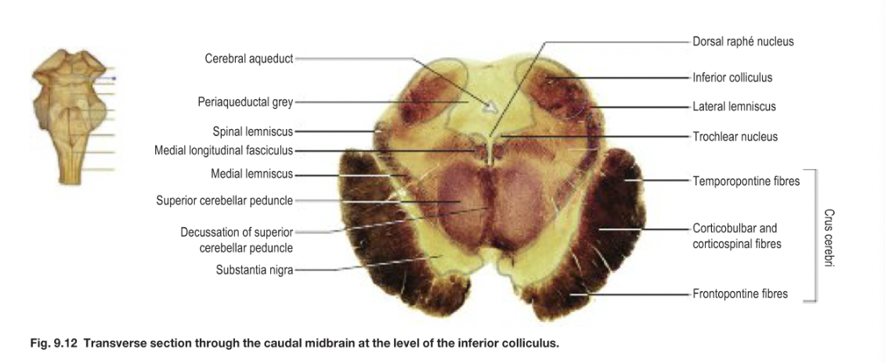
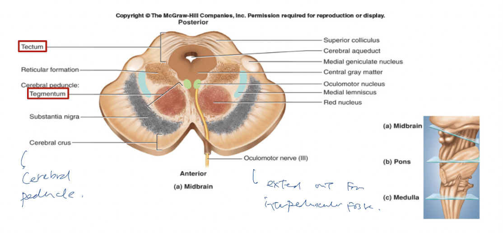

filters:: {}
tags:: [[HNNS]], [[Neuroanatomy]]

- ### Midbrain
  collapsed:: true
	- The midbrain (or **mesencephalon**) is the superior structure of the [[Brainstem]].
	- ### Surface anatomy of the midbrain
	  collapsed:: true
		- **Anterior features**
		  collapsed:: true
			- Anteriorly, the midbrain is characterised by **cerebral peduncles** and the **interpeduncular fossa**, from which the [[Occulomotor nerve (CN III)]] emerges from.
		- **Posterior features of the midbrain**
		  collapsed:: true
			- Posteriorly, the midbrain is characterised by the tectum, which includes the **superior colliculus** and the **inferior colliculus**.
			  collapsed:: true
				- The superior colliculus has vision and motor functions, while the inferior colliculus has hearing and motor functions.
			- The [[Trochlear nerve (CN IV)]] emerges inferior to the inferior colliculus, and is the only nerve that emerges posteriorly of the brainstem.
		- 
	- ### Internal structures of the midbrain
	  collapsed:: true
		- The midbrain is separated into 3 parts, which houses different structures:
		- The dorsal **tectum**, consisting of the superior and inferior colliculus,
		- The ventral **tegmentum**,
		- The tegmentum is further surrounded by masses of descending fibre system, known as the **cerebral peduncle**.
		- Tectum
		- **Tegmentum**
		  collapsed:: true
			- The tegmentum houses various structures:
			  collapsed:: true
				- **Ascending pathways**
				  collapsed:: true
					- Dorsolaterally, the medial meniscus of the [[Dorsal column medial lamniscus pathway]] ascends in an oblique plane.
					- Dorsal to the medial lemniscus would be the spinal lamniscus
					- Most dorsally, is the lateral lemniscus, which terminates at the inferior colliculus.
					- 
				- **Substantia niagra**
				  collapsed:: true
					- The [[Substantia niagra]], part of the [[Basal ganglia]], is located just dorsal to the [[#Cerebral peduncle]], and houses dopaminergic neurons, protruding to the striatum of the basal ganglia.
				- **Red nucleus**
				  collapsed:: true
					- The red nucleus is located dorsomedial to the substantial niagra, and is associated with motor functions ( ((63bd7df7-3ed3-43d7-a53d-f1b6efda05a6))).
				- **Cranial nerve nuclei**
				  collapsed:: true
					- The main occulomotor nucleus ([[Occulomotor nerve (CN III)]]) is located anterior to the periaqueductal gray medially, at the *level of the superior colliculus*.
					- The Edinger Westphal nucleus is located between the two main occulomotor nucleus.
					- The trochlear nucleus ([[Trochlear nerve (CN IV)]]) is located anterior to the periaqueductal gray medially, inferior to the main occulomotor nucleus, at the *level of the inferior colliculus*.
					- 
				- **Cerebral aqueduct**
				  collapsed:: true
					- The cerebral aqueduct is located dorsally in the tegmentum of the midbrain, and is surrouded by **periaqueductal gray**. It *drains cerebrospinal fluid from the 3rd ventricle to the 4th ventricle* ([[Cerebrospinal fluid pathway]]).
				- **Cerebral peduncle**
				  collapsed:: true
					- The cerebral peduncle houses various descending tracts:
					  collapsed:: true
						- The corticobulbar tract
						- The corticospinal tract is located in the middle
						- The corticopontine tract