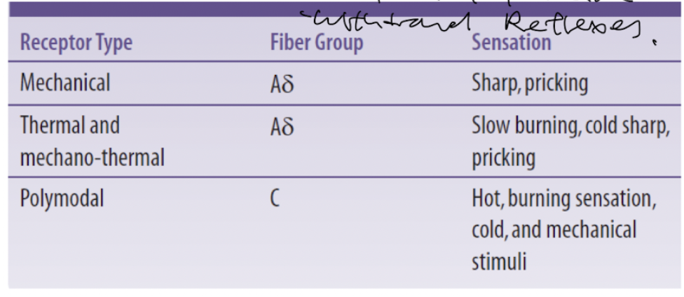

- ### Nociceptors
  collapsed:: true
	- Pain is detected by special specialised [[Somatosensory receptors]] called nociceptors.
	- They are unspecialised nerve endings that detect for various pain stimuli.
	- **3 types of nociceptors detect for different stimuli**
	  collapsed:: true
		- There are 3 main stimulus for detecting pain:
		  collapsed:: true
			- Mechanical stimuli
			- Thermal stimuli
			- Chemical stimuli (e.g. Bradykinin, Prostaglandin, seratonin, ATP and histamine)
	- **These stimuli are detected by different nociceptors**
	  collapsed:: true
		- Mechanical nociceptors - Detects for mechanical deformation of local tissues, *transmitting pain signals via fast Type A delta fibres*.
		- Thermal nociceptors - Detects for extreme temperatures (<5 or >45 degrees celsius), *transmitting pain signals via fast Type A delta fibres*.
		- Polymodal nociceptors - Detects for mechanical deformation of local tissue, temperature, and chemicals (e.g. Bradykinin, Prostaglandin, seratonin, ATP and histamine), *transmitting pain signals via slow Type C fibres*.
		- 