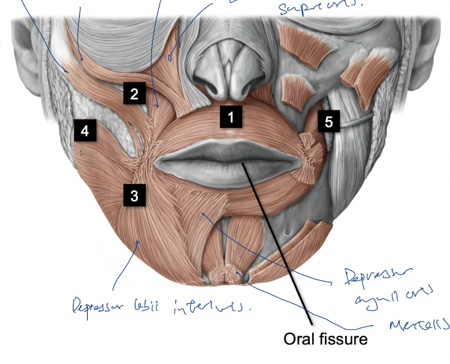

- # Oral group of muscles of facial expression
  collapsed:: true
	- There are many muscles in the oral group of muscles of facial expression, namely the **orbitalis oris**, **muscles of the upper lip**, **muscles of the lower lip**, **Risorius**, **Buccinator**, and **Platysma**.
	- ### Orbicularis oris
	  collapsed:: true
		- The orbicularis oris is the sphincter of the mouth, consisting of a complex system of fibres encircling the lips.
		- **Movements of the orbicularis oris**
		  collapsed:: true
			- It narrows the mouth, and closes the lips, responsible for *pursing the lips*.
	- ### Muscles of the upper lips
	  collapsed:: true
		- **Levator labii superioris**
		- **Levator anguli oris**
		- **Zygomaticus major and minor**
	- ### Muscles of the lower lips
	  collapsed:: true
		- **Depressor labii inferioris**
		- **Depressor anguli oris**
		- **Mentalis**
	- ### Risorius
	- ### Buccinator
	  collapsed:: true
	  id:: 63bd7e04-3e14-4808-8c43-3b77ac073db1
		- The buccinator has 3 origins:
			- It originates superiorly from the [[Maxilla]], and the **pterygomaxillary ligament**, a ligament extending from the maxillary tuberosity to hamulus of the medial pterygoid plate of the [[Sphenoid bone]] .
			- It originates inferiorly from the external oblique line of the [[Mandible]], *up to the 1st mandibular molar*.
			- It originates posteriorly from the **pterygomandibular raphe**.
	- ### Platysma
	  id:: 63b2a0b7-1d26-4cc0-81b5-47a5fb982314
	- {:height 502, :width 563}