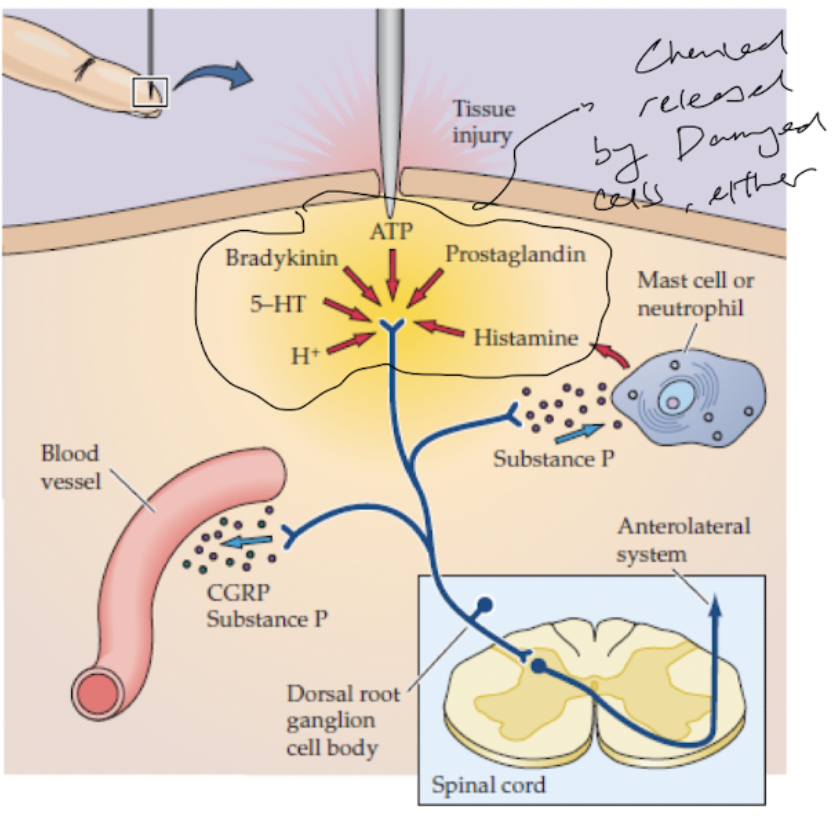
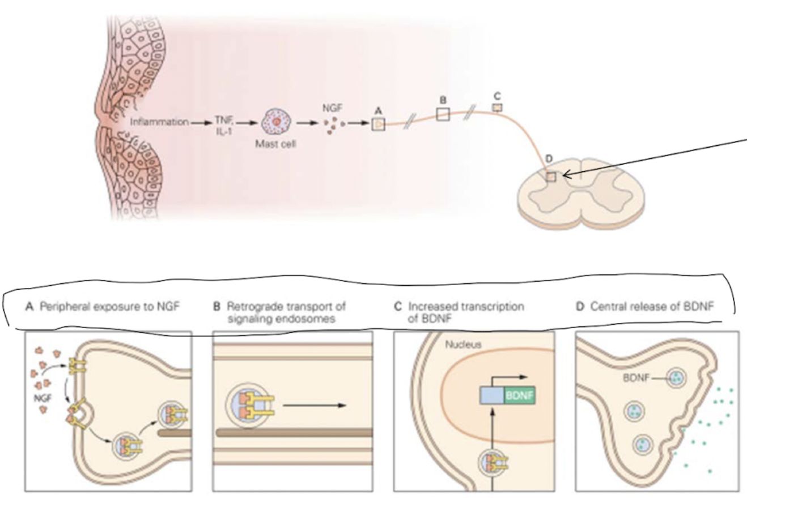

- ### Pain sensitization
  collapsed:: true
	- Pain sensitization refers to the process to which tissue damage results in reduced threshold to pain stimulus of [[Nociceptors]].
	- This results in either allodynia or hyperalgesia:
	  collapsed:: true
		- **Allodynia** is the pain sensation to innoculous stimulus.
		- **Hyperalgesia** is the increase in pain sensation to noxious stimulus.
	- ### Peripheral pain sensitization
	  collapsed:: true
		- Damaged tissue releases various chemicals, such as *bradykinin, prostaglandins, H+, lactic acid, and 5-HT*, which can either activate or sensitize [[Nociceptors]].
		- Furthermore, nociceptors release substance P and calcitonin-gene related proteins (CGRP), which mediates inflammation, and triggers histamine release by mast cells, which further sensitize nociceptors.
		- This results in **primary hyperalgesia**.
		- As these chemical spreads to nearby tissues, it results in **secondary hyperalgesia**.
		- {:height 612, :width 550}
	- ### Central pain sensitization
	  collapsed:: true
		- Inflammation triggers release of **nerve growth factor** by fibroblasts, which is taken up by the nociceptors.
		- Via axonal transport to the cell bodies, it triggers expression of **brain-derived neurotrophic factors**, which is released at the axons, increasing excitability of 2nd order neurons in the dorsal horn.
		- 