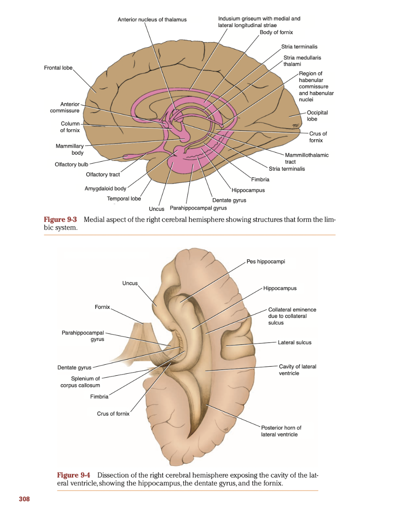

- # Papez circuit enables repeated hippocampal stimulation for learning and memory
  collapsed:: true
	- From a neurophysiological point of view, learning requires high frequency stimulation of the hippocampus which is enabled by the Papez circuit.
	- 1. When the **hippocampus** is stimulated, it signals the **mamillary bodies** via the fornix.
	- 2. The mamillary bodies stimulate the **anterior nucleus** of the [[Thalamus]] via the mamillothalamic tract.
	- 3. The anterior nucleus of the thalamus stimulates the **cingulate gyrus**.
	- 4. The cingulate gyrus then signals the hippocampus via the **parahippocampal gyrus**.
	- 