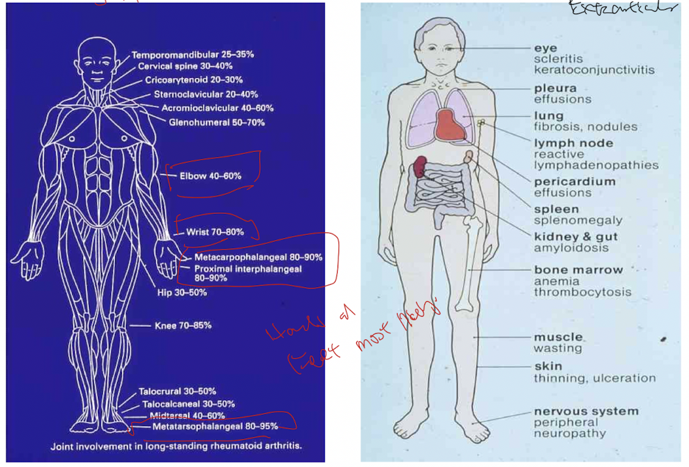
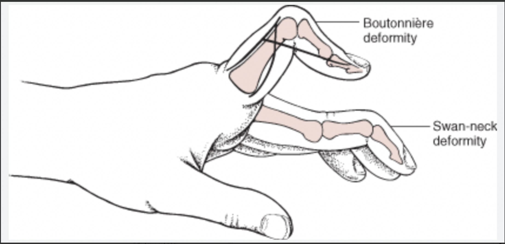
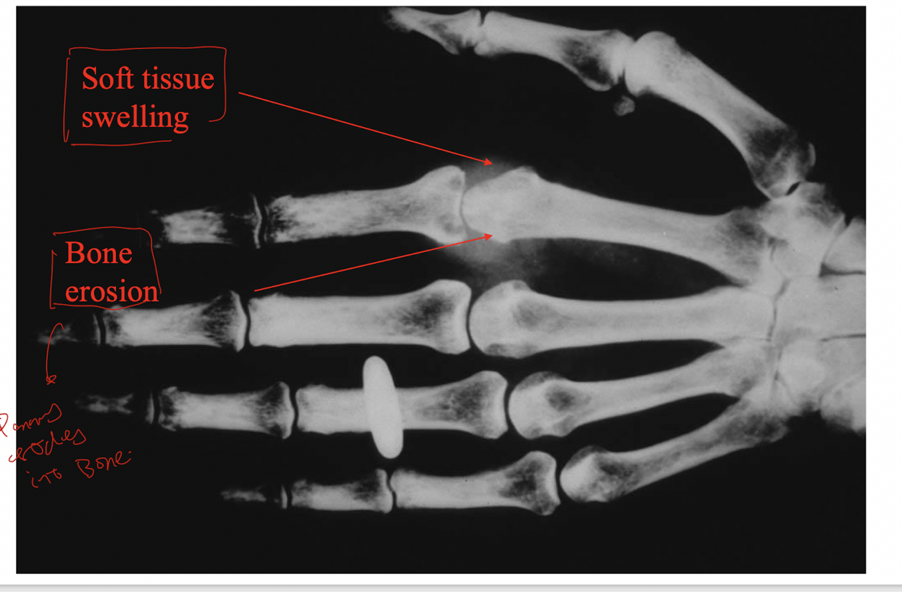
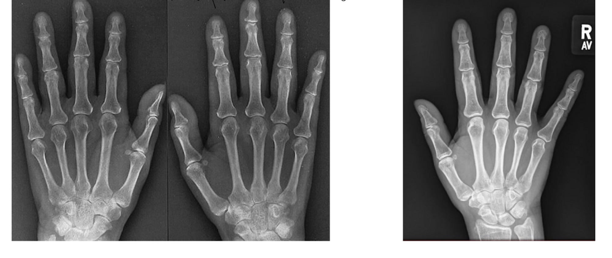
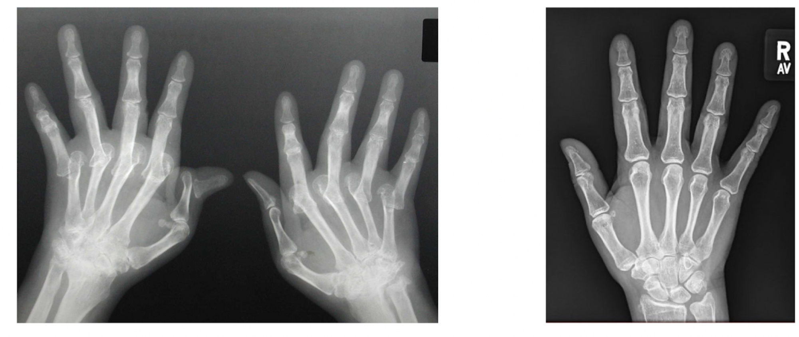
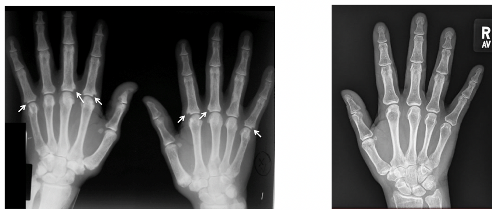
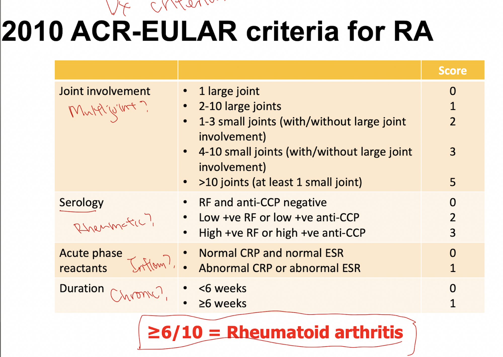

- # Rheumatoid arthritis
  collapsed:: true
	- ### What is rheumatoid arthritis?
	  collapsed:: true
		- Rheumatoid arthritis is a common, chronic, symmetrical polyarticular arthritis. It is the commonest autoimmune arthritis.
	- ### Clinical course of rheumatoid arthritis
	  collapsed:: true
		- Rheumatoid arthritis initially starts with onset of systemic effects: fever, malaise and generalised musculoskeletal pain, before the onset of joint symptoms and extra-articular manifestations.
		- Joint symptoms are characterised joint pain that involves:
		- The carpomatecarpal joints (CMC joints), proximal interphalangeal joints (PIP joints) of the fingers
		- Wrist joint, elbow joint and Knee joint are also commonly involved.
		- {:height 419, :width 529}
		- Joints involvement is chronic, symmetrical and polyarticular.
		- There is often morning stiffness of the joints.
		- On physical examination, the joints show soft tissue swelling, with warmth and erythema (showing the cardinal signs of inflammation).
		- Joint symptoms take a wax and wane course.
		- In severe RA, there may be adjacent soft tissue involvement (ligaments and tendons), which result in radial deviation of the wrist, ulnar deviation of the digits, and swan-neck and boutonniere deformities of the digits.
		- {:height 296, :width 633}
	- ### Investigations for rheumatoid arthritis
	  collapsed:: true
		- Blood tests:
		  collapsed:: true
			- There is leukocytosis on CBC, with positive ESR or CRP, indicating inflammation.
			- Most rheumatoid arthritis patients are positive for ACPA (anti-citrullinated protein antibodies) or rheumatoid factors.
		- Radiological features are predictable:
		  collapsed:: true
			- Soft tissue swelling and joint space widening initially
			  collapsed:: true
				- This is due to synovial inflammation and joint effusion.
				- {:height 388, :width 513}
			- Juxta-articular osteoporosis
			  collapsed:: true
				- This is due to hyperaemia from synovial inflammation, and disuse of the joint.
				- {:height 245, :width 522}
			- Severe RA shows joint space narrowing
			  collapsed:: true
				- As pannus erodes through the articular cartilage.
				- {:height 255, :width 499}
			- Periarticular erosions
			  collapsed:: true
				- Osteoclastic activity in pannus erodes through bone within the joint capsule.
				- {:height 210, :width 503}
	- ### Diagnostic criteria of rheumatoid arthritis
	  collapsed:: true
		- A score of more than 6 in the ACR-EULAR criteria is sufficient for diagnosis of RA. Scores are given in 4 domains: number and types of joints inolved (max:5), serological abnormalities (max:3), presence of acute phase reactants (max:1), and duration (max:1).
		- {:height 510, :width 678}
	- Related:
	  collapsed:: true
		- [[Pathogenesis and pathology of rheumatoid arthritis]]
	- Reference:
	  collapsed:: true
		- [[$ Robbins  Rheumatoid arthritis]]