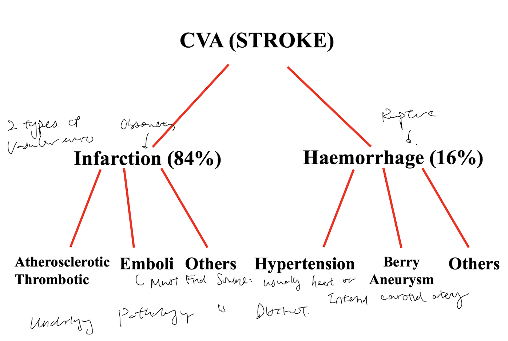

tags:: [[HNNS]], [[pathology]], [[Clinical]] 
status::
alias::

- ### Stroke is classified into two groups, each with different underlying pathologies
	- [[Stroke]], or cerebrovascular accident is can be classified into ischaemic stroke and haemorrhagic stroke.
		- Ischaemic stroke is caused by occlusion of blood vessels, either by thrombotic occlusion, or embolic occlusion, that results in focal ischaemia, and subsequently infarction.
			- Most often, an ischaemic stroke is caused by an **embolic occlusion**, often derived from an **cardiac mural thrombi**, e.g. Valvular heart disease, atrial fibrillation etc.
			- Ischaemic stroke can also be caused by **thrombotic occlusion** superimposing on atherosclerotic plaques. These plaques are usually found in *carotid bifurcation, origin of middle cerebral artery, and both ends of basillar artery*.
		- Haemorrhagic stroke is often caused by rupture of cerebral vessel walls.
		- 
	- Ischaemic stroke (84%) is much more common than haemorrhagic stroke (16%).