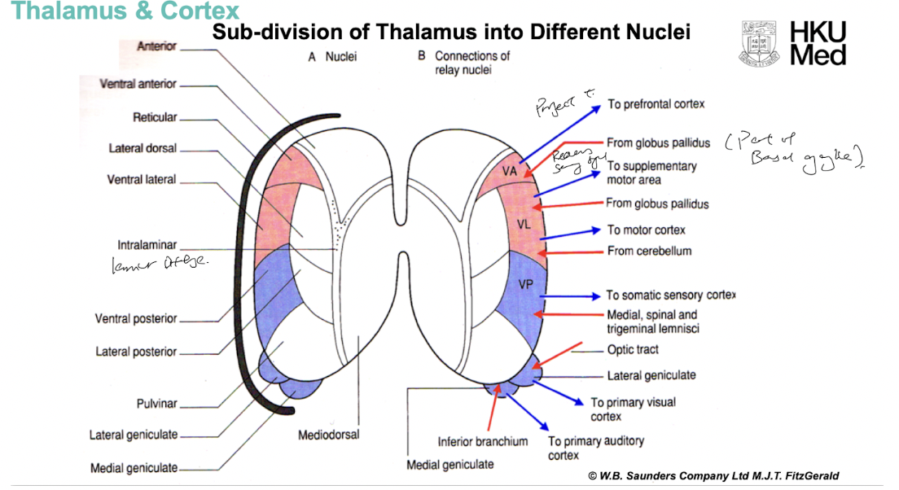

- # Thalamus
  collapsed:: true
	- The thalamus is a part of the larger diencephalon.
	- ### General appearance of the thalamus
	  collapsed:: true
		- The two thalamus is described as two oval mass of gray matter that forms a major part of the diencephalon, forming the walls of the ((63b38608-f9d8-49de-bf4d-b03baa11343b)) of the [[Ventricular system]].
		- The anterior end is narrow and round, the posterior end is expanded into the pulvinar, which overlies the superior colliculus of the [[Midbrain]].
		- The two thalamus are joined, at the anterior end by the **interthalamic adhesion**.
	- ### Internal organization of the thalamus
	  collapsed:: true
		- The thalamus is first divided by the Y-shaped **laminar** into the *anterior part, medial part and the posterior part.* Each part houses specific thalamic nuclei.
		- **Anterior part**
		  collapsed:: true
			- The **anterior nucleus** is located within the anterior part. It receives sensory signals from the mamillary body of the fornix, where the axons from the anterior nucleus projects to the **cingulate gyrus**.
		- **Medial part**
		  collapsed:: true
			- The **mediodorsal nucleus** is located within the medial part, and receives sensory signals from the [[Substantia niagra]], ventral pallidum, olfactory cortex and amygdala, and projects to the **prefrontal cortex**.
		- **Lateral part**
		  collapsed:: true
			- The lateral part is further subdivided into the ventral part and the dorsal part.
			- Ventral Part
			  collapsed:: true
				- Ventral part is subdivided into the ventral anterior nucleus, ventral lateral nucleus and ventral posterior nucleus. *The pulvinar is also comprises the ventral division of the lateral part of the thalamus, and houses the lateral geniculate body and the medial geniculate body*.
				- The ventral anterior nucleus receives signals from the  **globus pallidus** of the [[Basal ganglia]], which projects to the **premotor cortex**.
				- The ventral lateral nucleus receives sensory signals fromthe [[Cerebellum]], and projects to the [[Motor cortex]].
				- The **ventral posterior nucleus** is further subdivided into two nucleus: the vetral posterolateral (VPL) nucleus and the ventral posteromedial (VPM) nucleus, which receives somatosensory signals of the trunk and limbs from [medial lamniscus]([[Dorsal column medial lamniscus pathway]]) and the [[Spinothalamic pathway]] and somatosensory signals of the head and neck from the trigeminal lamniscus respectively. Both project to the primary somatosensory cortex for [[Somatosensation]].
				- The **lateral geniculate nucleus** receives special sensory signals from the optic tract (), and projects to the visual cortex.
				- The **medial geniculate nucleus** receives ascending signals from the inferior colliculus of the [[Midbrain]], via the **inferior branchium**, and projects to the auditory cortex.
			- Dorsal part
		- {:height 400, :width 718}
	- ### Functions of the thalamus
	  collapsed:: true
		- The thalamus serves as a relay centre for all sensory imputs to the corresponding areas of the cortex.