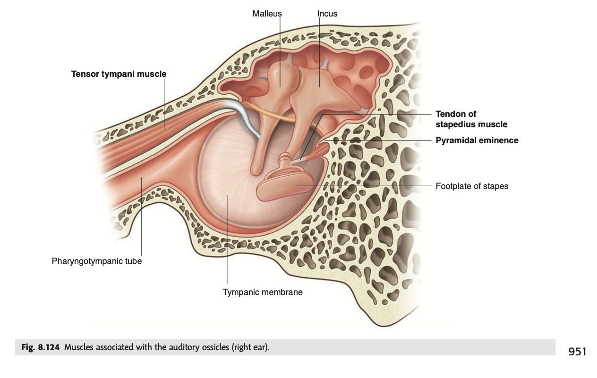
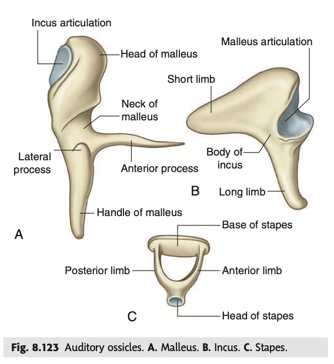

tags:: [[HNNS]], [[Anatomy]], [[Anatomy of the head and neck]] 
status::
alias::

- ### The 3 auditory ossicles form an osseus chain that conducts mechanical vibration from the tympanic membrane to the oval window
  collapsed:: true
	- There are 3 tiny ear bones within the middle ear, namely the **malleus**, the **incus** and the **stapes**, from laterally to medially.
	- **Malleus**
	  collapsed:: true
		- The malleus is characterised by the head, the neck, the handle, the lateral process and the anterior process.
		  collapsed:: true
			- The head of the malleus articulates with the inclus.
			- Inferior to the head, is the neck of the malleus, followed by the anterior process and lateral process.
			  collapsed:: true
				- The anterior process attaches to the anterior wall of the middle ear.
				- The lateral process protrudes onto the tympanic membrane.
			- The handle of the malleus projects inferiorly, and is also attached to the tympanic membrane.
	- **Incus**
	  collapsed:: true
		- The incus is characterised with the body, the long process and the short process.
		  collapsed:: true
			- The long process extends inferiorly, and articulates with the head of the stapes.
			- The short process extends posteriorly and attaches to the posterior wall of the middle ear.
	- **Stapes**
	  collapsed:: true
		- The stapes is characterised by the head, the anterior and posterior process, and the base.
		  collapsed:: true
			- The head articulates with the long process of the incus.
			- The anterior and posterior process deviate from each other, and join at the oval base (somewhat like the handle of a kettlebell).
			- The oval base fits into the oval window (fenestra vestibuli) on the medial wall of the middle ear.
	- {:height 362, :width 548}
	- {:height 509, :width 453}
	-