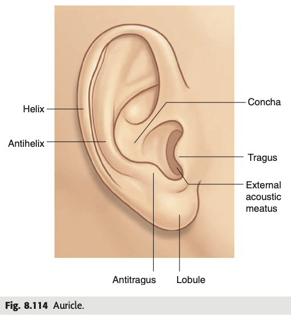

tags:: [[HNNS]], [[Anatomy]], [[Anatomy of the head and neck]] 
status::
alias::

- ### The auricle, or pinna is the visible part of the external ear, and is consists of a cartilaginous framework that gives it its distinctive features for sound collection
  collapsed:: true
	- The **auricle of the external ear** forms the visible part of the ear, lying on the lateral aspect of the head.
	- Much of it is supported by a cartilaginous framework, that facilitates sound collection.
	- **Features of the auricle**
		- Posteriorly, the auricle is characterised by a semicircular outer ring called the **helix**, and within it, another semicircular elevation called the **anti-helix**.
		- The helix is continuous inferiorly with the **lobule**, a lobe of fatty tissue that does not consist of cartilage.
		- Anteriorly, the auricle forms an elevation called the **tragmus**, and opposite to it, at the level of the lobule, as the **anti-tragmus**.
		- The hollow centre of the ear is the **concha of the auricle**, where its deep parts is continuous with the **external acoustic meatus**.
		- 
		-