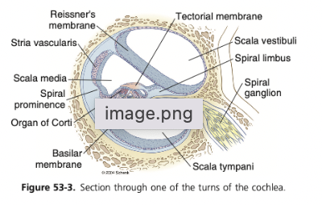

tags:: [[HNNS]], [[Anatomy]], [[Anatomy of the head and neck]], [[Nervous system physiology]] 
status::
alias::

- tags::
  status::
  alias::
- ### The cochlea is a system of 3 canals arranged into a snail shape
	- The cochlea is a snail-shaped structure that is a system of 3 canals:
		- The upper canal, the **scala vestibuli**
		- The middle canal, the **scala media**
		- The lower canal, the **scala tympani**
	- The scala vestibuli and the scala media is separated by the **vestibular membrane**.
		- It should be noted that the vestibular membrane is so thin that *it does not obstruct transmission of vibrations from the upper canal to the lower canal*.
		- Hence, the two canals can be considered as one.
	- The scala media and the scala tympani is separated by the **basilar membrane**, which is characterised by the receptive organ, the **organ of corti**.
	- 