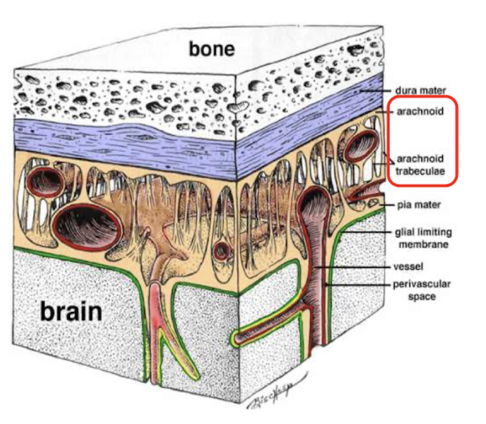
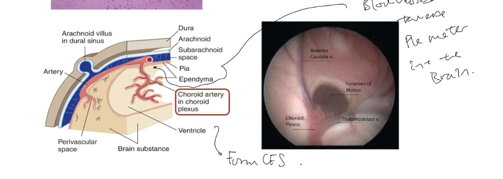

- ### The cranial meninges is a 3-layered covering of the brain
  collapsed:: true
	- The **cranial meninges** is a 3-layered covering that lies immediately within the [[Cranium]]. It extends to cover the spinal cord as the [[Spinal meninges]].
	- **The meninges consists of 3 Layers**
	  collapsed:: true
		- The **cranial meninges** consists of 3 layers. From outermost to innermost: 1) **Dura mater**, 2) **Arachnoid mater**, and 3) **Pia mater**.
		- **Dura mater**
		  id:: 63b385f7-f906-4514-bbb9-af3464db1087
		  collapsed:: true
			- The dura mater is the outermost layer of the **cranial meninges**, consisting of the outer [Periosteal]([[Periosteum and endosteum]]) layer and the inner meningeal layer.
			  collapsed:: true
				- The **outer periosteal layer** closely adheres to the inner surface of the [[Cranium]], and is said to "terminate" at the **foramen magnum**... It essentially wraps and lines the external surface of the cranium.
				- The **inner menigeal layer** closely adheres to the underlying arachnoid mater, and continues through the foramen and becomes the meningeal dura of the [[Spinal meninges]].
			- [[Dural folds are present with the cranial meninges]].
		- **Arachnoid mater and the subarachnoid space**
		  collapsed:: true
			- Arachnoid mater is the middle layer of of the meninges, consisting of trabeculae extending to the underlying **pia mater**.
			- *The arachnoid mater overlies the subarachnoid space:*
			  collapsed:: true
				- It consists of [[Cerebrospinal fluid]] that is produced in the ventricles ([[Cerebrospinal fluid pathway]])
				- The subarachnoid space proviedes mechanical support to the cerebral vessels and [[Cranial nerves]].
				- It "cushions" the brain (refering to ((63b8cd66-824f-4635-a955-4a705f6e0335))) .
			- 
		- **Pia mater**
		  collapsed:: true
			- The pia mater is the innermost layer of the meninges.
			- The pia mater tightly adheres to the brain, following the gyruses and sulcuses of the brain and the spinal cord.
			- Together with cerebral arteries within the **subarachnoid space**, *the pia mater invaginates into the ventricles, forming [[Choroid plexus]] to produce CSF.*
			- 