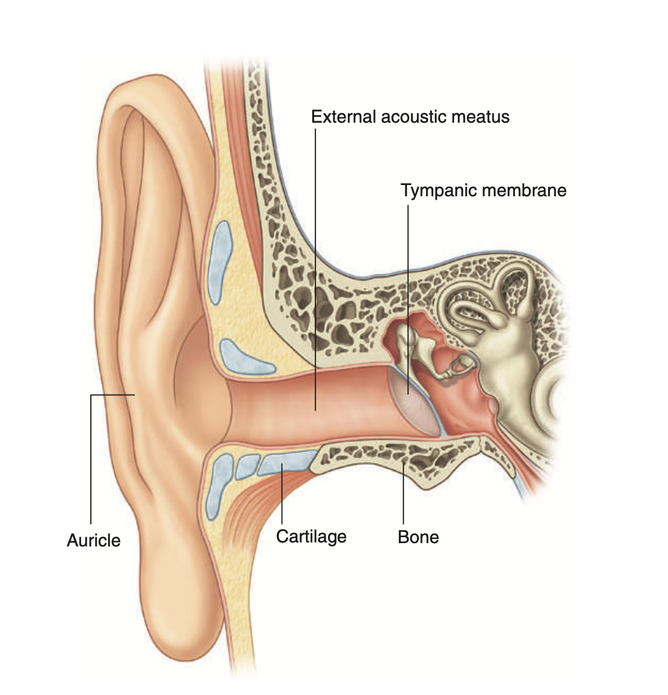

tags:: [[HNNS]], [[Anatomy]], [[Anatomy of the head and neck]] 
status::
alias::

- ### The external acoustic meatus is continuous from the deep areas of the concha of the external ear to the tympanic membrane, bordered by cartilage and bones
  collapsed:: true
	- The external acoustic meatus is a part of the external ear that extends from the deep parts of the **concha of the auricle** to the tympanic membrane.
	- From lateral to medially, it passes anterosuperiorly, then some what posteriorly.
	  collapsed:: true
		- This is clinically significant, as one can better visualize the tympanic membrane by pulling the ear superiorly, laterally and posteriorly.
	- **It is bounded by cartilages and bones**
	  collapsed:: true
		- The lateral 1/3 is border by the auricular cartilages.
		- The medial 2/3 is bordered by bones, particularly as it enters the opening for the external acoustic meatus on the [[Temporal bone]].
		- {:height 439, :width 424}