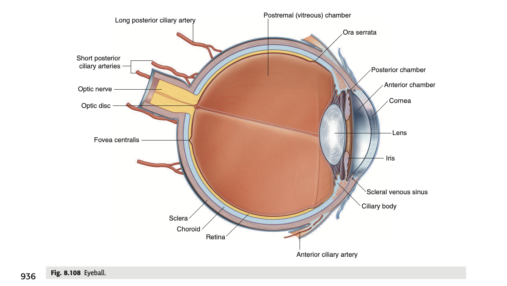

tags:: [[HNNS]], [[Anatomy]], [[Anatomy of the head and neck]]

- ### The eyeball is arranged in layers
  collapsed:: true
	- The eyeball is arranged into 3 layers:
		- The **outer fibrous layer**, consisting of the **sclera** and the **cornea**,
		- The **middle fibrous layer**, consisting of the **choroid** and its extensions, the **ciliary body** and the **iris**,
		- The **inner retinal layer**, consisting of the **retina**.
	- {:height 338, :width 554}