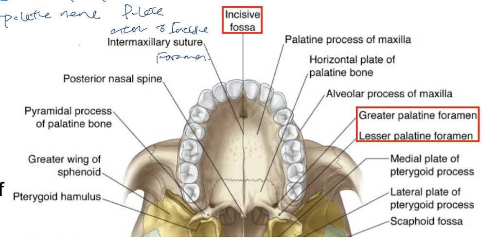

tags:: [[HNNS]], [[Anatomy]], [[Anatomy of the head and neck]]

- ### The hard palate separates the nasal cavity from the oral cavity, but consists of various foramina that enables passage of neurovasculature between the two cavities
  collapsed:: true
	- The hard palate is a bony structure that consists of the palatine process of the paired [[Maxilla]] bones, and the horizontal plate of the [[Palatine bone]], as well as a small part of the premaxilla.
	- The hard palate consists of 3 key foramina:
	  collapsed:: true
		- **Incisive foramen**
		  collapsed:: true
			- The incisive foramen is located anteriorly, for the nasopalatine nerve to drop through to supply the part of the hard palate anterior to the incisive foramen.
		- **Greater palatine foramen**
		  collapsed:: true
			- The greater palatine foramen is between the maxilla and palatine bone.
			- It enables the passage of the greater (anterior) palatine nerve and artery.
		- **Lesser palatine foramen**
		  collapsed:: true
			- The lesser palatine foramen is found within the palatine bone.
			- It enables the passage of lesser (middle and posterior) palatine nerves and arteries.
		- 