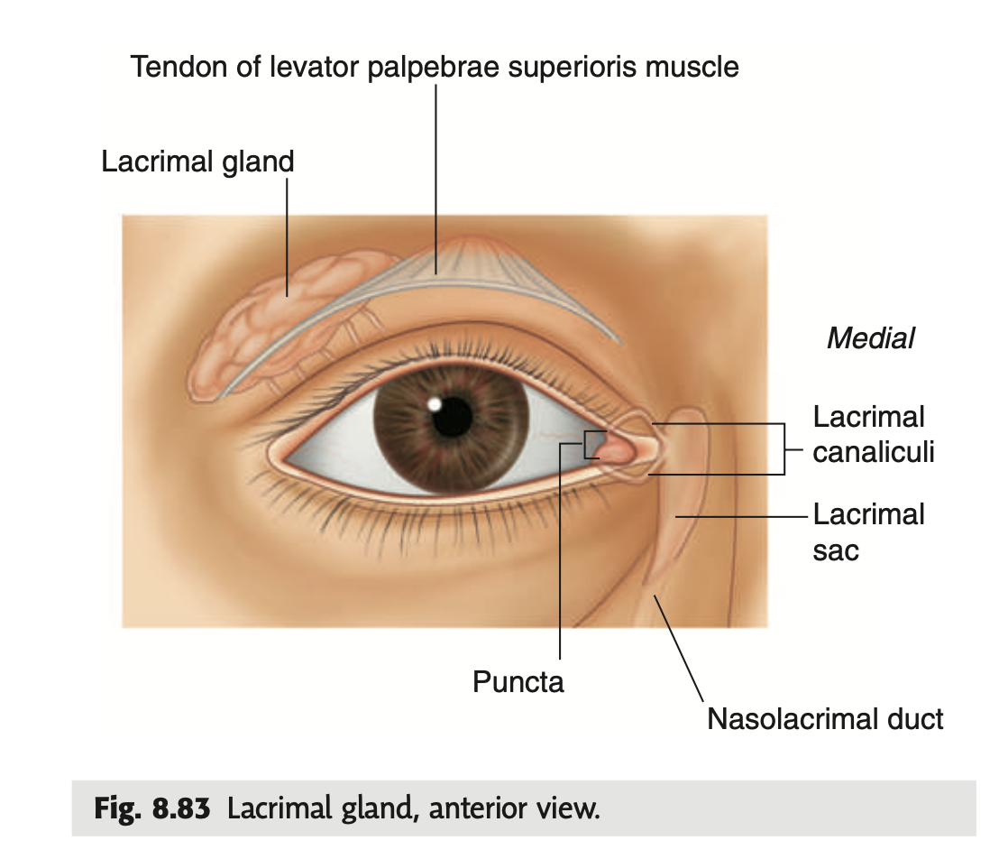
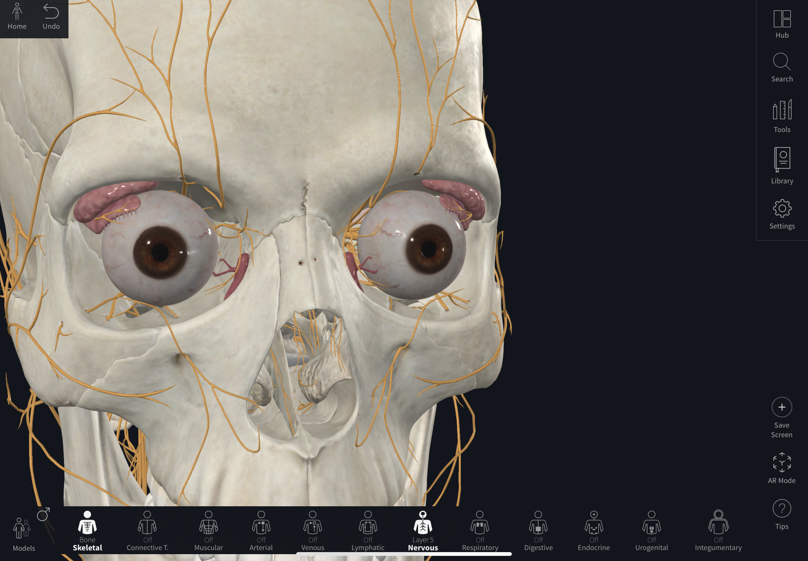

tags:: [[HNNS]], [[Anatomy]], [[Anatomy of the head and neck]]

- ### The lacrimal apparatus is a system of structures that are involved in the production, movement and drainage of tears
  collapsed:: true
	- The lacrimal apparatus is a system of structures that are involved in the production, movement and drainage of tears. It consists of the **lacrimal glands**, **lacrimal puncta**, **lacrimal cannaliculus**, **lacrimal sac**, and the **nasolacrimal duct**.
	- The **lacrimal gland** is located superolaterally, separated by the tendon of the **levator palpebrae superioris**.
	- *Tears produced by the lacrimal glands flow laterally to medially when we blink*.
	- The tears is then collected via the **lacrimal puncta**, drained via the **lacrimal cannaliculus**, into the **lacrimal sac** medially, posterior to the medial palpebral ligament.
	- The fluid within the lacrimal sac then drains via the **nasolacrimal duct** into the [[Nasal cavity]], within the inferior meatus ([[Bony framework of the roof, floor and lateral wall of the nasal cavity]]) anteriorly.
	- {:height 568, :width 527}
	- {:height 418, :width 529}