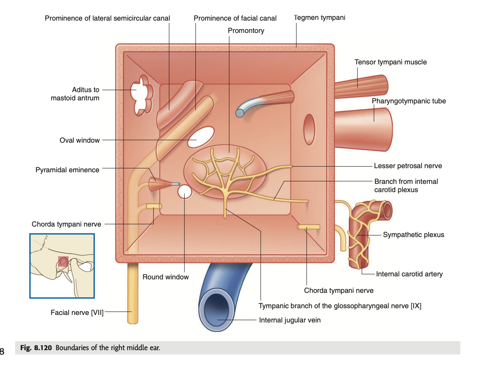

tags:: [[HNNS]], [[Anatomy]], [[Anatomy of the head and neck]] 
status::
alias::

- ### The middle ear is a box-shaped, air-filled cavity the petrous part of the temporal bone
	- The middle ear is an air-filled cavity lined with mucous membrane, located within the petrous part of the temporal bone.
	- It is shaped like a box, with 6 boundaries: the roof, the floor, the medial wall, the lateral wall, the anterior wall and the posterior wall.
	- **Roof: Tegmental wall**
	  collapsed:: true
		- The roof of the middle ear is formed by the tegmen tympani, the thinnest layer of bone of the petrous part of the temporal bone, separating the middle ear from the middle cranial fossa ([[The cranial base is is separated into three cranial fossas]]).
	- **Floor: Jugular wall**
	  collapsed:: true
		- The floor of the middle ear separates the middle ear from the [[Internal jugular vein]].
	- **Lateral wall: Membranous wall**
	  collapsed:: true
		- The lateral wall is entirely formed by the [Tympanic membrane]([[The tympanic membrane and its features]]).
	- **Medial wall: Labyrinth wall**
	  collapsed:: true
		- The medial wall is lying within the petrous part of the [[Temporal bone]], separates the middle ear from the inner ear (within the labyrinth).
		- It is characterised by a protuberance, called the **promontory**, which is formed by the cochlea, housing the **tympanic plexus (CN IX)**
		- Posterosuperior to the promontory, is the **oval window**, or the *Fenestra vestibuli*, for transmitting vibrations from the middle ear into the cochlea.
		- Posteroinferior to the promontory, is the **round window**, or the *fenestra cochlea*, for transmitting vibrations from the cochlea and the middle ear.
		- It is also characterised by the **prominence of the facial canal**, and the **prominence of the lateral semicircular canal**.
		- 
	- **Anterior wall**
	  collapsed:: true
		- The anterior wall of the middle ear opens superiorly to the auditory tube.
	- **Posterior wall: Mastoid wall**
	  collapsed:: true
		- The posterior wall  of the middle ear opens via the auditis of mastoid antrum into the mastoid antrum.