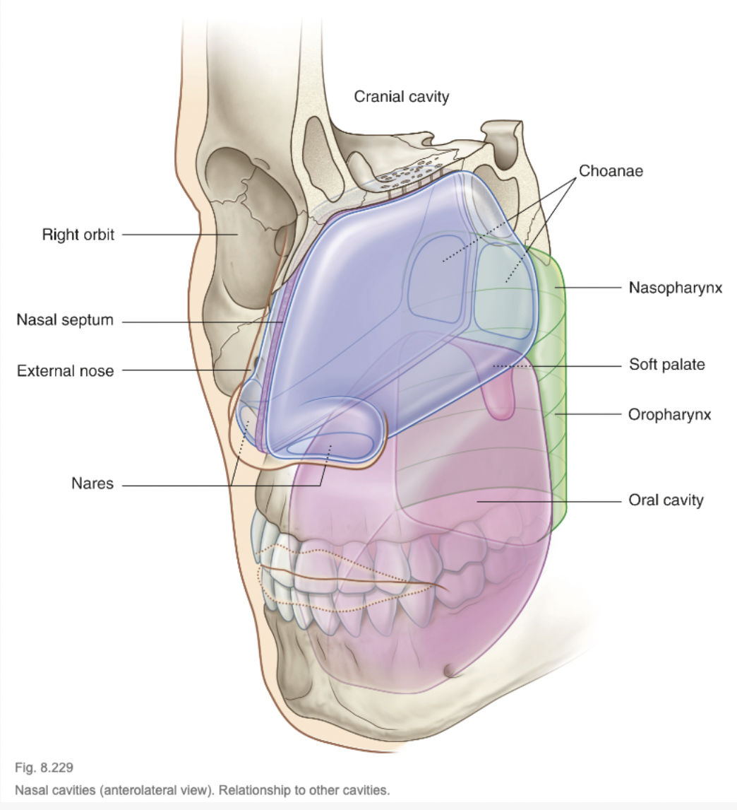

tags:: [[HNNS]], [[Anatomy]], [[Anatomy of the head and neck]] 
alias::

- ### The nasal cavity serves as the proximal part of the respiratory tract
  collapsed:: true
	- The 2 nasal cavities serve as the most proximal part of the respiratory tract.
	- It opens anteriorly to the external environment via the **anterior nasal aperture** (nares, or nostrils), which opens anteriorly and inferiorly.
	- Much of the nasal cavity lies more centrally within the skull.
	- It opens posteriorly to the **nasopharynx** ([[Pharynx]]) via the **posterior nasal aperture** (Choanae).
	- 