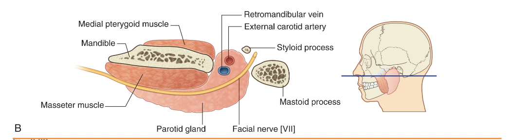
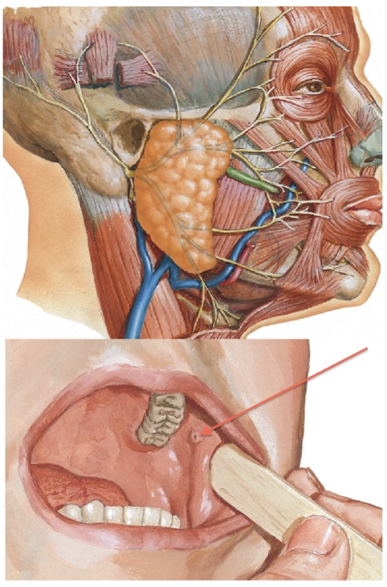

tags:: [[HNNS]], [[Anatomy]], [[Anatomy of the head and neck]] 
status::
alias::

- # The parotid gland, a main salivary gland, is located in the parotid region
  collapsed:: true
	- The parotid gland is a main salivary gland that occupies the parotid region.
	- It is roughly an inverted pyramid, wedged between the ramus of the mandible and the mastoid process of the [[Temporal bone]], in a sense that it *covers the superficial, posterior and deep surfaces of the ramus of the mandible*.
	- {:height 164, :width 506}
	- **The parotid duct**
		- The parotid duct, which drains digestive saliva from the parotid gland, *originates from the anterior border of the parotid gland*.
		- It then courses anteriorly, superficial to the ((63b8df26-982b-4ba2-813d-959a0dbdc7ca)). It then pierces through the fat pad and the buccinator muscle to drain saliva into the oral cavity at the vestibule, near the **2nd upper molar**.
		- {:height 630, :width 315}