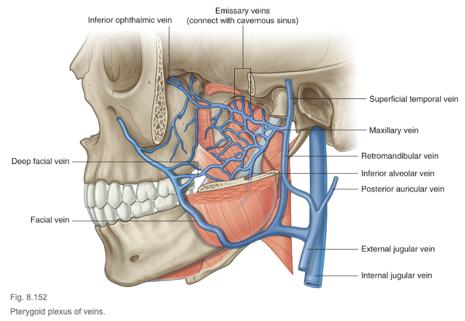

tags:: [[HNNS]], [[Anatomy]], [[Anatomy of the head and neck]] 
status::
alias::

- ### The pterygoid plexus is a venous plexus within the infratemporal fossa that provides venous drainage from various regions of the head and neck, including the infratemporal fossa itself
  collapsed:: true
	- The pterygoid plexus is a venous plexus located between layers of the infratemporal fossa, between the ((63b8f46d-da00-4103-8ada-8a5b474baa24)) and the lateral pterygoid, and between the lateral pterygoid and ((63b8f46d-a044-4ed1-8a38-a671d8f70f85)) muscle.
	- **Tributaries**
	  collapsed:: true
		- It receives venous drainage from various veins that drains:
		  collapsed:: true
			- The [[Nasal cavity]]
			- The [[Paranasal sinuses]]
			- The lateral wall and roof of the [[Oral cavity]]
			- The teeth
			- The muscles of the infratemporal fossa ([[The 4 muscles of mastication enable movement at the temporomandibular joint]])
	- **Drainage**
	  collapsed:: true
		- The pterygoid plexus drains anteriorly to the **facial vein** via the **inferior opthalmic vein (passing through inferior orbital fissure)** and the **deep facial vein**.
		- The pterygoid plexus drains posteriorly to the [[Retromandibular vein]], via a short stunk, the **maxillary vein**.
	- It also consist of emissary veins that pass through foramina in the roof of the [[Infratemporal fossa]], communicating with the [[Carveneous sinus]] .
	- {:height 432, :width 601}