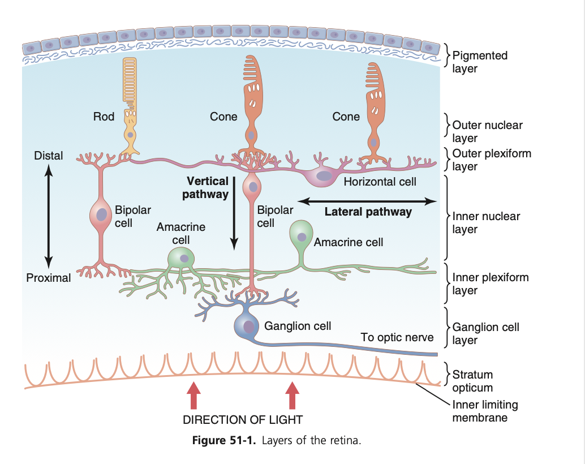

tags:: [[HNNS]], [[Anatomy]], [[Anatomy of the head and neck]], [[Nervous system physiology]]

- ### The retina is arranged in 3 layers of cells in a counterintuitive manner
  collapsed:: true
	- The retina is arranged in 3 layers of cells, from innermost to outermost:
		- The retinal bipolar cells, whose axons project through the optic nerve,
		- The bipolar cells, which conducts action potentials from the photoreceptors to the retinal ganglion cells,
		- The photoreceptors, which consists of cones (5%) and rods (95%).
	- The organisation of cells is quite puzzling, as light has to pass through the layer of retinal ganglion cells and bipolar cells before it can stimulate the cones and rods.
	- Passage of light through a non-homogenous tissue greatly decreases visual acuity.
	- {:height 508, :width 472}