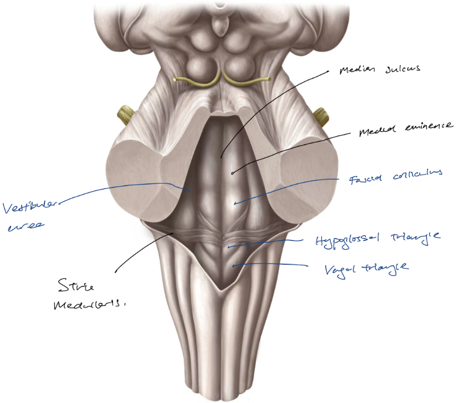

- ### The rhomboid fossa bears various features that reveals the internal structure of the medulla and pons
  collapsed:: true
	- The rhomboid fossa (floor of the ((63b38608-57f7-4a30-a0d0-dd8a0dd702ae)) ) bears various features that reveal the underlying structures of the [[Medulla]] and [[Pons]].
	- It is marked by the **median sulcus** which *separates the rhomboid fossa into two symetrical halves*.
	- Just lateral to the median sulcus are two swellings called **medial eminence**, which is laterally bordered by another sulcus, the **sulcus limitans**.
	- Lateral to the sulcus limitans is the **vestibular area**, which *overlies the vestibular nuclei.*
	- Inferior to the medial eminence, there is a prominent swelling called the **fascial colliculus**, which is formed by the *fibres arising from the fascial nucleus overlying the abducens nucleus*.
	- From the medial sulcus, fibres arise from the arcuate nuclei and convey via the inferior cerebellar peduncle into the [[Cerebellum]], known as the stria medullaris.
	- Inferior to the stria medullaris, certain features are identified:
	- Medially, the **trigone of hypoglossal nerve** corresponds to the hypoglossal nucleus.
	- Laterally, the **trigone of vagus nerve** corresponds to the dorsal motor nucleus of vagus nerve.
	- 