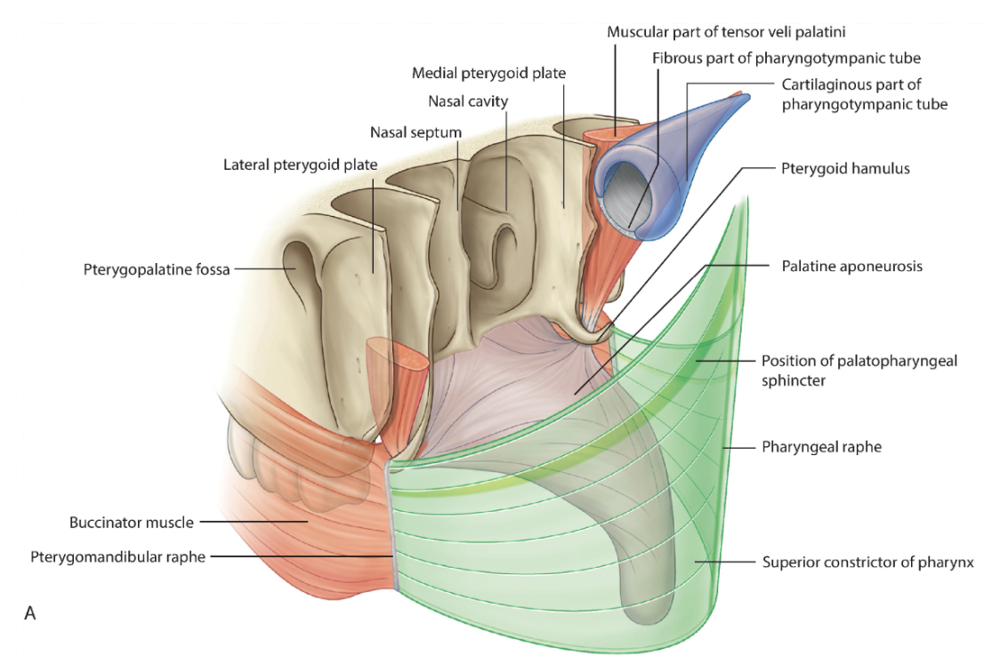
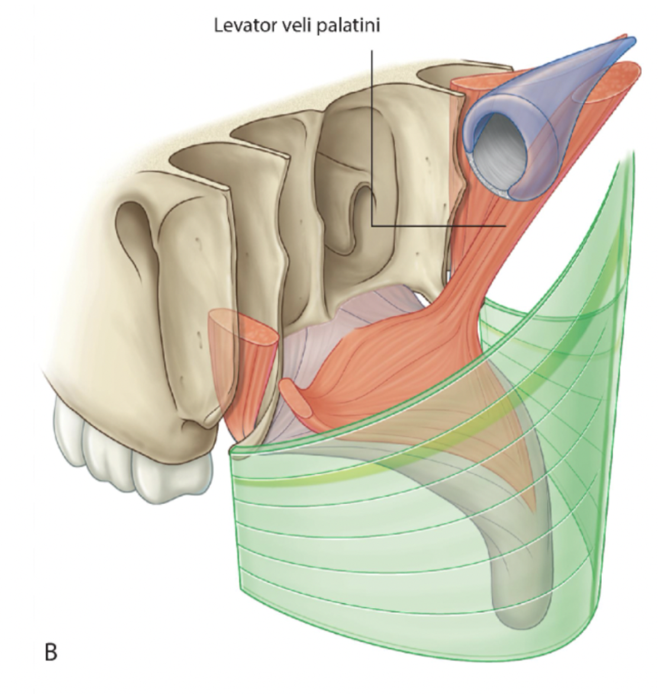
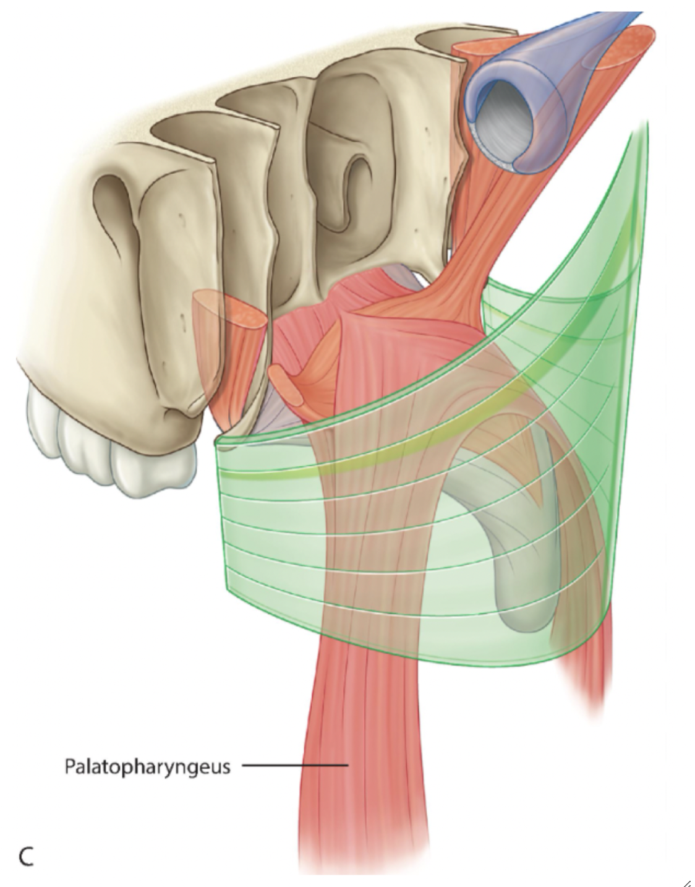
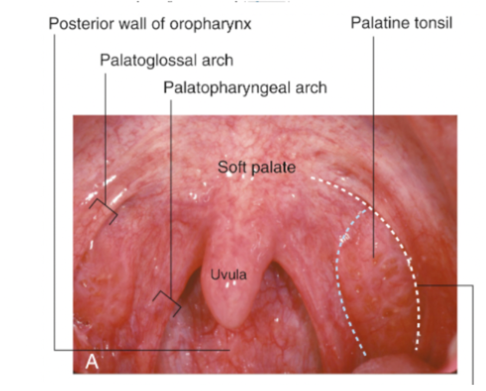

- ### Soft palate
  collapsed:: true
	- The soft palate is essentially a palatine aponeurosis of the **tensor veli palatini** that is *acted on by 5 pair muscles*.
	- ### Muscles of the soft palate
	  collapsed:: true
		- **Tensor veli palatini**
		  collapsed:: true
		  id:: 63b38605-476e-4014-a802-8b6fded8f278
			- The tensor veli palatini originates from the the scaphoid process of the [[Sphenoid bone]], and the lateral part of the cartilaginous part of the auditory tube. It descends lateral to the medial pterygoid plate of the [[Sphenoid bone]], hooks around the **pterygoid hamulus**, and expands into the **palatine aponeurosis**.
			- **Actions**
			  collapsed:: true
				- The tensor veli palatini tenses up the palatine aponeurosis for the other muscles to act on.
				- It also regulates the opening of the auditory tube.
			- **Innervation**
			  collapsed:: true
				- The tensor veli palatini is innervated by the nerve to medial pterygoid, a branch of the mandibular division of the [[Trigeminal nerve (CN V)]].
			- 
		- **Levator veli palatini**
		  collapsed:: true
			- The levator veli originates from inside the pharyngobasilar fascia, from the quadrate area on petrous part of [[Temporal bone]], and the medial part of the cartilaginous part of the auditory tube. It descends and inserts onto the superior surface of the palatine aponeurosis.
			- **Actions**
			  collapsed:: true
				- The levator veli palatini elevates the tensor veli palatini to close off the nasopharynx from the oropharynx.
				- It is also involved in regulating the opening of the auditory tube.
			- **Innervation**
			  collapsed:: true
				- The levator veli palatini is innervated by the pharyngeal plexus (CN X).
			- {:height 535, :width 434}
		- **Palatopharyngeus**
		  collapsed:: true
		  id:: 63b38605-0585-4bbf-b3b1-24c3e3ff161e
			- The palatopharyngeus from the **posterior nasal spine** and the **posterior surface of the palatine aponeurosis**. It descends posteromedially. constituting the palatopharyngeal arch. It eventually inserts at the posterior border of the thyroid cartilage, and the cornua of the [[Hyoid bone]].
			- **Actions**
			  collapsed:: true
				- The palatopharyngeus elevates the larynx and [[Pharynx]] , whist depressing the soft palate.
			- **Innervation**
			  collapsed:: true
				- The palatopharyngeus is innervated by the pharyngeal plexus (CN X).
			- {:height 717, :width 474}
			- {:height 427, :width 479}
		- **Palatoglossus**
		  collapsed:: true
			- The palatoglossus originates from the inferior surface of the **palatine aponeurosis**, and descends anterolaterally to insert onto the lateral side of the [[Tongue]], constituting the **palatoglossal arch.**
			- **Actions**
			  collapsed:: true
				- The palatoglossus elevates the tongue.
				- It is also sphincteric at the oropharyngeal isthmus.
			- **Innervation**
			  collapsed:: true
				- The palatglossus is innervated by the pharyngeal plexus (CN X).
		- **Muscular uvulae**
		  collapsed:: true
			- The muscular uvulae originates from the superior surface of the palatine aponeurosis and inserts at the mucosa of the uvula.
			- **Actions**
			  collapsed:: true
				- It shapes the uvula.
				- When contracting ipsilaterally, it deviates the uvula to the ipsilateral side.
			- **Innervation**
			  collapsed:: true
				- The muscular uvulae is innervated by the pharyngeal plexus (CN X).